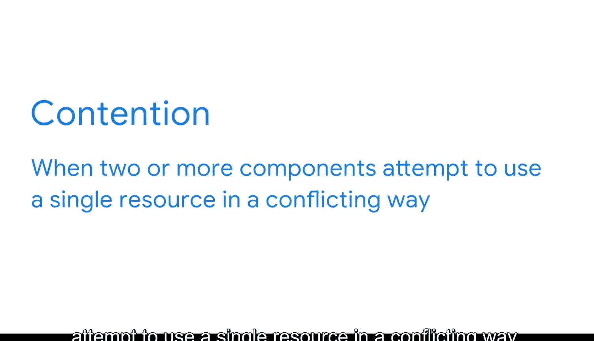

#  061：数据库性能五要素 🚀

在本节课中，我们将要学习数据库性能优化的核心概念。我们将深入探讨影响数据库性能的五个关键要素，帮助你理解如何确保数据库系统能够高效地响应用户需求。

---

## 概述

我们一直在探讨数据库优化，其重要性在于确保用户能够尽可能高效地从系统中获取所需信息。成功的优化可以通过数据库性能来衡量。数据库性能是衡量数据库能够处理的工作负载以及相关成本的指标。在本视频中，我们将探讨影响数据库性能的五个因素：工作负载、吞吐量、资源、优化和争用。

---

## 工作负载 📊

首先，我们从工作负载开始。工作负载指的是在任意给定时间内，数据库系统正在处理的事务、查询、分析和系统命令的组合。

数据库的工作负载通常会因处理的任务和交互用户数量的不同而在不同日期之间剧烈波动。

好消息是，你通常可以预测这些波动。例如，在月末处理报告时，工作负载可能会更高；或者在节假日前，工作负载可能会非常轻。

---

## 吞吐量 ⚡

接下来，我们讨论吞吐量。吞吐量是数据库硬件和软件处理请求的整体能力。

吞吐量由输入输出速度、中央处理器速度、机器运行并行进程的能力、数据库管理系统以及操作系统和系统软件共同构成。

基本上，吞吐量描述了系统能够处理的工作负载大小。

---

## 资源 💻

现在，让我们深入了解资源。在商业智能中，资源指的是数据库系统中可用的硬件和软件工具。

这包括磁盘空间和内存。资源是数据库系统处理请求和处理数据能力的重要组成部分。

资源也可能发生波动，特别是当硬件或其他专用资源与其他数据库、软件应用程序或服务共享时。此外，基于云的系统尤其容易出现波动。

因此，记住外部因素会影响性能是非常有用的。

---

## 优化 🔧

现在我们来谈谈优化。优化涉及最大化数据检索的速度和效率，以确保高水平的数据库性能。

这是商业智能专业人员反复关注的最重要因素之一。因此，我们很快将更详细地讨论它。

---

## 争用 ⚠️

最后，影响数据库性能的最后一个因素是争用。

当两个或多个组件试图以冲突的方式使用单一资源时，就会发生争用。

这确实会拖慢速度。例如，如果有多个进程试图更新同一块数据，这些进程就处于争用状态。

随着争用的增加，数据库的吞吐量会下降。因此，尽可能限制争用将有助于确保数据库发挥最佳性能。

---

## 总结

以上就是影响数据库性能的五个要素：工作负载、吞吐量、资源、优化和争用。

接下来，我们将通过一个实例来查看这些因素的实际作用，以便你更深入地理解每个因素如何影响数据库性能。