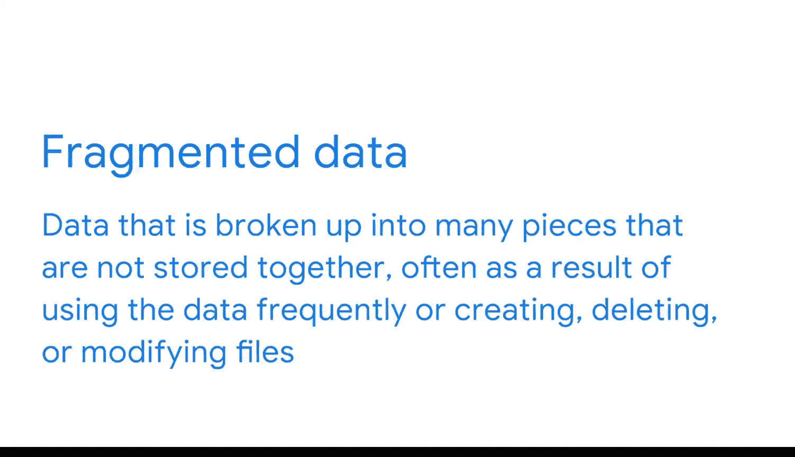

#  062：优化数据库性能 🚀

在本节课中，我们将学习如何优化数据库性能。我们将探讨性能的定义、优化的重要性，并深入分析导致数据库响应缓慢的常见原因及其解决方案。

数据库性能衡量的是数据库能够处理的工作负载以及相关的成本。优化是提升数据库性能最重要的因素之一。它旨在最大化数据检索的速度和效率，以确保高水平的数据库性能。其目标是让系统以最合理的成本处理尽可能大的工作负载。

## 优化与响应时间 ⏱️

上一节我们介绍了优化的目标，本节中我们来看看一个关键指标：响应时间。响应时间是数据库响应用户请求所需的时间。快速的响应时间对于维持团队工作效率至关重要。

设想一个场景：你是一名商业智能专家，收到团队成员的邮件，抱怨从数据库拉取数据所需的时间比平时长。这看似是小问题，但缓慢的数据库会严重干扰工作，导致团队浪费大量时间等待数据拉取或计算完成。

以下是用户可能遇到此问题的几个原因：

*   **查询未优化**：用户编写的用于与数据库交互的查询效率低下。
*   **数据库未正确索引或分区**：数据组织方式不佳。
*   **数据碎片化**：数据被分散存储。
*   **资源不足**：内存或CPU不足。

接下来，我们将逐一分析这些原因。

## 优化查询与查询计划 🔍

首先，如果用户编写的查询效率低下，会拖慢数据库资源。解决此问题的第一步是重新审视查询，确保其尽可能高效。

第二步是考虑查询计划。在使用SQL的关系型数据库系统中，**查询计划**是数据库系统为执行查询所采取步骤的描述。查询告诉系统“做什么”，而查询计划则定义了“如何做”。

如果查询运行缓慢，检查查询计划有助于找出是否存在导致不必要资源消耗的步骤。这是一个迭代过程：检查查询计划后，你可能会重写查询或创建新表，然后再次检查查询计划。

## 索引与数据分区 📂

现在让我们考虑索引。**索引**是用于在数据库系统中快速定位数据的组织标签。如果数据库中的表没有完全建立索引，数据库定位资源的时间就会变长。

在基于云的大数据系统中，你可能使用数据分区而非索引。**数据分区**是将数据库划分为不同逻辑部分的过程，旨在改进查询处理并提高可管理性。系统中数据的分布极其重要，因此确保数据被适当且一致地分区也是优化的一部分。

## 数据碎片化与资源容量 🧩

下一个问题是碎片化数据。**碎片化数据**是指数据被分割成许多未存储在一起的片段，这通常是由于频繁使用数据或创建、删除、修改文件导致的。

例如，如果你经常访问相同的数据，并且其版本被保存在缓存中，这些版本实际上会导致系统碎片化。

最后，如果你的数据库难以满足组织的需求，可能意味着没有足够的内存来处理所有人的请求。确保数据库有容量处理你要求的所有任务至关重要。

## 回顾与总结 📝

回顾我们的例子：你收到团队邮件，称访问数据库数据的时间变长。在了解情况后，你评估了形势并进行了一些修复。解决问题使你能够确保数据库为团队尽可能高效地工作。

然而，数据库优化是一个持续的过程。你需要持续监控性能，以确保一切运行顺畅。

本节课中，我们一起学习了数据库性能优化的核心概念。我们明确了优化旨在提升响应速度与效率，并分析了查询效率、索引与分区、数据碎片化及资源容量等关键影响因素。记住，优化是一个需要持续关注和迭代改进的实践过程。