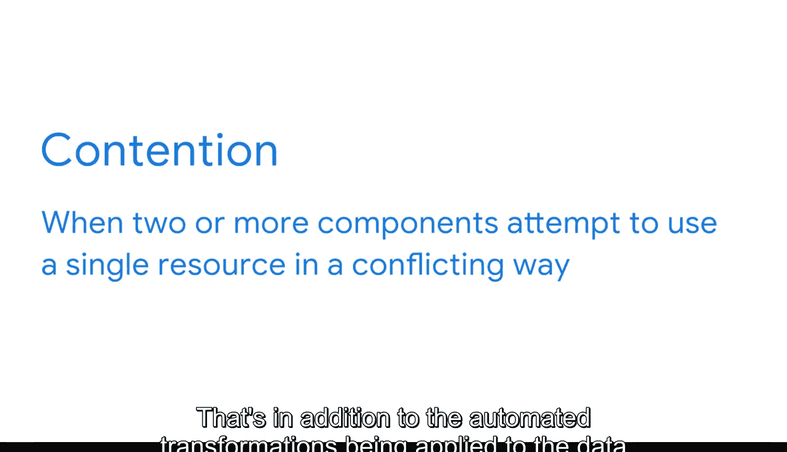

#  063：五要素实战应用 🎬

在本节课中，我们将学习数据库性能的五个核心要素——工作负载、吞吐量、资源、优化和争用——如何在一个实际的电影院连锁系统数据库中协同运作。我们将通过一个具体的例子，理解这些抽象概念在真实业务场景下的表现和影响。

## 数据库设计概述

在深入探讨五要素如何影响数据库之前，我们首先需要理解这个数据库是如何设计的。本节中，我们来看看这个电影院连锁系统的数据架构。

在这个例子中，我们将检查一个电影院连锁系统。在优化过程中，有几个方面需要考虑。

首先，思考这个数据库的用途。在本案例中，电影院连锁使用与购票、收入和观众偏好相关的数据，来决定放映哪些电影以及开展哪些促销活动。

其次，考虑数据的来源。在本例中，数据从多个来源被推送到一个进行分析的OLAP系统中。同时，数据库使用来自各个影院OLTP系统的数据，以探索不同电影放映时间和类型的售票趋势。

管理交易数据的OLTP系统使用了雪花型数据库模型。其核心是一个事实表，用于捕获关于电影票的最重要信息，例如某个特定座位是否已被预订。事实表包含预订类型、放映ID、录入预订的员工ID以及座位号等信息。

为了捕获这些事实的详细信息，该模型还包含了多个维度表，这些表与事实表相连，提供了关于员工、电影、放映、影厅、座位和预订的信息。这个数据库结构相当直观，它使得每个电影院都能在这些不同的表中记录数据，并防止它们意外地重复预订同一个座位。

然而，这些独立的OLTP系统并非为分析而设计，这就是为什么数据需要被提取到目标OLAP系统中的原因。在那里，用户可以访问和探索数据，以获得洞察并做出业务决策。

## 五要素对数据库性能的影响

现在我们对数据库有了更多了解，接下来看看数据库性能的五个要素如何影响它。

### 工作负载

首先，工作负载是指在任何给定时间内，数据库系统正在处理的事务、查询、数据仓库分析和系统命令的组合。在本案例中，大部分工作负载是处理用户请求，例如生成定期报告或执行查询。

如果数据库无法处理工作负载，可能会导致系统崩溃，从而中断用户访问和使用数据的能力。也许报告生成需要大量资源，或者访问此数据的分析师数量正在增加。但我们知道，通常可以预测工作负载的高峰时间，以便进行调整，确保系统能够处理这些请求。

### 吞吐量

接下来，我们探讨吞吐量。再次强调，这是数据库硬件和软件处理请求的整体能力。

因为我们的电影院系统主要专注于分析来自OLTP数据库的数据，所以我们使用的是一个主要依赖云存储的OLAP数据库。数据库存储处理过程以及系统中访问云数据的计算机，都需要能够处理影院的工作负载，尤其是在数据库系统被大量使用时。

### 资源

构成系统吞吐量的硬件和软件就是资源。例如，电影院可能使用缓存控制器磁盘来帮助数据库管理从内存系统存储和检索数据。

### 优化

接下来是优化，关于这一点你已经了解了很多。理想情况下，用户应该能够访问从多个其他数据库系统摄取的事务数据。

如果检索速度变慢，获取数据并向利益相关者提供洞察所需的时间就会更长。这就是为什么即使在数据库设置完成后，保持其优化状态仍然很重要。

### 争用

数据库性能的最后一个要素是争用。这家电影院公司有一个团队，其中许多不同的分析师都在访问和使用这些数据。除此之外，还有应用于数据的自动化转换和正在生成的报告。

所有这些请求最终可能会相互竞争，并导致争用。如果系统同时处理多个请求，反复进行本质上相同的更新，这可能会带来问题。为了限制这种情况，数据库会按照请求发出的顺序处理查询。

## 总结

在本节课中，我们一起学习了数据库性能五要素在一个真实的电影院连锁数据库系统中的实际应用。无论系统简单还是复杂，这些对于任何商业智能专业人士来说都是至关重要的考量因素。通过理解工作负载、吞吐量、资源、优化和争用如何相互作用，你可以更好地设计、维护和优化数据系统，以支持有效的业务决策。