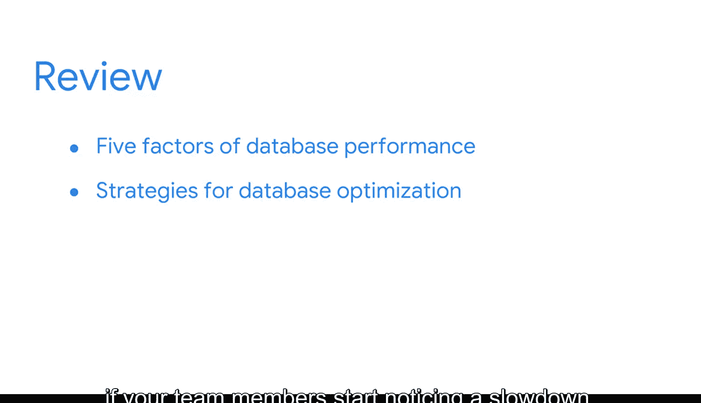

#  064：总结回顾与展望

在本节课中，我们将回顾数据库设计与商业智能（BI）专业人员角色的核心知识，并展望后续的学习方向。我们将重点总结影响数据库性能的五个关键因素，以及BI专业人员在优化和维护高效数据库系统中的作用。

## 数据库性能与BI角色回顾

上一节我们介绍了数据库设计的基础。本节中，我们来回顾BI专业人员在创建和维护有用数据库系统中所扮演的角色。

截至目前，课程重点聚焦于影响数据库性能的五个因素：
*   **工作负载**：指系统需要处理的总任务量。
*   **吞吐量**：指系统在单位时间内处理任务的能力。
*   **资源**：指可供系统使用的计算能力、内存和存储空间。
*   **优化**：指调整系统以提高效率的过程。
*   **争用**：指多个任务竞争同一有限资源时发生的冲突。

你还学习了一些专门用于数据库优化的策略，以及当团队成员开始注意到系统变慢时需要检查哪些问题。你甚至探究了这五个因素如何影响实际的数据库。

## 持续监控与系统演进

作为BI专业人员，进行数据库优化并保持数据库高速运行至关重要。开发能让团队自行获取洞察的流程是这项工作的关键部分。

但是，系统和流程会随着时间而改变。它们可能停止工作或需要更新。

这正是持续监控数据库性能如此重要的原因之一。数据库系统应保持持久的高性能水平。

## 课程展望与挑战

接下来，你将进一步探索关于优化系统以及作为BI专业人员将要创建的工具。

但首先，你将面临另一个每周挑战。和往常一样，你可以随时回顾任何课程材料并查阅术语表，为成功完成挑战做好准备。

完成评估后，我们将再次在这里会面，深入学习关于优化ETL（提取、转换、加载）流程的更多知识。做得很棒。

---

**本节课总结**：本节课我们一起回顾了数据库性能的五个关键因素（工作负载、吞吐量、资源、优化、争用）以及BI专业人员在系统维护中的核心职责。我们强调了持续监控的重要性，因为系统会不断演进。最后，我们预告了后续将深入学习的系统优化与ETL流程主题。