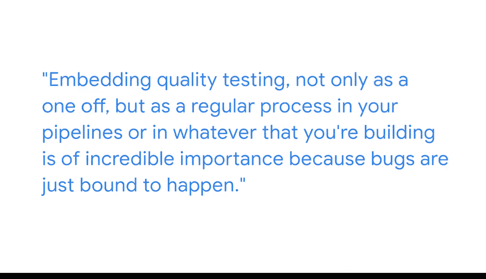

#  067：优质数据即有效数据

在本节课中，我们将学习数据质量测试的核心概念及其在商业智能项目中的重要性。我们将探讨优质数据的定义、质量测试在数据生命周期中的应用，以及如何培养相关技能。

我的名字是玛娜，我是谷歌的一名高级技术数据项目经理。我的工作是与业务伙伴合作，帮助他们创建工具，以便更好地利用数据做出决策。我是一个数据爱好者，喜欢研究数据，并构建能让人们工作更轻松的出色工具。

有一句俗语说：没有数据，你只有“泥土”。我喜欢更进一步说：没有优质数据，你只有“泥土”。质量测试的核心就是确保你拥有优质数据。优质数据可以有多重含义。

## 什么是优质数据？🔍

上一节我们提到了质量测试的目标是确保数据优质。本节中，我们来看看优质数据具体包含哪些维度。

优质数据通常意味着**准确的数据**，即如何确保你生成的数字是正确的，并且代表了事实。它也可以意味着**相关的数据**、**具有代表性的数据**，以及**触手可及的快速数据**。因此，质量控制的过程就是确保你基于数据构建的工具是准确、有用、相关且及时的。

## 质量测试的应用场景🔄

理解了优质数据的定义后，我们来看看质量测试在BI产品开发生命周期中的哪些环节发挥作用。

在构建BI产品的整个生命周期中，质量测试会在许多环节发挥作用。

以下是质量测试的关键应用阶段：
*   **数据提取阶段**：在早期阶段，例如有人尝试从日志中提取数据时，你需要确保提取的数据是准确的。即，从日志流入的数据，与你从可能正在创建的数据集市中输出的数据是否一致。
*   **ETL过程**：这个概念同样适用于你的ETL过程。**ETL**代表**提取（Extract）、转换（Transform）、加载（Load）**。当你获取数据、转换数据、处理数据并赋予其相关性时，你需要确保输入的数据与输出的数据保持一致。

## 拥抱不完美：数据质量的现实🚨

我们介绍了质量测试的理想目标，但在现实中，完美的数据状态几乎不存在。

我记得在我职业生涯初期，总是幻想有一天能进入一个数据“涅槃”的公司，那里所有的数据都无比干净、完美，充满魔力。我可以无忧无虑地查询数据。但事实是，这种“涅槃”状态在任何地方都不存在。

数据总是存在问题，错误总会发生。甚至你今天看到的数据，明天可能就不同了。因此，将质量测试不仅作为一次性任务，而是作为你构建的管道或任何产品中的常规流程嵌入进去，具有极其重要的意义，因为错误注定会发生。

## 给初学者的建议：技能与成长🌱

既然我们了解了数据质量的挑战和重要性，那么对于希望进入这一领域的人，有哪些建议呢？

在我刚开始工作时，有几件事我希望自己能早点知道。

我希望我当时能充分认识到，我在这个领域拥有的许多技能来自生活的其他部分，并非传统的BI技能。因此我应该对自己更有信心，因为我带来了非常出色的讲故事能力，并且能够不断磨练。尽管我不是软件工程师，但我有很多编码经验，并且我知道许多可以付诸实践的最佳方法。

所以我想说，如果你觉得自己在某些方面不是最强项，请保持好奇心、开放的心态和谦逊的态度，找到那些在这些方面真正擅长的人并向他们请教。要知道，你可以在这些方面学习和成长，并持续变得全面。

作为人类，我们在某些方面有优势，在某些方面需要成长，这很正常。但成功不在于天生拥有这些技能，而在于拥有不断自我进化的能力，不是成为专家，而是变得比昨天的自己更好。

---

本节课中，我们一起学习了优质数据的多维定义（准确、相关、代表性强、及时），探讨了质量测试在数据提取和ETL等关键环节的应用，并接受了数据永远不完美的现实，从而认识到将质量测试作为常规流程的重要性。最后，我们了解到跨领域技能的价值，并鼓励以持续学习和成长的心态来面对职业发展。