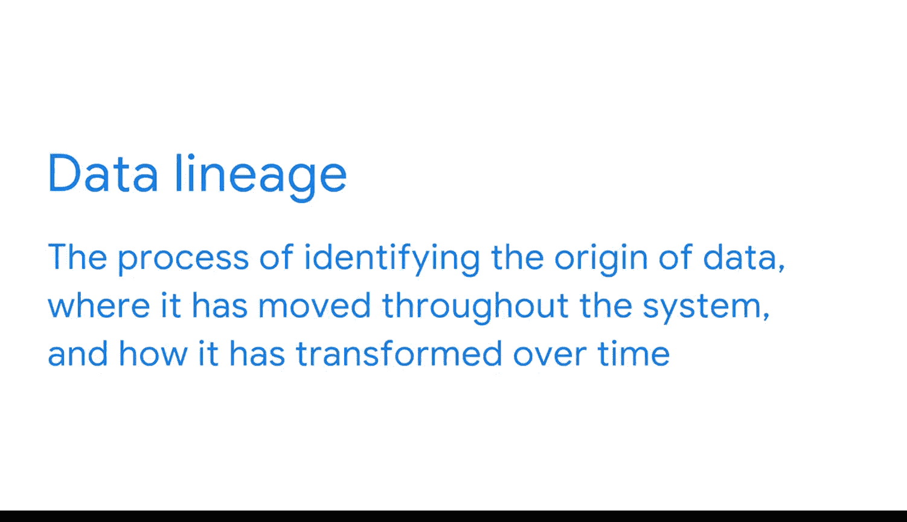

#  068：从源头到目标的合规性 📊

在本节课中，我们将要学习在ETL（提取、转换、加载）过程中，如何确保数据从源头到目标系统的合规性。我们将重点探讨三种关键工具：模式验证、数据字典和数据沿袭，它们如何共同作用以建立一致的数据治理。

你已经了解了很多关于质量测试在ETL过程中的重要性。现在你知道，这个过程的一个关键部分是检查合规性，即数据是否符合目标系统所需的格式。

为了确保从源头到目标的合规性，商业智能专业人员拥有三种非常有效的工具：模式验证、数据字典和数据沿袭。在本视频中，我们将研究它们如何帮助你建立一致的数据治理。

## 模式验证 🔍

首先，模式验证是一个确保源系统数据模式与目标数据库数据模式相匹配的过程。正如你所学习的，如果模式不匹配，可能会导致难以修复的系统故障。因此，将模式验证构建到你的工作流程中对于预防这些问题非常重要。

数据工具提供了各种模式验证选项，可用于根据目标模式的要求检查传入的数据。例如，你可以规定某一列只能包含数值数据。然后，如果你试图在该列中输入不符合要求的内容，系统将标记错误。或者在关系数据库中，你可以指定ID号必须是一个唯一的字段。这意味着如果与现有条目匹配，则不能添加相同的ID。通过这些属性生效，可以防止数据冗余。

如果数据不符合要求并抛出错误，你会收到警报。如果它满足要求，你就知道它是有效的并且可以安全加载。模式验证属性应确保三件事：键在转换后仍然有效；表关系得以保留；整个数据库中的命名约定保持一致。

### 确保键的有效性

让我们从键开始。正如你所学习的，关系数据库使用主键和外键来构建表之间的关系。当你将数据从一个系统移动到另一个系统后，这些键应继续发挥作用。例如，如果你的源系统使用客户ID作为键，那么它在目标模式中也必须是有效的。

### 保留表关系

这与模式验证的下一个属性相关：确保表关系得以保留。从源系统接收数据时，重要的是这些键在目标系统中仍然有效，以便关系仍可用于连接表，或者它们被转换以匹配目标模式。例如，如果客户ID键不适用于我们的目标系统，那么所有将其用作主键或外键的表都将断开连接。如果在移动数据时表之间的关系被破坏，那么数据将变得难以访问和使用，而这正是我们将数据移动到目标系统的全部原因。

### 保持约定一致

最后，你需要确保命名约定与目标数据库模式保持一致。有时，来自外部源的数据对列和表的命名使用不同的约定。例如，一个源系统可能使用“employeeID”（一个词）来标识该字段，但目标数据库可能使用“employee_I”。你需要确保这些是一致的，这样在尝试提取数据进行分析时才不会出错。

## 支持性文档工具 📚

除了模式验证属性本身，还有一些其他文档工具支持数据模式验证：数据字典和数据沿袭。

### 数据字典

数据字典是描述数据库内数据对象的内容、格式和结构及其关系的信息集合。你可能也听说过它被称为元数据存储库。你可能知道，元数据是关于数据的数据。这是商业智能中一个非常重要的概念。如果你想回顾谷歌数据分析证书中关于元数据的一些课程，现在就可以去学习。就数据字典而言，它们代表元数据，因为它们基本上使用一种类型的数据（元数据）来定义另一段数据的用途和来源。

以下是你的团队可能想要创建数据字典的几个原因：
*   它有助于避免整个项目中的不一致性。
*   它使你能够定义任何其他团队成员需要知道的约定，以便在团队之间建立更好的一致性。
*   最重要的是，它使数据更易于处理。

### 数据沿袭

现在让我们探讨数据沿袭。数据沿袭描述了识别数据来源、它在系统中的移动路径以及它随时间如何转换的过程。这很有用，因为如果你确实遇到错误，你可以追踪该数据的沿袭，并了解在过程中发生了什么导致了问题。然后，你可以制定标准，以避免将来出现同样的问题。

## 总结 ✨

本节课中我们一起学习了如何确保数据在ETL过程中的合规性。使用模式验证、数据字典和数据沿袭，商业智能专业人员可以有效地在数据从源头移动到目标时促进一致性。这意味着所有用户都可以对所创建的商业智能解决方案充满信心。我们很快将继续探索这些概念。