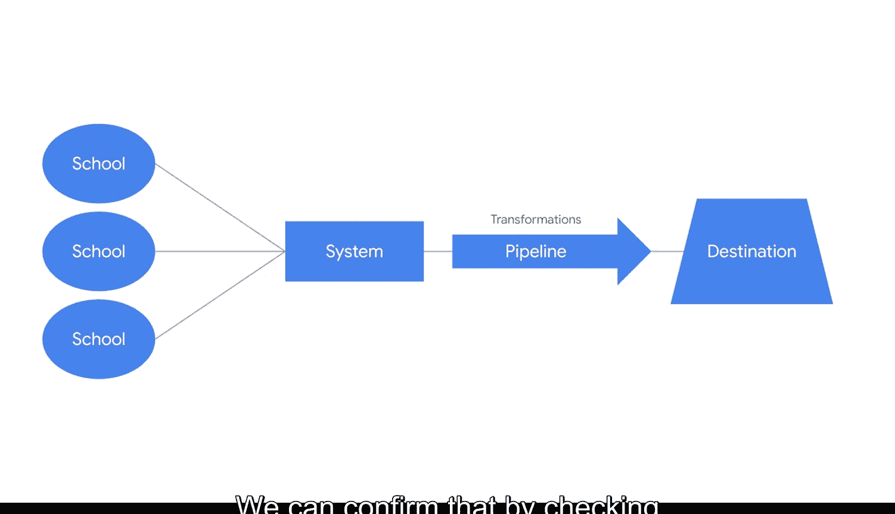

#  069：架构治理实战 🏛️

在本节课中，我们将通过一个真实案例来学习架构治理的实际应用。案例研究是理解抽象概念的最佳方式之一，它能生动地展示想法和概念在真实组织中的运作。

## 案例背景：教育非营利组织

上一节我们介绍了架构治理的概念，本节中我们来看看它在教育非营利组织中的具体应用。该组织的决策者希望衡量其社区的教育成果。为此，他们从学校数据库中提取数据，以评估学习目标、国家教育统计数据和学生调查结果。

由于他们从多个来源将数据提取到自己的数据库系统中，因此必须保持所有数据的一致性，以防止错误并避免丢失重要信息。幸运的是，该组织已经建立了数据字典和数据沿袭，以确立必要的标准。

## 数据字典的作用

以下是数据字典如何帮助维护数据标准的一个例子。我们以“学生信息表”中的一个列为例。该表包含五列：`student_id`、`school_system`、`school`、`age` 和 `grade_point_average`。

此表中的每一列都已在数据字典中记录，以明确其包含的信息。因此，我们可以查看 `school_system` 列的数据字典条目，以再次确认该表的标准。

作为回顾，**数据字典**是描述数据库中数据对象的内容、格式、结构及其关系的信息集合。该字典记录了四个特定属性：

以下是数据字典记录的四个属性：
*   **列名**：数据对象的标识符。
*   **定义**：对该列所包含信息的描述。
*   **数据类型**：数据在系统中的存储格式（如整数、文本）。
*   **可能值**：该列可以包含的具体数值或范围。

例如，`age` 列的字典条目告诉我们，该列的数据对象包含关于学生年龄的信息。它还告诉我们这是**整数类型**数据。我们可以利用这些属性将传入数据与目标表进行比较。

如果任何数据对象不是整数类型，那么在错误数据被提取到目标表之前，架构验证过程就会标记出该错误。

## 数据沿袭的追踪功能

那么，当一个数据对象未能通过架构验证过程时会发生什么？实际上，我们可以利用**数据沿袭**来追踪这片数据的旅程，并找出在流程的哪个环节可能需要添加质量检查。

再次强调，**数据沿袭**包含了关于数据起源、在系统中移动的路径以及随时间如何转换的信息。

在架构验证过程中，这片数据因为当前未被正确转换为整数类型而抛出了错误。当我们检查数据沿袭时，可以追踪该对象在我们系统中的移动路径。

这片数据最初存储于单个学校的数据库，然后被读取到学校系统的数据库中。我们数据管道提取了该学校的数据以及其他学校系统的数据，随后在移动过程中进行了组织和转换。显然，当这片数据最初输入学校原始数据库时，其类型转换就不正确。我们可以通过检查其在沿袭中的数据类型来确认这一点。

数据沿袭还包含了该数据迄今为止经历的所有转换。此时，我们可能还会注意到，在我们的质量检查转换过程中，并未内置类型转换的步骤。

这是个好消息。现在我们知道了，在数据被读取到目标表之前，我们应该将类型转换过程纳入数据管道中。在这个案例中，年龄数据对象应该是整数类型。

## 总结与展望

本节课中我们一起学习了架构治理和验证如何帮助改进系统并预防错误。通过数据字典定义标准，并通过数据沿袭追踪问题根源，我们可以持续优化数据处理流程。

除了架构验证，还有其他类型的测试应应用于数据管道以确保其正常运行，我们将在后续课程中进一步学习。现在，你已经对如何验证架构并持续改进管道流程有了更深入的理解。