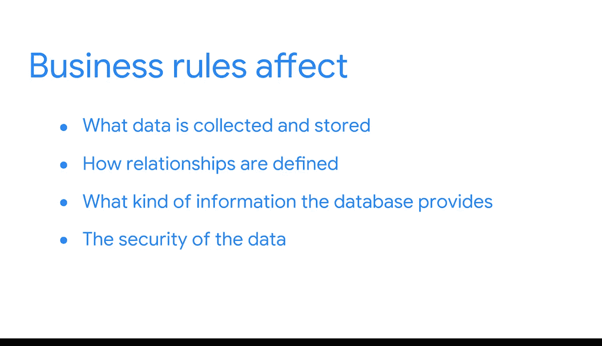

#  070：验证业务规则 📋

在本节课中，我们将要学习一个确保数据系统满足实际业务需求的关键环节：验证业务规则。我们将探讨业务规则的定义、重要性以及如何实施验证。

---

## 概述

到目前为止，我们已经学习了许多关于数据库性能、质量测试和模式验证的知识，了解了这些检查如何确保数据库和管道系统持续按预期工作。

现在，我们将探索另一项重要的检查：确保你所创建的系统与流程真正满足业务需求。这对于保证这些系统持续对利益相关者具有相关性至关重要。

---

## 什么是业务规则？

业务规则是一种对数据库特定部分施加限制的声明。

例如，一个物流数据库可能设定一条业务规则：**发货日期不能早于订单日期**。这可以防止订单日期和发货日期被混淆，从而避免系统内产生错误。

业务规则是根据特定组织使用数据的方式而创建的。在之前的课程中，我们发现，在构建数据库系统或ETL流程之前，观察企业如何使用数据非常重要。理解实际需求能指导设计，这对于业务规则同样适用。

你所创建的业务规则将深刻影响数据库的诸多设计方面：
*   收集和存储哪些数据。
*   如何定义数据间的关系。
*   数据库提供何种信息。
*   数据的安全性。

这有助于确保数据库按预期运行。

---

## 业务规则的多样性与动态性

每个组织的业务规则都不同，因为组织与其数据的交互方式总是独特的。此外，业务规则也总是在变化，这就是为什么记录存在哪些规则及其原因至关重要。

以下是另一个例子。考虑一个图书馆数据库。用户（在本例中是图书管理员）的主要需求是借阅图书和维护读者信息。

因此，该图书馆可能会在数据库中设定一些业务规则来规范系统：
*   一条规则可能是：**图书馆读者一次最多只能借阅五本书**。数据库将阻止用户借出第六本书。
*   或者，数据库可以有一条规则：**同一本书不能同时被两个人借出**。如果有人尝试，系统会提醒图书管理员存在重复借阅。
*   另一条业务规则可能是：**必须为新书在系统中录入特定信息，才能将其添加到图书馆库存中**。

---

## 验证业务规则

本质上，验证涉及确保导入目标数据库的数据符合业务规则。除此之外，这些规则是重要的知识片段，能帮助商业智能专业人员理解企业及其流程如何运作。这有助于商业智能专业人员成为领域专家和值得信赖的顾问。

你可能已经注意到，这个过程与模式验证非常相似。

在模式验证中，你获取目标数据库模式，并将传入数据与之比较。未通过此检查的数据不会被摄取到目标数据库中。

类似地，在将数据加载到数据库之前，你会将传入数据与业务规则进行比较。

在我们的图书馆例子中，如果一位读者提交了借书请求，但他已经从图书馆借了超过五本书，那么这条传入数据就不符合预设的业务规则，系统会阻止他借出这本书。

---

## 总结

本节课中，我们一起学习了验证业务规则的基础知识。这些检查非常重要，因为它们能确保数据库按预期完成工作。由于业务规则对数据库的运作方式如此不可或缺，验证其正确运行也就至关重要。

接下来，你将有机会更详细地探索业务规则。