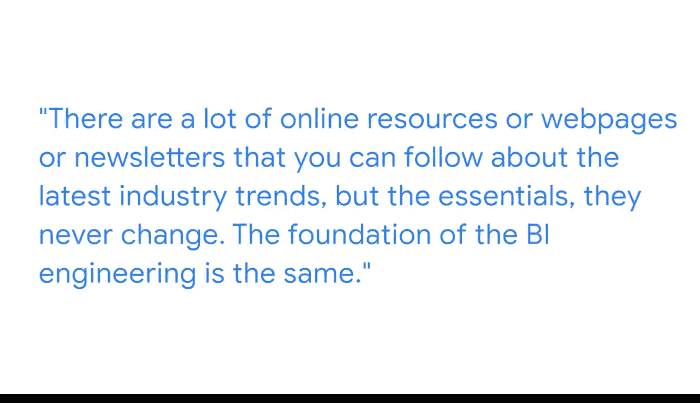

#  071：技术演进趋势 📈

在本节课中，我们将跟随谷歌商业智能工程师Barak的分享，了解商业智能（BI）领域的技术演进趋势、核心技能要求以及如何规划个人学习路径。

## 概述

商业智能工程师负责收集、存储和分析数据，其中涉及大量基础设施。过去十年间，BI技术经历了巨大变革。本节将探讨这些变化，并分析从业者应如何适应不断发展的技术环境。

## 技术演进：从电子表格到云端

上一节我们介绍了BI工程师的核心职责，本节中我们来看看技术本身是如何演进的。

十年前，电子表格（Spreadsheets）是数据分析的主要工具。如今，虽然仍有人用它进行快速分析，但整个行业已转向云端技术、更复杂的编程语言以及更强大的可视化工具。这意味着从业者必须持续学习新的语言和基础设施，以跟上技术发展的步伐。

## 如何跟上行业趋势

为了适应变化，你需要进行一些研究，以理解行业实际的演进方向。

以下是跟上行业趋势的几种方法：
*   关注在线资源、网页或行业通讯，了解最新趋势。
*   认识到核心基础技能是永恒不变的。例如，**SQL**语言是基础，尽管不同组织使用的SQL方言可能不同。
*   掌握基础后，学习新变体所需的时间将大幅减少，因为存在可迁移的技能。

## 给初学者的核心建议

对于希望进入此领域的人，首要建议是**专注**。

如果你真正热爱与数据打交道，并希望在此领域工作，专注是关键要求之一。因为需要学习大量技术技能，这需要时间投入。

## 确定你的专业方向

因此，我建议你明确自己想要专注于BI工程的哪个具体领域。

BI工程包含多个部分，你的选择将决定需要学习的技术技能组合。以下是几个主要方向：
*   **构建基础设施**：专注于数据管道和存储系统。
*   **设计系统**：负责整体的数据架构和流程设计。
*   **分析数据**：深入数据进行洞察和建模。
*   **开发可视化工具**：创建报表和数据看板。

## 总结

本节课中我们一起学习了BI技术的演进历程，从过去的电子表格发展到如今的云端和高级工具。我们了解到，尽管技术不断变化，但核心基础技能（如**SQL**）是持久的。对于初学者而言，关键在于保持**专注**，并尽早确定自己希望深入的专业方向（如基础设施、系统设计、数据分析或可视化），从而有针对性地学习所需技能。持续关注行业趋势，并利用可迁移的技能，能帮助你在快速变化的技术环境中保持竞争力。