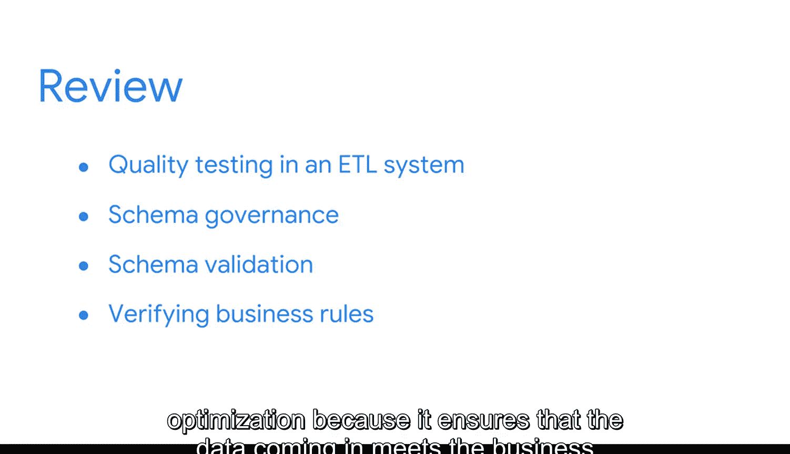

#  072：总结回顾

在本节课中，我们将回顾作为商业智能（BI）专业人士在构建数据系统后，为确保其持续有效运行所需掌握的关键维护与优化概念。

上一节我们探讨了数据质量测试和业务规则验证的重要性，本节中我们来看看如何维护存储系统以及优化数据管道。

---

作为一名BI专业人士，你的工作并非在为公司构建完数据库系统和管道工具后就结束了。

确保这些系统持续按预期工作，并在潜在错误演变成问题之前处理它们，同样至关重要。

为了应对这些持续性的需求，你已经学习了很多知识。

首先，你探索了在ETL系统中进行质量测试的重要性。

这涉及检查输入数据的以下方面：

以下是数据质量测试的核心维度：
*   **完整性**：数据是否完整无缺失。
*   **一致性**：数据在不同来源或系统中是否保持一致。
*   **合规性**：数据是否符合预定义的格式和标准。
*   **准确性**：数据是否正确反映了真实世界的情况。
*   **冗余性**：数据是否存在不必要的重复。
*   **完整性**：数据关系（如外键约束）是否保持完整。
*   **及时性**：数据是否在需要时可用。

接着，你研究了**模式治理**，以及**模式验证**如何通过确保输入数据符合目标数据库的模式属性，来防止其引发系统错误。这可以防止因数据结构不匹配导致的处理失败。

之后，你发现了验证**业务规则**是优化过程中的一个重要步骤，因为它能确保输入的数据满足使用该数据的组织的业务需求。

---

维护用户与之交互的存储系统，是确保你的系统满足业务需求的重要组成部分。

这就是**数据库优化**如此重要的原因。

但确保在不同位置间移动数据的系统尽可能高效，也同样重要。

而这正是**优化管道和ETL系统**的用武之地。

---

接下来，你将迎来另一次评估，相信你能顺利完成。

提醒一下，在准备过程中，你可以复习任何学习材料以及最新的术语表。

因此，在评估前，请随时重温任何视频或阅读材料以巩固记忆。

在此之后，你将有机会通过亲自开发BI工具和流程，将所学的一切付诸实践。

你在通往BI职业的道路上取得了出色的进展。

---

本节课中我们一起学习了BI系统构建后的持续维护策略，包括数据质量测试、模式治理、业务规则验证，以及数据库和管道的优化。掌握这些知识能确保你构建的数据基础设施稳定、高效且持续满足业务需求。