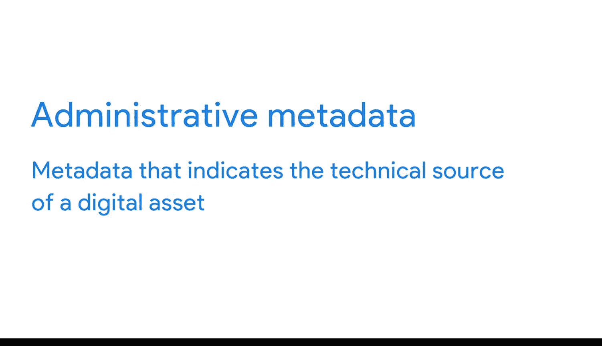

#  074：元数据 📊

在本节课中，我们将要学习一个数据库管理中的核心概念——**元数据**。我们将了解什么是元数据，它在数据分析中的重要性，以及数据分析师在工作中会遇到的三种主要元数据类型。

## 什么是元数据？

上一节我们介绍了在数据库中组织数据的不同方式。本节中，我们来看看如何描述这些数据。

**元数据**是用于描述数据的数据。它不是数据本身，而是关于数据的信息。在数据分析中，元数据帮助分析师理解和解释数据库中数据的内容，从而使其能够被用于解决问题和做出数据驱动的决策。

为了理解这个抽象概念，让我们从一些日常例子开始。

## 日常生活中的元数据示例

以下是元数据在我们生活中的两个常见应用：

*   **照片元数据**：当你用智能手机拍照时，设备会自动收集并存储关于这张照片的信息。例如，文件的类型、拍摄的日期和时间、地理位置（拍摄地点）以及使用的设备型号。
*   **电子邮件元数据**：每次发送或接收电子邮件时，元数据会随消息一同传递。这包括邮件的主题、发件人、收件人、发送日期和时间，甚至邮件从发送到送达所花费的时间。

## 数据分析中的元数据类型

作为数据分析师，你通常会遇到三种常见的元数据类型：**描述性元数据**、**结构性元数据**和**管理性元数据**。

### 描述性元数据

描述性元数据用于描述和标识数据，以便在后续时间点能够找到它。

以图书馆中的一本书为例，其描述性元数据包括：
*   书脊上的代码，即**唯一的国际标准书号**。
*   书的作者。
*   书的标题。

### 结构性元数据

结构性元数据指示数据的组织方式，以及它是否属于一个或多个数据集合。

再次以图书馆为例，结构性元数据的一个例子是：
*   一本书的页面如何组织成不同的章节。

此外，结构性元数据还跟踪两个事物之间的关系。例如，它可以表明一份书籍手稿的电子文档实际上是当前印刷版书籍的原始版本。

### 管理性元数据

管理性元数据指示数字资产的技术来源。

我们之前查看照片信息时，看到的就是管理性元数据。它显示了文件的类型、拍摄的日期和时间等信息。

## 理解元数据：一个类比

最后，用一个类比来帮助你理解元数据：如果你想去图书馆借一本书，你可以先研究这本书的标题、作者、页数和章节数——这些都是元数据，它们能告诉你很多关于这本书的信息。但是，你必须真正阅读这本书，才能知道它的具体内容。

同样，你可以阅读关于数据分析的知识，但你必须完成本课程才能获得谷歌数据分析证书。所以，请继续前进，以获得新的视角。

---

本节课中我们一起学习了**元数据**的概念。我们了解到元数据是“关于数据的数据”，它对于理解和有效使用数据库中的数据至关重要。我们还探讨了数据分析中三种主要的元数据类型：**描述性**、**结构性**和**管理性**元数据，并通过日常例子和类比加深了理解。掌握元数据是成为 proficient 数据分析师的关键一步。