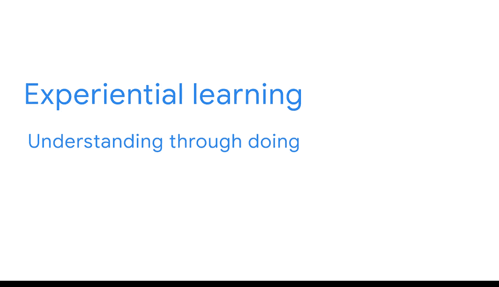

#  075：欢迎来到模块4

在本节课中，我们将学习如何利用课程期末项目来构建你的职业作品集，并为求职面试做好准备。我们将探讨作品集的重要性、如何通过项目展示技能，以及如何将课程所学转化为求职优势。

大家好，很高兴再次与大家见面。我是安妮塔，谷歌的高级商业智能分析师。

我将回来讨论你们课程期末项目的下一部分，以及如何将其用于求职。

你准备好开始在商业智能领域求职了吗？第一步是创建一个能展示你技能的作品集和简历。

你的作品集将是一系列材料的集合，可用于展示你的技能以及解决商业智能问题的方法。

构建作品集的一种方法是完成能够展示你所学知识的项目，例如本课程的期末项目。

这个期末项目也是一个非常宝贵的机会，可以锻炼你的面试技巧。当潜在雇主评估你时，他们可能会询问你过去如何应对挑战的具体例子。

你可以利用你的作品集来讨论你解决过的实际问题。

此外，一些雇主可能会在面试中要求你完成另一个案例分析。通过练习创建自己的案例分析，意味着你将能为这些面试做好更充分的准备。

你已经探索过体验式学习，即通过实践来理解的理念。

这个期末项目也是一个绝佳的机会，可以真正了解组织如何日常使用商业智能，练习你的新技能，并充分展示你的商业智能知识。

为了完成期末项目，你将获得关于业务案例的更多细节。

然后，你将使用你完成的关键商业智能文档，创建一个将数据输送到报告表的管道系统。

之后，你可以使用这些表来设计数据看板，与利益相关者分享洞察。

当你完成这个项目时，你将拥有一个可以添加到作品集中的完整案例分析。

你还将拥有记录你每一步过程的文档，可用于向未来的招聘经理解释你的工作。

目前，你可能已经完成了期末项目的一部分。现在，你即将完成本课程的下一部分，这意味着你已经掌握了应对下一阶段所需的一切知识。

准备好了吗？那么让我们开始吧。

---

在本节课中，我们一起学习了如何将课程期末项目转化为求职的有力工具。我们明确了构建作品集的重要性，了解了如何通过实际项目展示技能，并认识到完成案例分析对面试准备的帮助。接下来，我们将深入项目细节，开始构建你的商业智能管道系统。