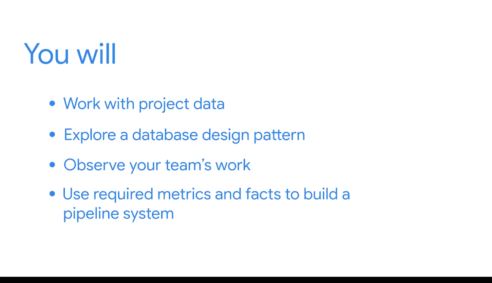

**谷歌商业智能课程：第37章：继续您的课程期末项目**

在本节课中，我们将把之前学到的数据库设计、BI工具（如管道和ETL系统）构建以及性能优化知识，应用到课程期末项目中。我们将开始处理项目数据，构建自动化关键流程的BI工具。

---

在之前的课程中，我们已经了解了项目场景、案例细节，并制定了利益相关者需求、项目需求和战略文档。现在，项目的重要基础已经奠定，是时候开始思考数据部分了。

本节课程中，我们将开始使用数据库，以创建能够自动化关键流程的BI工具。这些流程包括在将数据读取到报告用的目标表之前，对数据进行移动和转换。

---

接下来，您将执行以下步骤：

以下是项目启动的核心步骤列表：

1.  **访问项目数据**：获取并熟悉项目所需的数据集。
2.  **探索数据库系统设计模式**：理解数据库的结构和关系设计。
3.  **观察团队工作以确定需求**：分析团队成员如何使用数据，明确他们的具体需求。
4.  **使用必需的指标和事实构建管道**：基于需求，构建数据管道来处理和转换数据。

---

这些流程将使您的团队能够将时间集中在日常工作的其他方面，同时自动完成数据的移动和转换，以便立即用于报告和仪表板。

这些报告和仪表板将为您的利益相关者提供最新的洞察，并使他们能够直接从数据中获取答案。

课程期末项目的这一部分是向潜在雇主展示您具备此项能力的绝佳机会。请记住，开发这些工具是一个迭代的过程，因此您可以：

`while (has_new_ideas || learns_new_things) { continue_to_build_and_improve(); }`

---

**总结**

本节课中，我们一起学习了如何将数据库设计、管道构建和ETL系统知识应用于期末项目。我们概述了启动项目的步骤：访问数据、探索设计、明确需求并构建管道。这个过程是迭代的，旨在自动化数据处理，为生成洞察力的报告和仪表板提供支持。