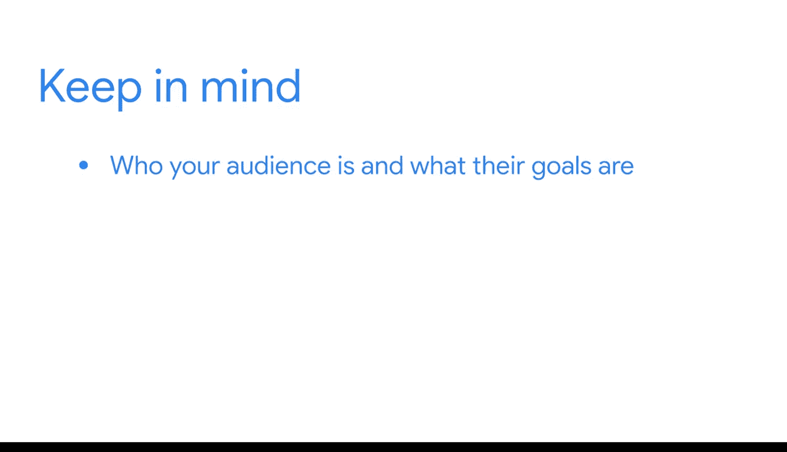

**谷歌商业智能课程：期末项目：持续成功技巧**

在本节课中，我们将探讨如何展示你的期末项目成果，使其成为求职时的有力工具。我们将学习如何向潜在雇主清晰阐述你的工作流程、技能和项目价值。

---

在期末项目的这个阶段，你已经完成了大量工作。

你已经与利益相关者协作，确定了他们的需求，并创建了重要的项目规划文档。

随后，你利用这些文档探索了项目数据，并构建了系统来交付数据。

当你继续完善期末项目时，需要考虑如何突出你的工作流程，并向潜在雇主和招聘经理解释你所完成的工作。

---

首先，重要的是认识到，作为一名商业智能专业人士，你可能需要学习并适应新的工具。市场上有许多优秀的解决方案，不同的企业根据其需求会使用不同的商业智能工具。

请记住，你已经学到了许多可迁移的技能，这些技能可以应用于不同的工具。

你也理解了观察和理解利益相关者如何使用数据的重要性，以便更好地满足他们的数据需求。

你认识了不同类型的数据库和存储系统，以及它们如何在更大的数据库系统中发挥作用。你理解了数据管道背后的逻辑，即**数据摄取、转换和交付**。这些都是在求职面试中值得强调的技能，无论职位要求使用何种工具。

---

此外，务必始终考虑你的受众。正如你在整个课程中所学到的，你经常需要与具有不同技术水平的不同类型的利益相关者合作。

当你与他们沟通时，请记住他们是谁、他们的目标是什么、他们已经知道什么以及他们需要知道什么。

---

这一点在你与面试官讨论期末项目时同样适用。通常，参与或旁听你面试的人不一定都是商业智能专业人士。

例如，招聘经理可能不像你那样对商业智能流程有详细的了解。

为了让你的展示与他们相关，请尝试记住关于受众的那些关键问题。

你的面试官面临一个业务挑战，就像商业智能项目中的利益相关者一样。他们有一个空缺的职位需要填补。思考他们需要了解你的哪些信息，以便做出解决这个挑战的决定。

---

接下来，我们将学习如何向利益相关者展示商业智能洞察，并为他们提供可用于决策的相关数据访问权限。

在本课程结束时，你将通过创建数据看板和演示文稿来完成你的期末项目。很快，你就将拥有一个完整的作品集案例研究。

---

**总结**

本节课中，我们一起学习了如何将期末项目转化为求职优势。关键点包括：强调可迁移的技能、理解数据管道的核心逻辑（**数据摄取、转换和交付**）、以及在沟通时始终以受众为中心。记住，向面试官展示项目，就如同向项目利益相关者汇报，需要清晰阐述你如何理解需求、解决问题并交付价值。准备好这些，你的项目就能成为展示你商业智能专业能力的绝佳案例。