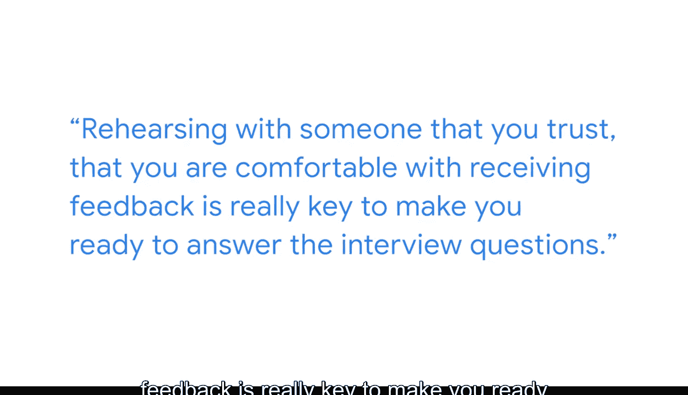

#  078：路易斯的面试准备建议 🎯

在本节课中，我们将学习来自谷歌数据与分析经理路易斯的面试准备建议。课程将涵盖如何系统性地准备面试，包括理解职位、准备作品集、展示技术影响力以及进行有效演练。

---

## 面试前的系统性准备 📝

上一节我们介绍了课程概述，本节中我们来看看如何进行面试前的系统性准备。

我叫路易斯，是谷歌的数据与分析经理。当我准备面试时，我喜欢准备一份文档，在其中描述以下内容：

以下是准备文档应包含的核心要素：
*   **职位理解**：描述目标职位是什么。
*   **面试类型**：分析该公司典型的面试问题和面试形式。
*   **团队与组织**：了解我所申请的职位所在的团队或组织。
*   **团队项目**：研究帮助该团队成长和取得卓越成就的项目。
*   **技术准备**：准备技术层面的内容。

具体而言，需要准备作品集，理解我想要展示的影响力，确保这些内容与公司战略保持一致，并至少花两周时间为首次面试做好充分准备。

---

## 打造你的个人品牌：作品集 🎨

上一节我们讨论了系统性准备，本节中我们来看看如何通过作品集打造个人品牌。

**作品集**是你过去经验和项目的集合，你认为这些内容有助于向面试官展示你的能力。本质上，它就是你的个人品牌。

你需要确保项目能够展示你品牌的价值。我通常看到的一个常见错误是，在技术层面缺乏对影响力的展示。

以下是准备作品集时需注意的关键点：
*   **明确目的与结果**：确保你理解为何创建某个数据解决方案，其成果是什么。
*   **量化影响力**：明确其影响力，以及你如何衡量该影响力。
*   **解释方案选择**：确保你能够解释为何选择特定解决方案，而非其他方案。
*   **规划后续步骤**：确保你能够定义并解释基于此解决方案的下一步可以做什么。

---

## 关键演练与反馈 🔄

上一节我们介绍了如何准备作品集，本节中我们来看看面试前的关键演练步骤。

当你准备面试时，确保与其他人进行模拟面试练习。这一点非常重要。

以下是进行有效演练的核心要点：
*   **传递正确信息**：确保你能够传达正确的信息。
*   **聚焦影响力**：将重点放在影响力上。
*   **最佳自我展示**：确保你能够以最佳方式推销自己。

你需要为面试做好充分准备。与你信任的人、你乐于接受其反馈的人进行演练，是让你准备就绪的关键。

---

## 超越课程：拓展人脉与交流 🤝

上一节我们探讨了面试演练，本节中我们来看看如何超越课程内容，为职业发展铺路。

如果商业智能确实是你想追求的道路，学习本课程是迈出的非常好的第一步。但你不应止步于此。

以下是推动你职业发展的建议：
*   **走出去交流**：走出去与人们交流。围绕数据和商业智能有众多的线下聚会。
*   **融入社群**：不要觉得你在这条路上是孤独的。有很多人可以帮你拓展人脉、建立联系。
*   **分享与学习**：你将能够分享知识，同时也能从他人那里获得知识。

---

## 总结 📚

本节课中，我们一起学习了路易斯关于商业智能岗位面试的系统性准备方法。我们了解了如何通过准备文档来深入理解职位和团队，如何打造一个能清晰展示技术影响力和个人品牌价值的作品集，以及通过模拟面试演练来优化自我展示。最后，我们认识到持续学习、积极拓展行业人脉和交流对于职业成长至关重要。记住，充分的准备和主动的社区参与是迈向成功的关键。