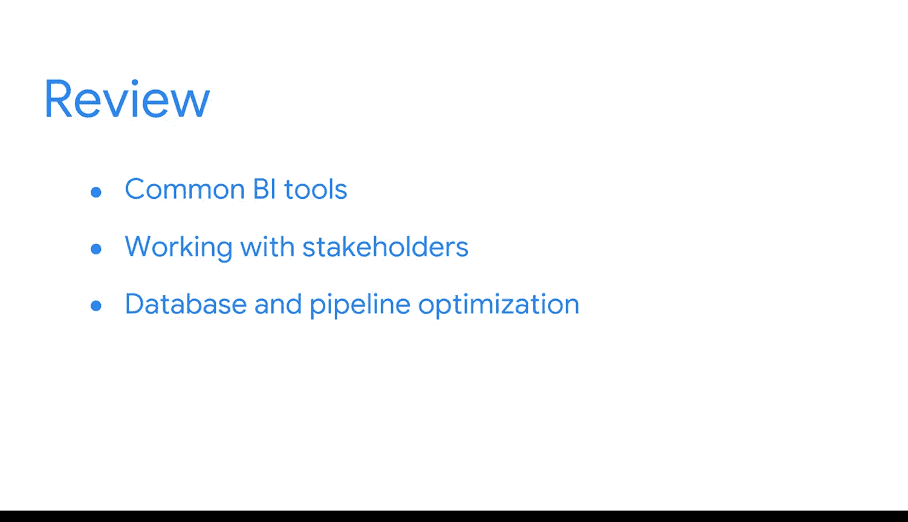

#  079：课程总结

在本节课中，我们将对已完成的课程内容进行回顾与总结，梳理在数据库建模、数据管道及BI工具等方面所学的核心知识。

恭喜你完成了又一门课程。你离完成整个项目并获得证书又近了一步。

你已经学到了很多知识，现在可以花点时间回顾一下本课程涵盖的所有内容。

## 🗂️ 核心知识回顾

以下是我们在本课程中探讨的几个关键领域。

*   **数据库建模与设计**：你学习了数据库建模、设计模式，以及如何使用数据库模式来描述这些设计模式。
*   **数据库类型与用途**：你了解了多种类型的数据库，以及它们在数据库系统内的不同用途。
*   **数据管道与处理**：接着，你探索了数据管道，以及ETL和ELT过程如何帮助将数据送达所需之处，并在此过程中对其进行转换以使其变得有用。
*   **数据存储系统**：你还学习了在管道中可能用到的不同数据存储系统。
*   **BI工具与协作**：此外，你探索了更常见的BI工具以及如何有效地与利益相关者互动。你甚至有机会创建了自己的管道。
*   **流程优化**：随后，通过探索数据库和管道优化，你能够思考BI流程和系统通常是迭代式的。

## 🚀 后续学习展望

在回顾了坚实的基础之后，接下来你将迎来更令人兴奋的发现。

既然你已经理解了如何创建系统以向利益相关者交付数据，现在是时候开始思考如何呈现这些数据，并使其易于访问和用于决策。

在下一门课程中，你将学习更多关于如何为BI设计可视化和仪表板，并呈现这些见解的知识。

到目前为止，做得非常出色。

---

**本节课总结**：我们一起回顾了数据库建模、多种数据库的应用、数据管道（ETL/ELT）的构建、数据存储系统的选择、BI工具的使用以及与利益相关者的协作方法。这些知识构成了商业智能系统的基石。接下来，我们将进入数据呈现与决策支持的阶段，学习如何通过可视化和仪表板将数据转化为清晰的见解。