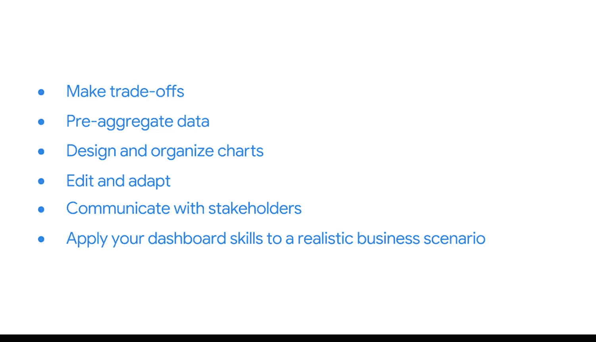

#  080：课程介绍

在本节课中，我们将要学习商业智能（BI）专业人士的核心工作流程，并重点介绍数据监控与报告的重要性。课程将引导你了解如何通过创建有效的仪表板来支持业务决策。

当一位商业智能专业人士开展项目时，他需要同时处理多项任务。

他们应用有效的BI实践和工具，以产生积极影响。

他们与利益相关者沟通并管理其期望。他们提取数据、转换数据并加载数据。他们优化和维护数据库。

然后，他们将开始BI专业人士角色中下一个令人兴奋的部分：监控与报告。

这些活动汇集了BI的各个方面，以产生一个可用的工具——能够被他人分享和理解的可视化数据。毕竟，分享数据才能使其发挥力量。这是信息转化为智能的关键途径之一。

欢迎来到谷歌商业智能证书的最终课程。

我是你们的讲师Ternce，是谷歌的一名商业智能分析师。

我很高兴能与你们一起探索数据监控与报告。作为谷歌的BI分析师，我的职责是深入理解利益相关者试图解决的问题，并进一步利用我们的数据为这些问题提供解决方案。

有时，这些解决方案是简单的数据查询或报告中的数字表格，但最好的解决方案通常是带有交互式可视化的仪表板，它能立即将注意力引向最重要的趋势和洞察。这可以为你的团队节省大量工作时间。

在本课程中，我们将专注于为利益相关者构建可视化和报告。为此，BI专业人士会创建可视化和仪表板，以监控随时间变化的数据并持续回答业务问题。

然后，他们将这些仪表板呈现给利益相关者，并随着时间推移不断改进。这使得企业能够使用专门构建的监控工具做出快速、明智的决策。需要提醒的是，仪表板是一种监控实时传入数据的交互式可视化工具。

你可以为各种目的创建仪表板，但BI专业人士主要使用它们来展示为特定业务目的而收集、分析和跟踪的数据。

在本课程中，你将学习设计仪表板、沟通其范围，并随着业务需求的发展改进可视化效果。

首先，你将了解为了准备合适的仪表板，需要知道关于项目的哪些信息。

你将探索如何通过为仪表板设计交互性来赋能利益相关者。

你还将获得关键的工具和技术来自行设计仪表板。

首先，你将制定一个创建仪表板原型的计划。然后，你将探索Tableau——一个常用的数据可视化工具，它将使你能够在接下来的练习中设计自己的仪表板和演示文稿。

你将学习如何做出适当的设计权衡，以及是否在SQL中预先聚合你的数据。

接着，你将着手设计图表，并将它们组织成简单有效的仪表板。

你将优化你的可视化效果，以适应不断变化的业务需求。

此外，你将获得一些与利益相关者进行演示和沟通的绝佳策略。

与用户就业务需求和项目范围进行清晰的对话，有助于你为利益相关者、客户或用户创建最佳工具。你肯定会运用这些沟通技巧来分享你的工作，并开启你作为BI专业人士的职业生涯。

一旦你掌握了这些技能，你将有机会在一个真实的业务场景中应用它们。你将评估利益相关者的需求，并决定如何最好地规划、构建和迭代一个仪表板。

那么，让我们开始吧。我迫不及待地想与你分享BI这个激动人心的世界。

---

**本节课总结**

本节课我们一起学习了商业智能专业人士的工作全景，特别是数据监控与报告的核心地位。我们明确了仪表板作为交互式工具的价值，并概述了本课程将带你从理解需求、设计原型、使用工具（如Tableau）、做出技术权衡，到最终呈现和迭代仪表板的完整学习路径。准备好开启你的BI仪表板构建之旅吧。