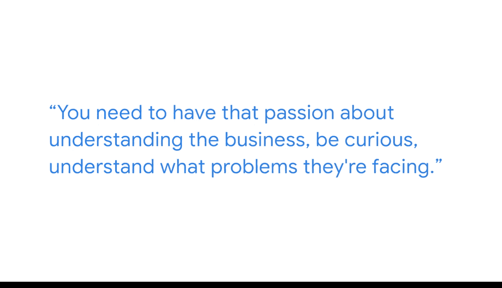

#  081：特伦斯-作为商业智能分析师的一天

在本节课中，我们将跟随谷歌商业智能分析师特伦斯的分享，了解他日常工作的核心内容、所需技能以及他对这个领域的深刻见解。你将了解到商业智能分析师如何连接数据与业务决策，以及驱动成功的核心素质。

我是特伦斯，是谷歌的一名商业智能分析师。我的团队隶属于谷歌财务组织下的一个核心数据与分析团队。我们的工作是帮助公司在人员编制、资金投资、基础销售、收入表现和盈利能力等相关方面做出决策。我们提供各类指标，以支持财务工作范围内的决策制定。

对于商业智能领域，我并没有接受过学校里的正式培训。我的职业生涯始于一名传统的财务分析师。后来，我发现自己被编写SQL、创建数据管道这类工作所吸引，这些工作能让数据变得对每个人都有用。当时，商业智能这个角色正逐渐崭露头角，而我发现自己确实被它深深吸引。

在我的日常工作中，就商业智能工具而言，我更多地偏向项目管理侧。这要求我对团队使用的工具有非常深入的了解，这些工具最终会被我们的数据工程师用来构建数据管道。无论是**Google Cloud Platform**和**BigQuery**，还是最终的数据看板工具，我都需要涉猎。我会全程跟进项目，从概念构思开始，理解数据来源，评估项目可行性，到确认数据是否以可被提取和转换的形式存在。

我最重要的心得之一是：最简单的解决方案往往是最强大的。而真正理解这些解决方案是什么的唯一途径，就是坐下来，真正从你的利益相关者和用户那里理解他们想要解决什么问题。

你必须拥有好奇心。你必须怀有强烈的热情，去主动了解：你们的业务是如何运作的？你们面临什么问题？你们试图回答哪些问题？你们的日常工作是什么样的？你必须先建立这种基础性的、然后深入的理解，才能真正利用那些可能对你可用的数据，并更进一步，从中提炼出重要的洞见，让他们能够基于以前甚至不知道存在的数据来做出决策。

你需要对理解业务怀有热情。保持好奇，理解他们面临的问题。最终，这正是我觉得这个领域真正有趣的地方：能够有机会、被授权去理解业务面临的问题，并利用数据为这些问题提出真正富有创造性的解决方案。

本节课中，我们一起学习了商业智能分析师在谷歌财务团队中的角色与日常工作。特伦斯分享了他的职业路径，从财务分析师转向BI，并强调了项目管理、技术工具理解（如**GCP**和**BigQuery**）以及全程跟进项目的重要性。他指出了成功BI分析师的核心在于对业务的深刻理解、强烈的好奇心，以及将简单方案转化为强大洞察的能力。关键在于通过数据创造性地解决实际业务问题。