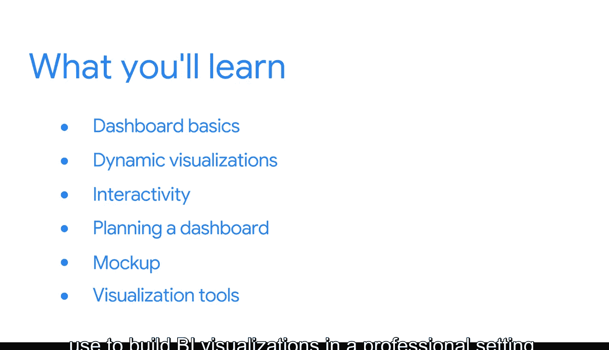

#  082：欢迎来到模块1 🚀

在本模块中，我们将学习商业智能仪表板的基础知识，探索其与其他数据分析仪表板的区别，并了解动态可视化在回答业务问题中的强大作用。我们还将学习规划仪表板的具体步骤，包括创建线框图，并介绍在专业环境中构建BI可视化可能用到的工具。

## 什么是BI仪表板？📊

在接下来的课程中，我们将探索BI仪表板的基础知识，并了解它们与其他类型的数据分析仪表板有何不同。

我们还将发现动态可视化是回答业务问题的绝佳方式，尤其是当这些问题的答案会随时间变化时。

## 仪表板的交互性与规划 🛠️

你将学习仪表板的交互性如何赋能于你为之构建的利益相关者。

同时，我们将深入探讨规划仪表板时需要采取的具体步骤。为此，你甚至将创建自己的线框图，这是仪表板构建过程中的关键一步。

以下是规划仪表板的核心步骤：
*   明确业务问题与目标用户。
*   确定关键绩效指标与数据来源。
*   设计线框图，规划布局与交互逻辑。
*   选择并利用合适的工具进行开发。

## 工具准备与课程展望 🎯

最后，你将了解在专业环境中构建BI可视化可能使用的各类工具。

如果你尚未准备，你需要安装并设置Tableau，这是本课程中将使用的可视化工具。

接下来的课程将为你的仪表板学习之旅奠定基础。