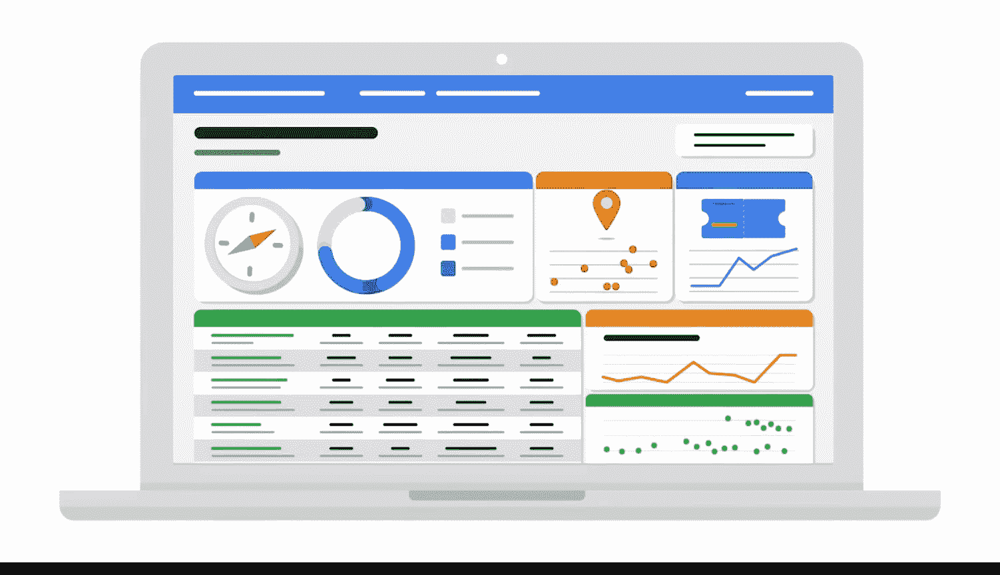

#  083：商业智能中的数据可视化 📊

在本节课中，我们将要学习数据可视化在商业智能（BI）中的独特角色和应用。我们将探讨它与数据分析（DA）中可视化的区别，并理解BI可视化如何支持长期的、动态的业务决策。

---

你可能知道，数据可视化是数据的图形化表示。

也许你甚至有一些创建图表、图形和其他类型数据可视化的经验。如果你已经获得了谷歌数据分析师证书，你探索了许多关键的数据可视化概念，包括可访问性和设计思维。如果你愿意，可以在继续前进之前花些时间重温这些课程。

因此，你对数据可视化有一些熟悉度。

但你是否知道，数据分析可视化与商业智能可视化并不完全相同？

在许多方面，它们非常相似。两者都是数据的视觉表示，旨在向解读它们的人传达洞察。它们的目标是以清晰且易于理解的方式分享数据。

然而，它们在**上下文**上有所不同。

一个数据分析（DA）可视化旨在回答一个具体的业务问题，例如：**“我们公司今年的收入趋势如何？”**。这个图表仅使用现有数据。

另一方面，一个商业智能（BI）可视化寻求**长期**回答这个问题。因此，BI专业人员可能会问：**“收入年同比趋势如何？以及与收入相关的哪些其他指标可能预示着收入趋势即将发生变化？”**

一个BI可视化跟踪或监控与一个持续存在的业务问题相关的数据。这意味着有时它是为尚不存在的数据而构建的。

此外，来自数据分析可视化的洞察通常用于做出一个重要的业务决策。然而，BI可视化用于现在做出一个决策，但未来随着跟踪数据的更新和新洞察的出现，会做出另一个决策。

通过这种方式，BI可视化通常比静态图表更**动态**，这意味着它们是交互式的或会随时间变化。

---

在创建数据看板时，BI专业人员采取的方法与数据分析师不同。这是因为他们的工作超越了构建和设计看板，还包括随着时间的推移对其进行维护。

以下是具体步骤，说明BI专业人员如何维护一个动态的数据看板：

以下是BI专业人员维护动态数据看板的步骤示例：

1.  **初始设计与构建**：BI专业人员设计一个包含多种图表类型的看板，以便用户轻松识别关键指标和KPI。
2.  **监控与接收反馈**：随着时间推移，行业或业务需求可能发生变化。利益相关者可能会提出新的需求。
3.  **评估请求**：BI专业人员负责解读利益相关者的请求，评估其合理性和可行性。
4.  **实施更新**：将合理的更新请求实施到看板中，例如添加新的KPI或重新排列视觉元素。
5.  **持续迭代**：通过不断更新，确保看板能够长期为决策提供信息、解决问题并回答关键问题。

例如，假设一家航空公司的BI专业人员为利益相关者设计了一个看板，用于监控未来10年的新飞机需求。他们包含了六种不同的图表类型，以便用户可以轻松识别与消费者旅行频率、飞机有用生命周期、新飞机需求等相关的关键指标和KPI。

但如果行业发生了变化，利益相关者可能会要求新的KPI、不同的视觉元素排列或类似的更新。BI专业人员的职责就是解读他们的请求，判断其是否合理可行，并将其落实到看板中。

这样，看板就能长期地为决策提供信息、解决问题并回答关键问题。

正如你所了解的，主动响应变化并保持持续有用的能力是商业智能的重要组成部分。

---

下一节，我们将更深入地探讨如何通过数据可视化赋能利益相关者。

---

本节课中，我们一起学习了商业智能中数据可视化的核心特点。我们明确了BI可视化与DA可视化的关键区别在于其**长期性**和**动态性**，它旨在监控持续的业务问题并支持迭代决策。我们还通过一个航空公司的例子，了解了BI专业人员如何构建和维护一个能够适应变化、持续提供价值的动态数据看板。