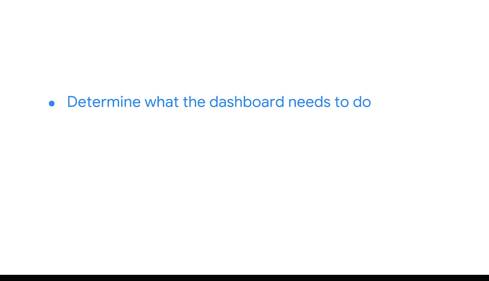

#  084：赋能利益相关者 📊


在本节课中，我们将要学习商业智能（BI）专业人士如何通过构建数据工具来赋能利益相关者，使他们能够自主地探索数据并做出明智的商业决策。核心在于理解数据看板（Dashboard）的本质、作用及其构建逻辑。

---

## 数据看板的本质与目的

作为一位BI专业人士，你将构建用于监控和展示重要业务数据的工具。

在学习过程中，你需要理解，追踪这些数据并将其构建成数据看板的主要目的，在于**赋能利益相关者，让他们能够自主解答其核心的数据问题**。

数据看板本质上是一个工具。例如，一个追踪年度收入的数据看板，可以讲述一家小企业如何一夜之间爆红的故事；而一个监控全球市场的看板，则可以告诉你某个特定市场的竞争加剧了。

数据看板所讲述的故事，提供了关于公司数据当前状况的重要信息。这些故事进而为采取行动创造了机会。例如，一家面临新竞争的公司现在知道，它需要推出新的产品线或改进现有产品。

---

## 可视化 vs. 原始数据

可视化图表比原始数据更有帮助，因为它们能使数据洞察变得更加清晰和易于理解。有时，如果没有可视化，一些重要的趋势可能几乎无法被识别。

例如，在这份关于公司国际销售额的电子表格中，所有数据都在这里，但其含义并不直观。

```plaintext
| 年份 | 国家A销售额 | 国家B销售额 | 国家C销售额 |
|------|-------------|-------------|-------------|
| 2018 | $100,000    | $150,000    | $200,000    |
| 2019 | $120,000    | $180,000    | $220,000    |
| 2020 | $90,000     | $160,000    | $250,000    |
```

另一方面，基于这些数据构建的数据看板可以更清晰地呈现实际情况。毕竟，数据看板的主要目的不仅仅是美观，而是**回答问题或解决问题**。

想象一下，你需要查找公司2019年的总销售额。数据看板中的这个图表可以非常简单地回答这个问题：

```plaintext
年度总销售额柱状图：
2018: $450,000
2019: $520,000  <-- 目标数据点
2020: $500,000
```

你可以轻松地找到2019年销售总额的数据点。

---

## 数据看板的交互性与灵活性

数据看板还具有交互性，这使其成为极其灵活的工具，将主动权交到用户手中。

数据看板不会在回答一个问题后就失去其效用。相反，根据用户的搜索内容和使用方式，它可以回答多个问题。

回到我们的例子。假设一位利益相关者想使用数据看板来找出哪个国家在所有年份中的总销售额最高。他们只需在看板环境中更改设置，即可聚焦于不同的数据，或以不同的方式查看相同的数据。

通过创建和维护这样一个多功能工具，BI专业人士可以减少他人的工作量。与其构建10个独立的图表来回答10个问题，**一个交互式数据看板就能完成任务**。

---

## BI专业人士的角色

正如你所知，你的利益相关者使用你构建的工具来做出明智的商业决策。因此，作为BI专业人士，你的角色很少涉及解释你的数据看板所显示的数据。

相反，你将创建一个能够**赋能用户，让他们自行解读数据**的看板。因此，你需要确定数据看板需要实现什么功能，构建合适的工具，并随着时间的推移对其进行维护和改进。

---



## 总结与展望 🚀

本节课中，我们一起学习了数据看板的核心价值：它是一个赋能工具，旨在让利益相关者能够自主、灵活地探索数据并获取洞察。我们明确了可视化的重要性、看板的交互性优势，以及BI专业人士在其中的核心职责是构建和维护工具，而非直接解读数据。

接下来，我们将更深入地探讨利益相关者的目标，并基于数据看板计划创建一个原型设计。你很快就能踏上规划完美数据看板的道路。