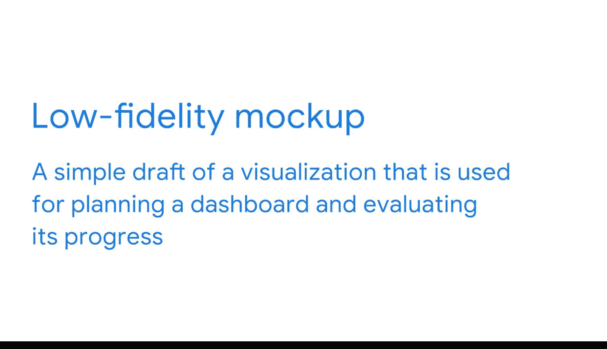

#  085：使用线框图规划仪表板 📊

在本节课中，我们将学习如何为仪表板进行有效的规划。仪表板是商业智能中的关键工具，用于呈现数据洞察以支持决策。成功的仪表板离不开周密的规划和团队协作。

## 规划的重要性与协作

与任何重要的专业工作一样，仪表板需要大量规划才能做好。它们也需要大量的协作。你已经完成了商业智能规划的许多方面，包括利益相关者需求文档、项目需求文档和战略文档。在本视频中，我们将更深入地学习规划，并获取一些专门针对仪表板的策略。

## 需求收集与提问

通常，商业智能专业人员会与利益相关者合作，以确定仪表板需要包含哪些内容。这个过程通常始于利益相关者描述他们的需求。例如，销售或市场主管可能想要一个跟踪客户消费习惯的仪表板。他们可能要求提供展示客户再次购买同一产品的频率，或在特定节假日等购物高峰期收入增长多少的可视化图表。

在利益相关者解释他们的需求之后，商业智能专业人员会提出自己的问题。这有助于确定所涉及的细节层次。一些我喜欢问的问题是：仪表板应该做什么？它跟踪哪些**关键绩效指标**和**维度**？询问仪表板是为谁构建的也很有帮助。是需要最具体细节的人，还是只需要高层次洞察的人？

最后，商业智能专业人员必须考虑在何处找到必要的数据，以及它应该代表的时间线。当然，随着你不断获取背景信息，有无数问题可以帮助阐明任何给定的项目。你可能会发现理解上的一些空白，或者发现一些甚至利益相关者都未曾预料到的痛点。跟进这些新发现将帮助你确保更直接地满足利益相关者的需求，并为他们创建一个有效的工具。

## 观察与迭代

除了提问，许多商业智能专业人员还会观察利益相关者的工作。这可以是实际坐在他们的工作站旁，或者通过共享屏幕来演示特定的工作流程。这非常有帮助，因为利益相关者通常对自己的流程非常熟悉，以至于不会注意到仪表板可以在何处或如何帮助他们。这项练习需要时间，但能产生大量宝贵的洞察。

同样，与你的利益相关者一起迭代也很有价值。我们在商业智能中经常谈论迭代。作为复习，这仅仅意味着一遍又一遍地重复一个过程，以不断接近期望的结果。正如你所知，期望的结果总是在变化，这就是为什么商业智能专业人员总是在迭代。

## 创建低保真线框图

仪表板迭代过程的第一步是创建一个低保真线框图。**低保真线框图**是用于规划仪表板和评估其进度的可视化草图的简单草案。

它可能是一个关于其组织方式的纸笔模型，或者是一个数据量非常有限的仪表板。利益相关者提供反馈，你据此采取行动。共享低保真线框图是让利益相关者参与进来并充分利用协作的绝佳方式。此外，它在避免潜在错误方面非常有效。如果你做出了一个后来被证明不正确的假设，线框图可以帮助你和你的用户识别它并实施必要的修复。

## 总结

在本节课中，我们一起学习了仪表板规划的关键步骤。我们探讨了如何通过与利益相关者沟通、提问和观察来收集需求。我们强调了迭代过程的重要性，并介绍了创建**低保真线框图**作为规划起点的具体方法。清晰的规划是达成目标的最佳途径。接下来，我们将继续探索更多关于仪表板规划的内容。

