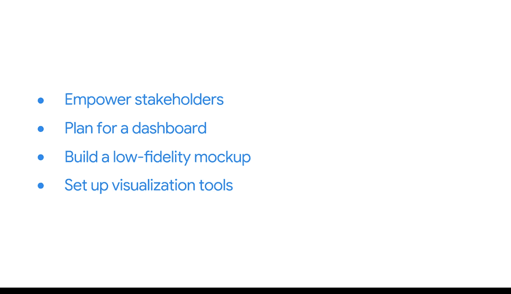

#  088：总结回顾与评估准备 🎯

在本节课中，我们将对之前学习的商业智能核心知识进行总结，并了解如何为接下来的课程评估做好准备。

---

## 课程概述

在本课程中，我们深入探索了商业智能的世界。我们学习了交互式BI可视化如何赋能利益相关者做出决策，探讨了如何有效地规划数据看板，以及如何构建低保真原型。我们还设置了用于构建动态可视化所需的工具。

## 核心知识回顾

上一节我们介绍了课程的整体框架，本节中我们来回顾一下已掌握的核心技能。

以下是我们在本课程中学到的主要内容：

*   **交互式BI可视化**：你已了解交互式BI可视化如何**赋能利益相关者自主探索数据并做出数据驱动的决策**。
*   **数据看板规划**：你探索了如何**有效地规划一个数据看板**，确保其能精准满足业务需求。
*   **低保真原型设计**：你学会了**如何构建一个数据看板的低保真原型**，这是在投入开发前验证设计思路的关键步骤。
*   **工具设置**：你已经**设置了用于构建动态可视化所需的工具**，为实际动手操作做好了准备。

## 为专业环境与应用做好准备

一旦进入专业环境，你将能够运用这些经验来规划出色的数据看板。但现在，是时候将注意力转向接下来的评估了。

需要提醒的是，这些挑战旨在帮助你评估自己在本课程中的学习与进展。请将它们视为衡量你专业成长的重要标尺。

## 评估准备建议

在开始评估前，建议你花些时间复习任何你认为必要的材料。

以下是具体的准备建议：

*   **复习课程材料**：回顾课程中的关键概念、操作步骤和案例分析。
*   **查阅术语表**：最新的术语表包含了大量新词汇的定义和概念，是复习的好帮手。

祝你顺利。你一定会表现出色。😊

---

## 课程总结

本节课中，我们一起回顾了商业智能基础、洞察路线（模型与管道）以及决策支持（数据看板）的核心学习内容。我们总结了如何利用交互式可视化、看板规划与原型设计等技能，并为接下来的课程评估做好了准备。请记住，持续复习与实践是巩固知识、实现专业成长的关键。