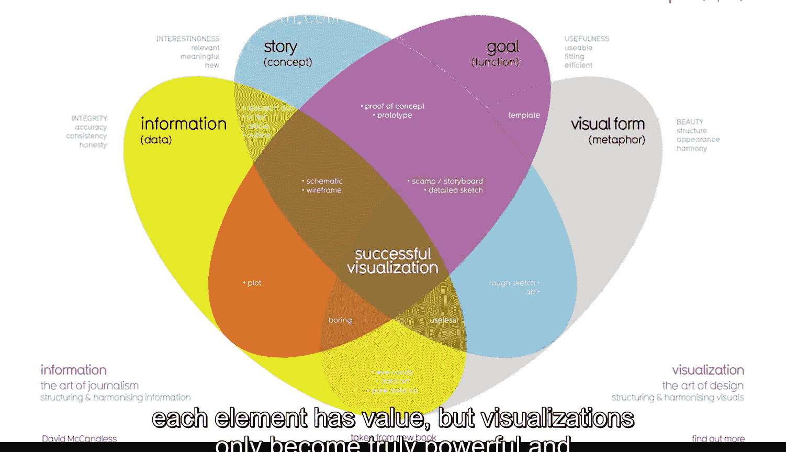

#  089：数据可视化基础

在本节课中，我们将要学习数据可视化的核心概念、历史背景及其在现代数据分析中的重要性。我们将探讨如何构建一个有效且具有说服力的可视化图表，并理解其关键构成要素。

## 数据可视化简介

数据可视化是数据的图形化表示和呈现。本质上，它是将信息转化为图像，以便他人更容易理解。

如果你曾看过任何形式的地图，无论是纸质的还是在线的，那么你就能确切地知道视觉图像有多么有用。数据可视化在当下正发挥着重要作用。我们被各种以不同方式展示信息的图像所包围。

## 可视化的历史

但数据可视化的历史远比互联网要久远。数据可视化始于很久以前的地图，地图是地理数据的视觉表现。这张已知世界的地图来自1502年。随着新大陆被绘制、关于这些地点的新数据被收集以及可视化数据的新方法被创造出来，地图制作者们不断改进他们的可视化作品。

科学家和数学家们在18世纪和19世纪开始真正接受将数据视觉化排列的想法。这个条形图来自1821年，它看起来与我们今天看到的条形图没有太大不同。

然而，自20世纪90年代数据分析的数字时代开始以来，可视化的范围和影响力随着它们所图形化表示的数据一起增长，因为我们不断学习如何更有效地通过视觉进行沟通。我们洞察的质量也随之提高。

## 现代数据可视化

今天，我们可以通过数据量化人类行为。我们已经学会使用计算机来收集、分析和可视化这些数据。

作为当今世界的一名分析师，你可能会在两个方面分配处理数据可视化的时间：查看可视化图表以理解和得出关于数据的结论，或者从原始数据创建可视化图表来讲述一个故事。

无论如何，始终要记住，数据可视化将是您成功的关键。这一点尤其正确，一旦您准备好向观众展示数据分析结果时。让人们理解您的观点和思维过程可能具有挑战性，但一个制作精良的数据可视化有能力改变人们的想法。此外，它可以帮助那些没有与您相同技术背景或经验的人形成他们自己的观点。

## 创建可视化的一个快速规则

以下是创建可视化图表的一个快速规则：您的观众应该在看到它的前五秒内确切地知道他们正在看什么。

基本上，这意味着视觉图表应该清晰且易于理解。而在接下来的五秒内，您的观众应该理解您的可视化图表所要表达的结论，即使他们不完全熟悉您一直在进行的研究。他们可能不同意您的结论。这没关系。您总是可以利用他们的反馈来调整您的可视化图表，并返回数据做进一步分析。

## 构建有效可视化的要素

现在，让我们来谈谈为了创建一个可理解的、有效的，以及最重要的、有说服力的可视化图表，我们必须做些什么。让我们从头开始。

数据可视化是一种将大量信息融入小空间的有用工具。要做到这一点，您首先需要构建和组织您的思路。思考您的目标以及您在梳理数据后得出的结论。然后思考您在数据中注意到的模式、让您感到惊讶的事情，当然，还有所有这些如何融入您的分析中。

识别您发现的关键要素有助于为您应如何组织演示奠定基础。

请看这个由知名数据记者David McCandless制作的数据可视化图表。

该图表包含四个关键要素：信息或数据、故事、目标和视觉形式。它被安排在一个四部分的维恩图中，这告诉我们成功的可视化需要所有这四个要素。

到目前为止，您已经学到了很多关于可视化中使用的数据的知识。这很重要，因为它是您可视化的关键构建块。

故事或概念为数据增添了意义并使其变得有趣。我们稍后将更多地讨论数据叙事的重要性。但现在，只需记住，故事和数据相结合，为您试图展示的内容提供了一个大纲。

目标或功能使数据既有用又可用。而视觉形式则创造了美感和结构。

## 组合要素的重要性

仅使用两个要素，您可以创建一个视觉草稿。如果您处于早期阶段，这可能有效，但不会给您一个完整的可视化，因为您会缺少其他关键要素。

即使使用三个要素也让您更接近目标，但您还没有完全完成。例如，如果您结合了信息、目标和视觉形式，但没有任何故事，您的视觉图表可能看起来不错，但不会有趣。

每个要素本身都有价值，但只有当您以一种有意义的方式将所有四个要素结合起来时，可视化才变得真正强大和有效。当您将这些要素放在一起思考时，您可以为您的观众创造有意义的东西。

在谷歌，我确保开发的可化图表能够讲述包含所有这四个要素的数据故事。我可以告诉您，每个要素都是可视化成功的关键。这就是为什么作为分析师，您必须密切关注每个要素，这一点非常重要。

## 可视化的目标与责任

其他人可能不知道或不理解您得出结论所采取的确切步骤，但这不应阻止他们理解您的推理。基本上，一个有效的数据可视化应该引导观众得出与您相同的结论，但要快得多。

因为我们所处的时代，我们不断被展示不同的方式来查看和吸收信息。这意味着您在设计自己的可视化图表时，已经可以参考许多您见过的视觉图像。您有能力讲述能够改变观点和思维方式的令人信服的故事。这很酷。

但您在创作这些故事时，也有责任关注他人的观点。因此，始终牢记这一点很重要。

接下来，我们将开始在数据和图像之间建立联系，为您的视觉杰作打下坚实的基础。我迫不及待要开始了。

## 总结

本节课中我们一起学习了数据可视化的定义、历史发展及其在现代数据分析中的核心作用。我们探讨了创建有效可视化图表的快速规则，并深入分析了其四个关键构成要素：**数据**、**故事**、**目标**和**视觉形式**。理解并整合这些要素是制作出清晰、有说服力且能引导观众快速理解结论的可视化作品的关键。作为分析师，我们既有能力通过可视化讲述有力的故事，也有责任在创作过程中考虑他人的视角。