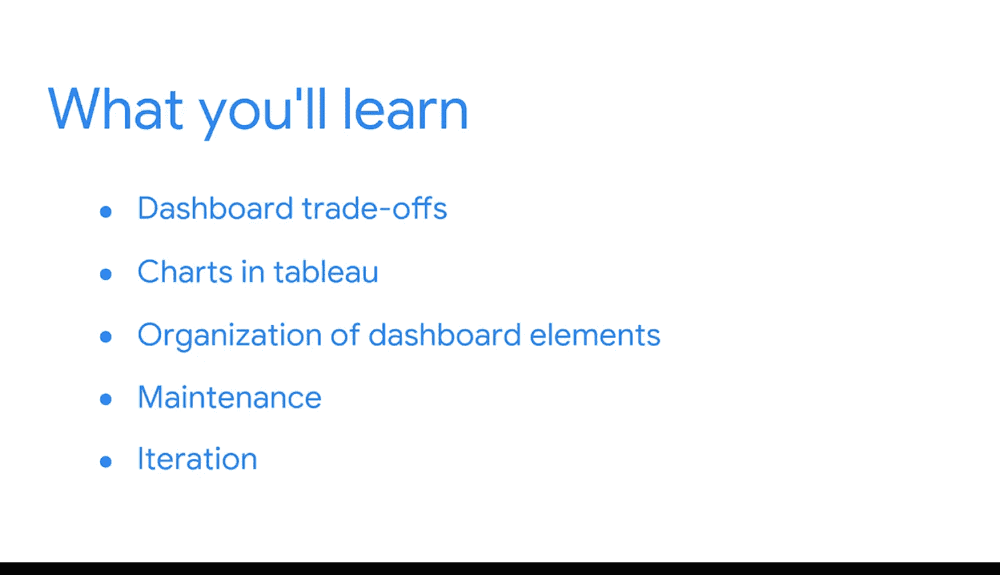

#  090：欢迎来到模块2 🎯

在本模块中，我们将学习如何将商业智能计划转化为实际的图表和数据看板。我们将探讨设计可视化时的权衡取舍，应用最佳实践来创建图表，并学习如何有效地组织看板元素。

---

想象你正在构建一个数据看板。你已经明确了需要为用户解答的问题，并绘制了一个低保真线框图来规划将要制作的图表。此外，你也确定了需要使用的合适工具。

现在，是时候进入下一步：设计可视化。在接下来的课程中，你将有机会亲自练习创建图表和看板。

---

首先，我们将更深入地探讨构建商业智能可视化时必须考虑的权衡取舍。

上一节我们介绍了设计看板的准备工作，本节中我们来看看创建具体图表时的关键决策。

以下是构建BI可视化时需要考虑的主要权衡因素：
*   **简单性与完整性**：图表应易于理解，但也不能遗漏关键信息。
*   **准确性 versus 可读性**：某些图表类型（如饼图）可能牺牲精确度以提升直观性。
*   **定制化 versus 一致性**：独特的图表可能更吸引人，但遵循团队的设计规范能保证统一性。

---

然后，你将应用设计最佳实践和你的商业智能知识，在Tableau中创建一个图表。

完成图表后，你将探索在看板内有效组织各元素的方法。

你将再次运用你的设计技能，但这次是在更大的规模上。

---

并且，由于商业智能角色的一个重要部分包括维护和迭代，你将学习如何在业务需求变化时进行修改。

我们将按照以下顺序来学习看板设计，但这并非唯一方法。

你可能会倾向于在具体设计图表之前，先规划好看板的高层布局。这完全可以。每个人的设计流程都不同。

就我个人经验而言，你很少能在第一次尝试时就设计出完美的看板。

---

尽早与利益相关者分享你的想法，是获取反馈的好方法。

这有助于持续理解商业智能目标，并确保你不会将精力浪费在错误的问题上。

接下来的几节课将帮助你做好准备，将所学知识应用到一个现实的商业场景中，这将在本课程后续部分进行。

---

我希望你和我一样，对开始构建看板感到兴奋。

让我们开始吧。😊

---

本节课中我们一起学习了模块二的概览，明确了从规划到实现数据看板的路径。我们了解了设计过程中的关键权衡，并认识到迭代和获取反馈的重要性。接下来，我们将深入具体实践，开始创建我们的第一个图表。