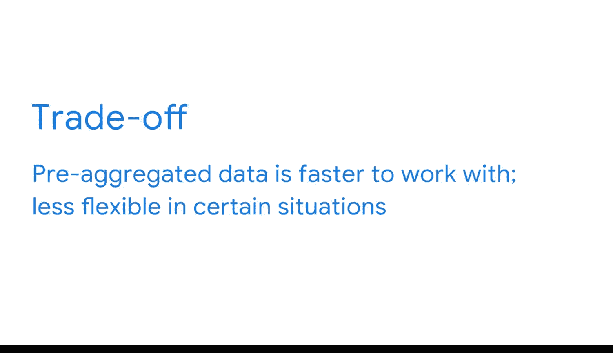

#  091：构建仪表板时的设计权衡 📊

在本节课中，我们将要学习作为商业智能分析师在规划仪表板时，如何通过权衡取舍来最有效地呈现数据。我们会探讨不同的数据呈现方式、预聚合技术的应用，以及如何在速度、灵活性和清晰度之间找到平衡。

## 规划仪表板的核心任务

作为商业智能分析师，规划仪表板时的一项核心工作是确定如何以最有效的方式呈现数据。在这个过程中，你经常需要做出一些艰难的决定。

这些决定大多以**权衡**的形式出现。在商业智能领域，权衡涉及平衡各种因素，通常通过优先考虑一个元素，同时牺牲另一个元素，以达到最佳可能的结果。

## 数据呈现的权衡实例

我们在上一节课的国际销售图表中看到了一个权衡的例子。在该图表的视图中，数据设定为**年度时间尺度**。每个柱代表一年，柱的高度代表该年的总销售额。

但是，仪表板是灵活的，可以改变以不同的方式呈现相同的数据。例如，你可以将筛选器设置修改为**季度时间尺度**。现在，屏幕上显示了更多柱状图，提供了更多信息。

请注意，年度时间尺度更紧凑，因此更难解读全年发生的情况。但可用的数据简单且易于跟踪，因为它不那么密集。无论如何，选择合适的权衡取决于最终的商业目标。

例如，如果利益相关者想知道公司2019年在特定区域的年度总销售额，年度时间尺度图表提供了最清晰的答案。然而，如果他们的问题是识别过去几年中哪个季度实现了最高销售额，那么季度时间尺度图表是最好的。

## 更复杂的权衡：速度与灵活性

有时，权衡可能更为复杂。假设你的利益相关者希望再次按国家细分数据，但他们也提到仪表板更新太慢。

在这种情况下，相关的权衡是用户希望仪表板**做得更多、更快**，这是一项具有挑战性（即使不是不可能）的任务。为了找到最佳解决方案，你可能会考虑通过使用SQL对数据进行**预聚合**来加速仪表板。

正如你在谷歌数据分析认证中学到的，**聚合**是将许多单独的部分收集或聚集到一个整体的过程。因此，**预聚合**是商业智能专业人士用来描述在数据仍在数据库中时就执行计算过程的术语。这意味着在将数据用于分析或仪表板之前，减少行数或数据集的大小。

可以这样理解：如果你对数据进行预聚合，它将更接近你最终需要的状态。这是因为一些必要的计算将在数据在数据库中聚合并发送到数据可视化工具之前发生。

这就是权衡所在。你的数据管道将涉及更多步骤，但你的用户将能更快地获得他们需要的信息。另一方面，如果你选择在数据进入数据可视化工具后计算所有数据，这就从构建过程中消除了聚合步骤。这里的权衡是你的数据管道步骤更少，但你的用户可能会体验到更慢的结果。

也可以只预聚合部分数据，然后在导入到数据可视化平台后计算剩余部分。同样，这一切都关乎考虑利益相关者的需求，然后平衡不同因素，选择优先考虑哪个元素。

## 预聚合的额外成本

此外，请注意预聚合会带来另一个成本。**预聚合的数据灵活性较低**。想象一下，另一位利益相关者希望按商店规模来呈现销售数据。

如果你已经使用预聚合按区域合并了数据，从而将所有商店（无论其规模大小）放在一起，你就会遇到问题。

你如何解决这个问题将再次取决于具体情况。如果速度问题可以通过其他方法解决，或者你完全确定不需要灵活性，你可以做出权衡，优先考虑速度或灵活性。

## 总结与展望

最佳解决方案并不总是显而易见的。有时你需要发挥创造力。这正是成为一名商业智能专业人士最令人兴奋的部分之一：为难题找到创造性的解决方案。

在本节课中，我们一起学习了在构建仪表板时如何进行设计权衡。我们探讨了如何根据业务目标选择合适的数据呈现尺度（如年度与季度），深入分析了通过**预聚合**在数据处理速度与数据灵活性之间做出的关键权衡，并认识到没有放之四海而皆准的方案，需要根据具体情境和利益相关者需求，创造性地平衡各种因素，以设计出最有效的仪表板。