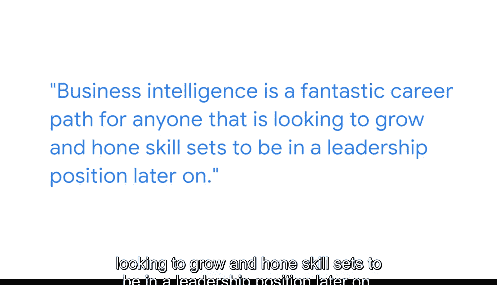

#  092：商业智能在谷歌支付产品中的应用 🚀

在本节课中，我们将通过谷歌支付产品运营与战略负责人迪安德烈的分享，学习商业智能在实际业务场景中如何驱动关键决策。我们将了解数据如何被收集、分析并转化为具体的市场进入策略和产品优化建议。

---

我的名字是迪安德烈，我是谷歌钱包的产品运营与战略负责人。

我支持产品管理组织，为谷歌推出支付产品。

我具体负责谷歌钱包应用，该应用允许用户在安卓设备上存储信用卡、会员卡、驾照和其他物品。

商业智能用于驱动组织内的关键决策。在我目前于支付部门的角色中，商业智能帮助我们识别出哪些是应继续拓展谷歌钱包的关键市场。我们查看大量不同信息，以试图理解一个市场是否已为支付解决方案做好准备。例如，与谷歌钱包兼容的设备采用率如何？商店是否已设置好可以接受非接触式支付的线下支付系统？我们利用这些数据和商业智能信息来判断一个市场是否已为像谷歌钱包这样的产品做好准备，或者是否需要在合作伙伴方面做更多工作，以确保消费者在拥有谷歌钱包时，能够在店内随时进行非接触式支付。

---

## 数据驱动的决策与沟通 💡

上一节我们了解了商业智能如何评估市场机会。本节中我们来看看，当提出建议时，数据如何成为沟通的基石。

任何时候你推荐某件事，人们都会要求查看数据。他们想知道为什么你的说法有道理。如果没有商业智能，不理解观点或建议背后的依据，以及为什么那个想法是最佳选择，就无法做到这一点。

---

## 从原始数据到可执行洞察 📊

上一节我们强调了数据在支撑观点时的重要性。本节中我们将探索如何将海量的原始反馈转化为清晰、可操作的洞察。

在之前的一个职位上，我负责了一项调查。我们询问了所有广告客户：您如何看待与谷歌的关系？它是否满足了您的需求？您的销售代表是否满足了您的需求？我们可以做哪些不同的事？我们可以如何改进？我们如何才能最好地支持和赋能您的业务？调查结束后，我们收回了大量数据。因此，我们有许多不同的数据点需要找到方法进行汇总，并提炼出核心故事。

以下是处理此类定性数据的关键步骤：

*   **使用数据工具进行总结**：利用不同的数据工具来归纳我们从各种定性回复中得到的摘要。这些反馈是积极的还是消极的？
*   **进行高层级汇总**：帮助在高层面上总结这些信息。

我认为，如果只有原始数据，期望任何人通读所有内容是不太可行的。因此，商业智能、不同的数据工具、数据专家和仪表板被用来提升信息层级，使其更容易按特定团队或特定客户进行筛选，并且能够以国家等维度查看汇总后的数字。

---

## 商业智能的职业发展路径 🧭

上一节我们探讨了数据处理的具体方法。最后，让我们看看商业智能领域的职业前景。

商业智能对于任何希望提升自身技能组合、未来迈向领导职位的人来说，都是一条极好的职业道路。

坚持下去，始终保持开放心态，不断学习和成长。我很期待也许有一天能见到大家，并与各位在商业智能领域共事。

---

## 总结

本节课中，我们一起学习了商业智能在谷歌支付产品中的实际应用。我们了解到，商业智能不仅用于分析市场准备度（如设备兼容性、支付基础设施），还是内部沟通和决策支持的关键。通过将原始调查数据汇总、提炼成高层洞察，商业智能工具和仪表板使信息更易于理解和操作。最后，商业智能被强调为一个充满前景的职业发展方向，需要持续学习和开放的心态。