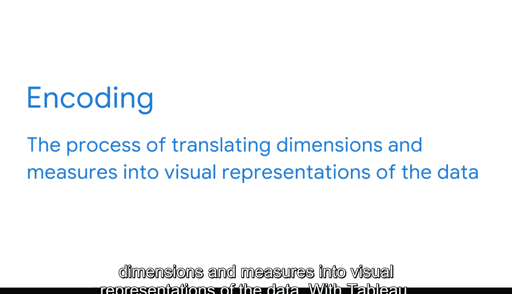
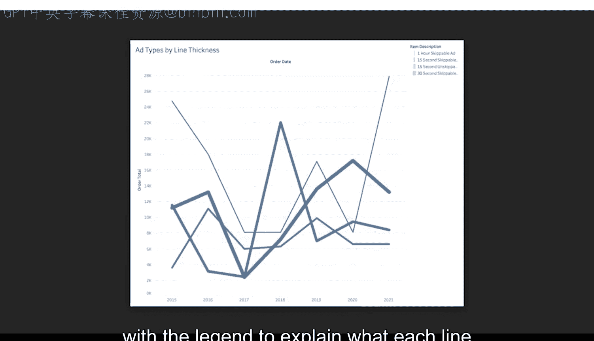
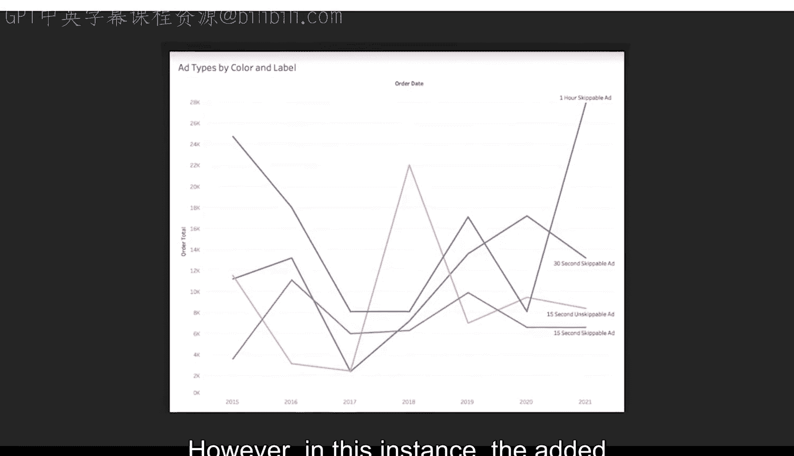

#  093：开始创建图表 📊

在本节课中，我们将开始学习如何创建商业智能图表。我们将介绍数据可视化的核心概念，包括维度和度量，并探讨如何通过编码将这些元素转化为有效的视觉表示。课程将使用Tableau作为示例工具，但核心原则适用于任何BI平台。

## 访问图表构建界面

上一节我们介绍了BI的基础概念，本节中我们来看看如何实际操作。首先，打开Tableau Desktop或Tableau Public软件。跟随步骤操作是可选的，但这有助于你熟悉界面。

我们将从工作簿的“工作表一”开始，进入图表构建界面。

## 理解维度和度量

在构建图表前，必须理解数据的两个基本组成部分：维度和度量。

*   **维度** 是用于对数据进行分类的定性数据类型。
    *   公式表示为：`维度 ∈ {分类数据}`
    *   例如：客户姓名、产品名称、地理位置。

*   **度量** 是可以是离散或连续的定量数据类型。
    *   在谷歌数据分析证书课程中，对离散和连续数据类型有详细解释。如需复习，可以回顾相关课程。
    *   **离散数据** 具有有限数量的值。
        *   代码示例：`学生人数 = [20, 25, 30]` （班级花名册是有限的）
        *   例如：一个班级的学生人数是离散数据，因为不可能有1.5个学生。
    *   **连续数据** 可以具有几乎任何数值，其值集合是无限的，且每个值内部包含区间。
        *   代码示例：`温度 ∈ ℝ` （实数集）
        *   例如：温度是连续数据，因为它可以是任何数值。

在数据可视化中，维度和度量是需要被表示的重要可追踪元素。

## 数据编码与视觉表示

作为BI专业人员，你需要做出的众多决策之一就是如何对这些维度和度量进行编码。

在BI中，**编码** 描述了将维度和度量转化为数据视觉表示的过程。

以下是编码的核心步骤：

使用Tableau时，我们可以将数据集的维度或度量拖放到“标记”下拉菜单中的某个编码类型上。

以前面的例子说明，我们的“广告类型”维度可以用颜色进行编码。这意味着每种类型的广告（例如15秒可跳过广告）的线条将由不同的颜色表示。

如果我们以不同的方式编码这个维度，将会改变图表的解读方式。下图展示了同一个维度用线条粗细而非颜色编码的效果。

即使有图例解释每条线代表什么，理解数据也变得不那么直观。

## 设计权衡与最佳实践

编码引出了另一个你可能需要做出权衡的情况。

颜色是一种常用的编码类型。对许多人来说，它是区分信息的简单方法。然而，色盲人士可能觉得某些类型的颜色编码不太有帮助。BI专业人员通常会参考解释无障碍调色板的指南。

此外，在这种情况下，我们可以考虑对“广告类型”维度进行双重编码。例如，我们可以同时用颜色和标签对其进行编码。标签也指明了广告类型，这使得我们的可视化更清晰、更易于访问。

但这又造成了另一个权衡：因为我们使用标签来表示一种类型，图表中就有了更多的视觉元素。如果视觉元素过多，图表可能难以理解。然而，在这个例子中，增加的视觉元素并没有造成太多杂乱。

这是一个明智的权衡，因为无障碍性是构建有效可视化的关键部分。做出优先考虑无障碍性的权衡是一种设计最佳实践。

在为可视化中的数据编码时，你可能还需要做出其他类型的权衡。当这种情况发生时，请始终回顾你的业务问题和利益相关者的需求。

## 总结

本节课中，我们一起学习了创建BI图表的基础。我们理解了**维度**和**度量**的区别，掌握了通过**编码**将数据转化为视觉元素的过程，并认识了在设计可视化时可能遇到的**权衡**，特别是关于无障碍性的考虑。掌握了这些构建模块，你现在可以在图表中表示各种BI数据了。接下来，我们将扩展图表基础知识，并指导你使用BI数据构建自己的图表。敬请期待。