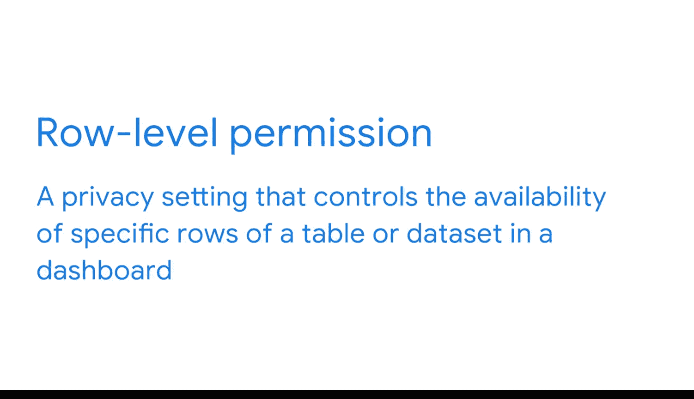

#  095：处理速度与隐私设置 🚀🔒

在本节课中，我们将学习如何优化数据看板的处理速度，并了解配置隐私设置的基础知识。交付看板并非项目的终点，基于利益相关者的反馈进行迭代，才能使其更接近理想状态。我们将探讨影响处理速度的常见原因及其解决方案，并介绍三种主要的隐私权限级别。

## 优化处理速度 ⚡

上一节我们介绍了看板迭代的重要性，本节中我们来看看如何解决处理速度慢的问题。处理速度是指程序更新和加载特定数据量的快慢。负载过高会导致处理速度变慢，甚至可能使工具崩溃，从而影响使用体验。

以下是导致高负载和慢处理速度的几个主要原因：

*   **数据量、度量与维度数量**：这是最主要的原因。处理和可视化的数据量越大，速度越慢。
*   **看板中的标签页数量**：多个标签页有助于组织可视化内容，但过多也会拖慢速度。

在规划初期就应考虑如何减少负载、提升处理速度。通常，你应该先广泛收集需求，再逐步缩小范围。具体做法是：先确定关键绩效指标，再考虑并完善辅助信息。在此过程中，你可能会发现某些最初要求追踪的指标已不再相关，此时可以从看板中移除它们以提升速度。

此外，通过更改数据库中的计算方式也能优化处理速度。因为后端服务器比前端服务器更强大，能更快地处理更多数据。但如果某个计算依赖于看板中应用的筛选器，则只能在看板内部完成。对于初级BI专业人员，这种情况不常见，但需要了解。

配置看板预加载的数据量也是一个好方法。预加载较少的数据可以减轻看板压力，但需注意，这可能意味着洞察结果不如实时数据那样及时。

其他加速看板的策略包括早期数据筛选和预聚合，这些内容在本节前面已经学习过。

## 配置隐私设置 🔐

现在，让我们将注意力转向看板迭代过程的另一个重要部分：隐私设置。一个看板可能被公司内的许多利益相关者使用，但某些数据可能只对部分人开放。作为BI专业人员，配置隐私设置是构建和维护看板的关键环节。

以下是三种主要的隐私权限级别：

*   **公开可用**：任何人都可以访问看板。使用此无限制设置可与公众共享看板。
*   **对象级权限**：此隐私设置控制单个项目（如表、数据集或单个可视化图表）的可用性。由于其简单性，这可能是你最常使用的权限类型。授予用户对某个对象的访问权限后，撤销访问只需移除其权限即可。
*   **行级权限**：此隐私设置控制表或数据集中特定数据行的可用性。这种设置更为复杂，因为它必须在数据库中进行配置，而非在可视化工具中。配置涉及多源数据、对不同组选择性开放的复杂权限，即使是一些经验丰富的专业人士也会觉得困难。

在BI职业生涯初期，你不需要理解权限的每一个细节。你甚至可能在一个团队中，与数据工程师合作来配置这些权限。

## 总结 📝

本节课中我们一起学习了如何基于利益相关者的反馈迭代优化看板。我们探讨了影响处理速度的因素及优化策略，并介绍了公开可用、对象级权限和行级权限这三种核心的隐私设置类型。掌握这些基础知识，将帮助你构建更高效、更安全的数据看板。接下来，你将有机会将这些知识应用到你自己的看板项目中。