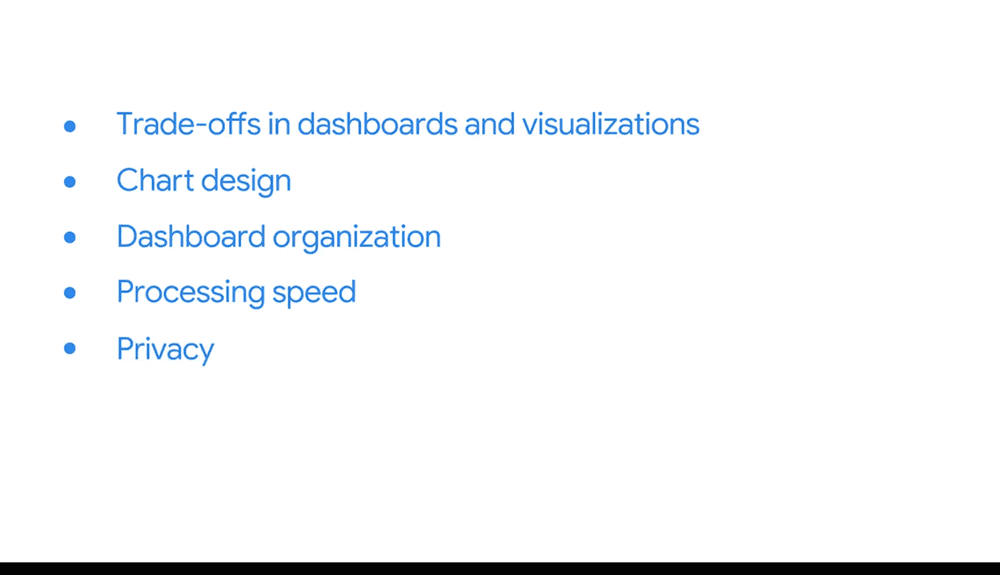

#  096：总结回顾


在本节课中，我们将对构建数据看板的核心概念进行总结，回顾在灵活性、交互性、设计原则以及数据处理方面所做的权衡，并展望接下来的实践环节。

## 课程概述

恭喜你完成本节内容。你的学习进展非常出色。

你已经深入了解了构建数据看板时涉及的各项权衡，以及这些权衡如何影响数据可视化效果。通过理解这些权衡并做出正确决策，你可以更高效地回答利益相关者的问题。

## 核心学习内容回顾

上一节我们介绍了数据可视化的基础，本节中我们进一步探讨了BI图表的设计。

### 1. BI图表设计
本课程在你先前数据可视化经验的基础上，重点强调了**灵活性**和**交互性**。你再次学习了在对数据的维度和度量进行编码时可能做出的各种权衡。

以下是设计时需要考虑的关键权衡：
*   **细节与概览**：在展示详尽数据与提供宏观洞察之间的平衡。
*   **静态与交互**：决定图表是仅供查看，还是允许用户通过筛选、下钻等方式进行探索。
*   **复杂度与可读性**：在图表中融入更多信息与保持图表清晰易懂之间的取舍。

### 2. 看板组织与设计
接下来，你学习了如何将图表和其他BI可视化元素组织成一个完整的看板。

你考虑了如何应用最佳设计实践，来创建能够有效回答业务问题的清晰、简洁的看板。这包括：
*   **布局逻辑**：按照用户的阅读习惯和问题逻辑排列图表。
*   **视觉层次**：使用颜色、大小和位置来引导用户关注最重要信息。
*   **一致性**：保持整个看板中颜色、字体和风格的统一。

### 3. 处理速度与隐私权限
此外，你还深入研究了处理速度的影响，以及它如何贡献于看板的**可用性**和**响应速度**。处理速度的公式可以简化为：
`用户体验 = 数据计算效率 + 前端渲染速度`



同时，你探讨了不同的**隐私权限**设置，这些设置影响你处理数据以及与利益相关者共享数据的方式。例如在代码中，权限控制可能表现为：
```sql
GRANT SELECT ON table_name TO role_stakeholder;
```

## 后续学习安排

在接下来的课程中，你将获得更多创建数据看板的实践机会，并将你的BI设计技能应用于一个真实的业务场景。

但在那之前，还有一项挑战等待你。本章内容详实，涵盖了大量材料。如果需要更多时间复习，请不必担心。你可以随时返回观看视频、阅读资料、完成活动和练习测验。当然，也请务必查阅词汇表的最新条目。

当你准备就绪后，请继续进行分级评估。祝你好运。

## 课程总结


本节课中，我们一起学习了构建有效数据看板的核心：即在图表设计的灵活性与交互性中做出权衡，按照最佳实践组织看板布局，并充分考虑处理速度与数据隐私权限对最终成果的影响。这些技能将帮助你创建出真正能驱动业务决策的可视化工具。