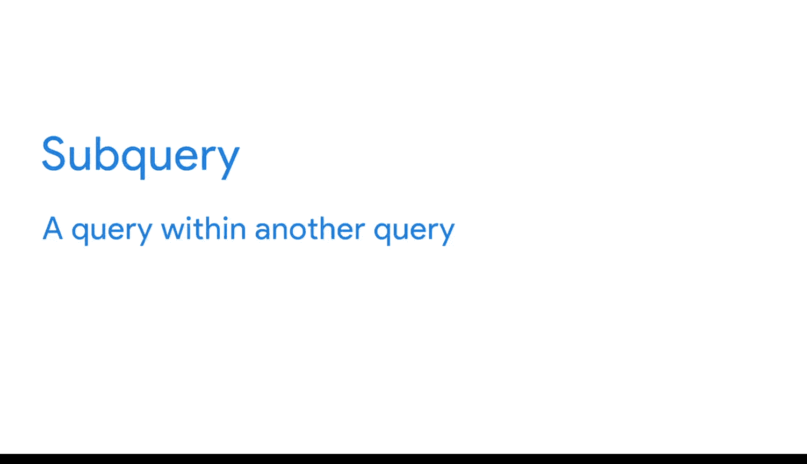

#  097：数据聚合复习 📊


在本节课中，我们将要学习数据聚合的核心概念。数据聚合是数据分析中的一项基础且关键的技术，它能够帮助我们将分散的数据整合起来，形成有意义的摘要，从而支持更深入的洞察和决策。

## 什么是数据聚合？ 🤔

上一节我们介绍了课程的整体目标，本节中我们来看看数据聚合的具体定义。

数据聚合是指将许多独立的部分收集或聚集成为一个整体的过程。例如，银河系就是恒星、尘埃和气体的聚合体。

因此，**数据聚合**是从多个来源收集数据，以便将其合并成一个单一的、经过汇总的集合的过程。在数据分析中，这个汇总的集合或摘要描述了识别所需数据并将其全部集中到一处的工作。

## 一个生动的比喻 🧩

为了更直观地理解，我们可以用一个比喻。

想象你有一个装满不同拼图的柜子。有一天，一个架子坏了，所有的盒子都倒了下来，拼图碎片散落一地。为了让每个拼图恢复原状，你需要：
1.  识别出属于每个特定拼图的碎片。
2.  将它们收集在一起。
3.  放回正确的盒子里。

只有这样，你才能用这些碎片拼出一幅完整的图画。

在数据领域：
*   **拼图碎片** 代表存在于不同、独立数据集中的数据。
*   **整理它们** 就是聚合过程。
*   **能完成单个拼图的那堆碎片** 就成了你的数据摘要。
*   **最后，把这些碎片拼回去** 就像分析它们以获得重要洞察。

## 数据聚合的价值 💡

数据聚合帮助数据分析师识别趋势、进行比较、获得洞察，而这些如果单独分析每个数据元素是无法实现的。

以下是数据聚合的几个具体应用场景：

*   **跨个体汇总**：例如，单个学生的高中毕业数据可以聚合成整个班级的单一毕业率。
*   **跨时间汇总**：数据也可以在给定的时间段内聚合，以提供统计信息，如**平均值**、**最小值**、**最大值**和**总和**。
*   **层级汇总**：例如，同样的年度毕业率数据可以再次聚合成一个摘要，向我们展示学区、州和国家的毕业率。

## 实际案例 🏠

让我们来看另一个例子。

假设你拥有某个社区过去10年中每年的房地产销售数据。如果你聚合所有这些数据，你将能够发现：
*   该区域房屋的平均价格。
*   房价随时间是如何上涨或下跌的。

## 实现工具：函数与子查询 ⚙️

上一节我们了解了数据聚合的应用，本节中我们来看看实现它的工具。

**函数**是实现数据聚合的重要帮手。你很快将学习如何使用一些最常见的函数来创建摘要。

此外，我们还将讨论使用一种叫做**子查询**的东西来聚合数据。你已经见过SQL的实际应用，并且理解查询是对数据库的信息请求。

因此，**子查询**（也称为内部查询或嵌套查询）是另一个查询中的查询。其基本形式如下：

```sql
SELECT column1, (SELECT AGG_FUNC(column2) FROM table2 WHERE condition) AS aggregated_value
FROM table1;
```

在接下来的几个视频之后，你将掌握如何聚合数据，并理解一路上将使用的工具。

## 总结 📝

本节课中我们一起学习了数据聚合。我们了解到，数据聚合是将分散的数据汇集、整理并汇总的过程，它就像把散落的拼图碎片分类整理好，以便最终拼出完整的画面。通过聚合，我们可以从更高维度（如整体、时间趋势、不同层级）观察数据，从而发现仅看原始数据无法获得的模式和洞察。我们知道了函数和子查询是实现聚合的关键工具，为后续的实际操作打下了基础。



现在，让我们开始深入探索吧！