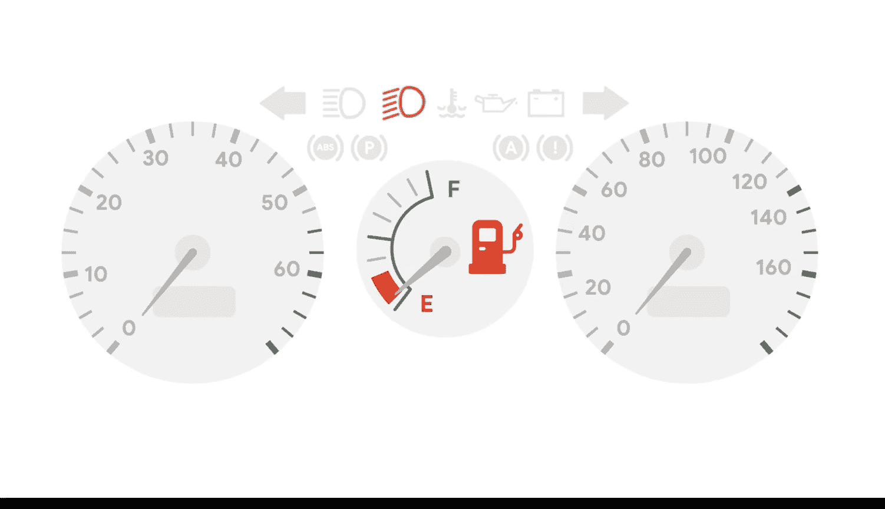
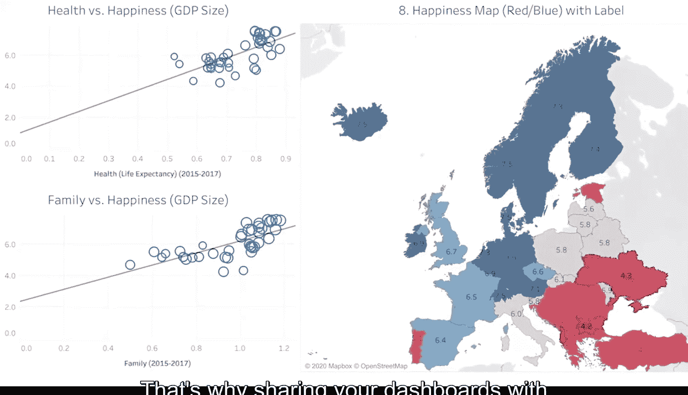

#  100：数据看板设计 🚗

在本节课中，我们将要学习数据看板的核心概念、设计原则及其在商业智能中的重要性。数据看板就像汽车的仪表盘，它能将复杂的数据转化为清晰、直观的可视化信息，帮助决策者快速洞察业务状况。

你是否曾在驾驶汽车时，看到仪表盘上的某个警告灯突然亮起？也许是因为燃油不足，油量表开始闪烁。这个直接呈现在你面前的警报非常有用，它清晰地提示你需要关注油量。你能想象如果汽车没有仪表盘会怎样吗？

我们将永远不知道是否即将耗尽燃油。我们也不会知道轮胎气压是否过低，或者是否该更换机油了。如果没有仪表盘，当汽车出现异常时，我们就不得不翻出用户手册，筛选其中的所有信息，并尝试自己找出问题所在。

汽车仪表盘使驾驶员能够轻松理解和应对车辆的任何问题，因为它持续跟踪和分析汽车状态。

## 从汽车仪表盘到数据看板 📊

上一节我们提到了汽车仪表盘的类比，本节中我们来看看数据看板在商业环境中的应用。

但正如你所学习的，看板不仅仅用于汽车。公司也使用它们来共享信息，让员工参与业务计划和目标，并发现潜在问题。就像汽车的仪表盘一样，数据分析看板将海量信息以清晰、视觉上吸引人的方式呈现出来。这在用数据讲故事时极其重要，这也是为什么它是我们数据叙事三个步骤中第二步的重要组成部分。

你已经了解到，**看板**是一种工具，它将来自多个数据集的信息组织到一个中心位置，通过表格、图表和图形进行跟踪、分析和简单可视化。看板通过持续监控实时传入的数据来实现这一点。

## 设计以受众为中心的看板 👥

正如我们一直在讨论的，你可以制作专门为你的利益相关者设计的看板。你可以思考谁将查看数据、他们需要从中获得什么以及他们使用它的频率。然后，你可以为他们制作一个包含完美信息的看板。

这很有帮助，因为当人们面对过多数据时，可能会感到困惑和分心。看板使信息保持整洁、有序且易于理解。

在设计看板时，最好从最重要的数据点开始，保持简单。如果后来发现缺少某些内容，你随时可以返回调整你的看板或创建一个新的。

## 看板的布局与视觉设计 🎨

看板设计的一个重要部分是图表、图形和其他视觉元素的放置或布局。这些元素需要具有** cohesive**，这意味着它们要平衡并充分利用看板上的空间。

在你决定了看板上应包含哪些信息后，你可能需要调整其大小并重新组织，以使其更适合你的用户。

在 Tableau 中，一个选项是在垂直或水平布局之间进行选择。**垂直布局**调整高度。**水平布局**调整其所包含视图和对象的宽度。

此外，正如你在这里看到的，在布局中均匀分布项目有助于创建清晰有序的数据可视化。

你可以选择**平铺**或**浮动**布局。平铺项目是单层网格的一部分，会根据整体看板大小自动调整大小。浮动项目可以层叠在其他对象之上。

在这个例子中，地图和散点图是平铺的。它们不重叠。这确实有助于清晰地展示数据的全貌，这一点很有价值，因为世界上大多数人是视觉学习者。他们根据所看到的信息进行处理。这就是为什么与利益相关者共享你的看板是一种宝贵的实践。

## 共享看板：赋能与风险 ⚖️

现在，关于共享看板，有一点很重要需要记住。

与他人共享看板很可能意味着你将失去对叙事的控制。换句话说，你将无法在场讲述数据的故事并分享你的关键信息。看板将讲故事的力量交到了查看者手中。这意味着他们将构建自己的叙事并得出自己的结论。

但不要让这一点吓退你，使你不敢进行协作和开放。只需理解共享看板所带来的风险。毕竟，共享信息和资源意味着将有更多人共同解决一个大问题或构思下一个大创意。这会带来更多的联系，从而可能产生真正令人兴奋的新实践和创新。

## 总结 📝

本节课中我们一起学习了数据看板的核心价值。它通过整合与可视化多源数据，为决策者提供了一个实时、直观的业务状态监控工具。设计时应以受众为中心，从核心指标开始，并注重布局的清晰与平衡。虽然共享看板会将数据解读权部分让渡给查看者，但这促进了协作与创新。掌握这些原则，你将能创建出有效驱动业务洞察和行动的数据看板。