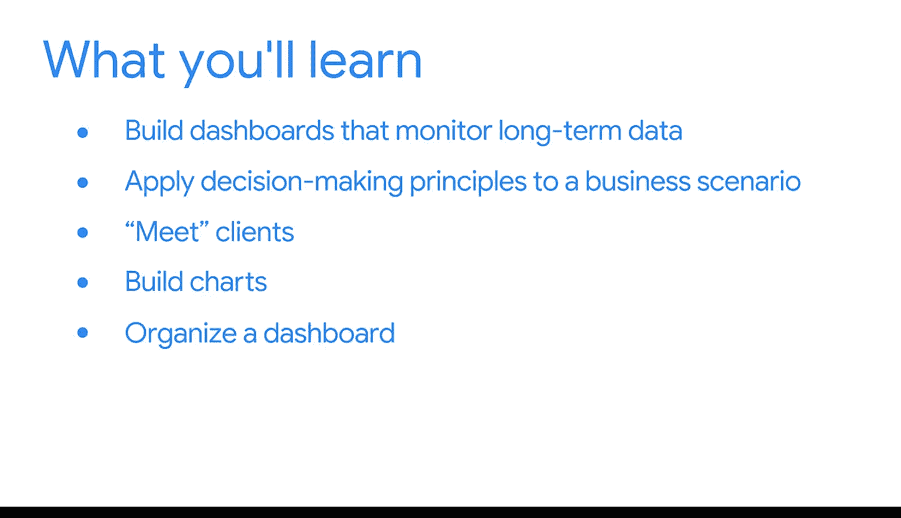

#  101：构建灵活的数据看板

在本模块中，我们将学习如何构建能够长期有效监控数据的、灵活且响应迅速的数据看板。我们将应用之前学到的决策原则，在一个真实的商业场景中进行实践。

## 概述

在商业智能领域，我们通常无法预知所构建的工具和解决方案将被使用多久。因此，我们构建的内容必须具备**灵活性**和**响应性**。当然，设计出具备这种适应性的看板需要练习。本节将重点介绍如何构建能够长期有效监控数据的看板。

上一节我们介绍了决策制定的基本原则，本节中我们来看看如何将这些原则应用到实际的看板构建中。

## 实践与应用

我们将在Tableau中继续练习创建看板。但这次有所不同，你需要将之前学到的决策制定原则应用到一个现实的商业场景中。

这个练习将使你能够真正设想自己未来作为商业智能专业人士的角色。它也使你能够练习识别利益相关者的需求，并通过你自己构建的、功能完整的看板来满足这些需求。

以下是本模块你将完成的主要步骤：

1.  与你的“客户”会面，并使用他们提供的信息。
2.  在Tableau中构建相关的图表。
3.  将图表组织成一个完整的看板。
4.  与用户分享看板。
5.  处理他们的反馈并对你的看板进行迭代改进。

现在，是时候开始了。请为你商业智能旅程中的下一个重要里程碑做好准备。

## 总结

本节课中，我们一起学习了构建长期有效、灵活的数据看板的重要性。我们明确了本模块的目标：通过一个模拟的真实商业场景，综合应用决策原则、需求识别和Tableau技能，完成从需求沟通到看板交付与迭代的全过程实践。