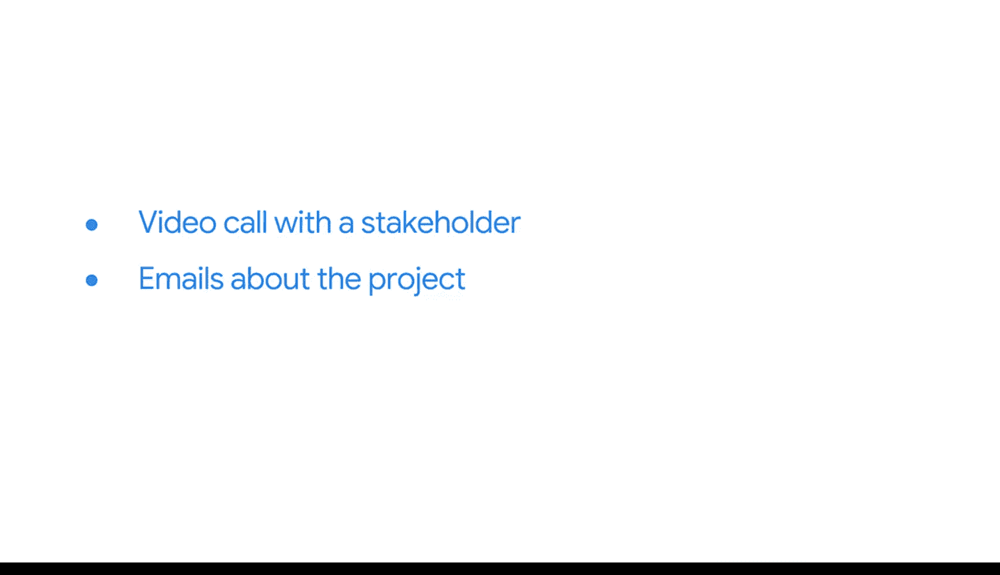

#  102：完成仪表板项目 📊

在本节课中，我们将学习如何完成一个仪表板项目。我们将通过一个角色扮演练习，模拟商业智能（BI）专业人员与利益相关者协作的全过程，从需求沟通到设计决策，最终产出符合业务需求的仪表板。

---

创建仪表板是商业智能专业人员与利益相关者之间的协作过程。

这个过程可以比作一场需要技巧、沟通和实践的精心编排的舞蹈。接下来，我们将聚焦于这场“仪表板之舞”的实践部分。

接下来的几节课包含一个角色扮演练习。与过去的课程类似，你将通过视频、阅读材料、活动和测验来学习。然而，你将采用一个全新的视角。

你将扮演一位刚刚接手一个新项目的商业智能专业人员。你遇到的第一个视频将是你与利益相关者的一次模拟视频通话。你将与他们互动，体验一次典型的、用于探讨商业智能项目细节的会议的基本流程。

然后，你将在这个角色扮演场景中，通过阅读材料或电子邮件，获取关于项目的更多背景信息以及如何进行的提示。

这些电子邮件将类似于你在专业环境中从利益相关者和主管那里收到的邮件。

所有这些元素将使你能够完成活动并产出交付成果。

这个练习的目标是实践应用你的决策和设计技能。

一些指示可能是开放式的，需要你尝试不同的方法。

你将不会被引导着在Tableau中点击每一步来制作一个预定的图表，而是会被要求设计一个符合特定参数的图表。

你收到的指导将侧重于如何满足利益相关者的需求，而不是如何使用程序本身。

你可能会先开发出某个东西，然后认为它可以改进，或者它未能充分满足期望。这很好。我们鼓励你实践试错。这是商业智能工作的重要组成部分。

但你不会完全靠自己。你的主管和客户会通过阅读材料提供线索和方向，说明他们的期望。

请沉浸于商业智能专业人员的角色，并展望你在这个领域的未来。

按照你自己的节奏探索每一步，并在规划、构建和迭代你的仪表板时，尝试各种不同的策略。

虽然这个练习包含虚构的细节和实践数据，但在完成它的过程中，你将获得一些很棒的业务洞察。祝你玩得开心。

---

本节课中，我们一起学习了如何通过角色扮演来模拟仪表板项目的完整流程。我们了解到，仪表板开发是一个需要与利益相关者紧密协作、不断沟通和迭代的“舞蹈”。通过模拟会议、邮件沟通和开放式设计任务，我们实践了如何将业务需求转化为具体的数据可视化方案，并体验了商业智能工作中试错和决策的重要性。