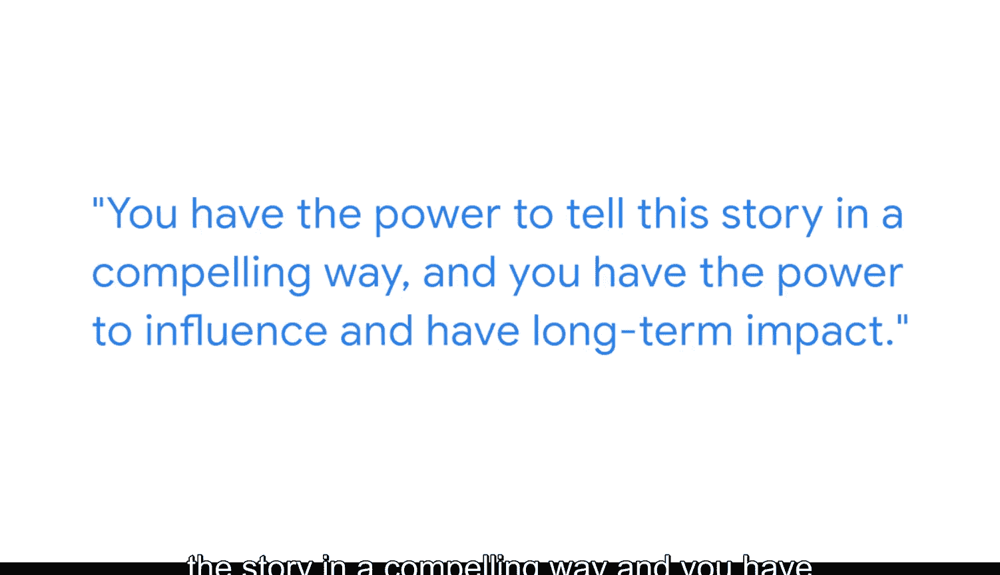

#  103：商业智能专家的力量 💪


在本节课中，我们将通过一位资深商业智能专家的视角，了解商业智能（BI）工作的核心价值与影响力。我们将学习BI专家如何利用数据工具，从海量信息中提炼洞察，并最终影响企业的长期决策。

---

我叫安德烈亚，是一名高级数据分析师。在我的工作中，我拥有向高层领导提出建议并影响其决策过程的能力。这种能力来源于深入数据、处理数据并尝试理解数据背后的含义。

我的用户和客户是需要使用我生成的财务数据来做出决策、创建报告的财务分析师或财务经理。他们将这些分析转化为行动，这些行动将影响谷歌未来的发展。

## 日常使用的核心工具 🛠️

上一节我们了解了BI专家的角色，本节中我们来看看他们日常工作中依赖的核心技术工具。我每天都会使用商业智能工具。

以下是主要使用的工具及其作用：

*   **SQL**：用于创建和处理大型数据集。
    ```sql
    -- 示例：从销售表查询数据
    SELECT product_id, SUM(sales_amount) AS total_sales
    FROM sales_table
    WHERE date >= '2024-01-01'
    GROUP BY product_id;
    ```
*   **Python**：用于理解这些数据集、进行统计分析，并构建最终要分享给领导层的“数据故事”。
    ```python
    # 示例：使用Python进行简单的趋势分析
    import pandas as pd
    data = pd.read_csv('sales_data.csv')
    monthly_trend = data.groupby('month')['revenue'].sum().plot()
    ```

## 数据看板的设计哲学 📊

理解了基础的数据处理工具后，我们转向数据呈现的关键环节——数据看板。虽然我使用看板的次数相对较少，但当我使用时，我会确保我创建的可视化图表看起来美观。

但最重要的一点是，我所构建的“故事”必须具有说服力，并且易于快速理解。因为我的受众没有太多时间。一旦你能理解数据，回到你的受众面前，解释这个故事，并与他们分享你的发现，同时提出一些建议，这时工作就变得非常令人兴奋。

## 商业智能专家的核心影响力 💡

前面我们探讨了工具和呈现方式，本节我们来总结BI专家独特价值的来源。作为一名商业智能分析师，你是深入数据的人，是花费数小时研究这些数据集的人。因此，没有人会比你更了解答案，也没有人能像你希望的那样来讲述这个故事。

所以我认为，当你知道数据中正在发生什么时，这确实赋予了你很大的力量。当你回到你的受众面前提出建议或方案时，你拥有以引人入胜的方式讲述这个故事的力量，你也拥有产生长期影响力的力量。因为你的决策者将利用你的输入来做出可能持续五到十年的决策。

---




本节课中我们一起学习了商业智能专家如何通过**SQL**和**Python**等工具处理数据、构建叙事，并设计简洁有力的**数据看板**来传达洞察。最重要的是，我们理解了BI工作的核心在于将数据转化为有影响力的建议，从而在战略层面推动企业的长期发展。