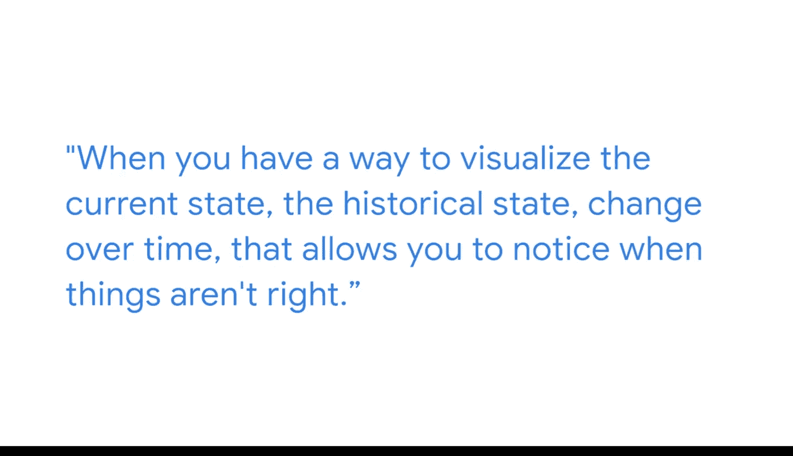

#  106：商业智能工具的实际应用 📊

在本节课中，我们将跟随谷歌技术项目经理埃里卡的分享，了解商业智能（BI）工具，特别是数据看板，在实际工作中的应用场景和价值。我们将学习数据看板如何帮助团队从数据中获取洞察，并支持更有效的决策。

## 职业旅程与学习路径 🛣️

上一节我们介绍了课程背景，本节中我们来看看埃里卡的职业经历。埃里卡是谷歌的一名技术项目经理。她的职业旅程有些曲折，从驾驶飞机转向数据分析，再到目前的技术项目经理职位。

她本科毕业于海军学院，之后成为一名驾驶P-3“猎户座”的海军飞行员。从军队转型后，她意识到自己仍需学习大量关于商业智能和数据分析的知识。因此，在开始新工作后，她主要通过以下方式进行自学：
*   利用在线资源和YouTube。
*   通过在不同系统中尝试和摸索来学习。

她坦言，快速学习这些新技能并完成工作要求起初确实令人畏惧。但随着时间的推移，她逐渐克服了这种紧张情绪，并相信自己能够学会新技能，也学会了在需要时寻求帮助。

## 数据看板的核心价值 📈

了解了学习过程后，我们进入核心部分：数据看板。埃里卡目前参与的一个项目，就使用了一个看板来追踪用户对他们所创建系统的参与度。

**数据看板**是一种可视化呈现信息的方式，能让其他人从中获取洞察。试想如果没有看板，你只能向他人展示一张数据表格，他们将很难得出任何有用的结论，尤其是对于那些没有时间亲自深挖数据的领导层而言。

因此，看板的价值在于它以有用的方式呈现数据，使人们能够：
*   **快速获取洞察**。
*   **通过更改筛选器等交互方式**，理解他们需要从数据中了解的信息。

在她的项目中，看板用于观察参与度随时间变化的历史趋势。这使他们能够洞察到参与度随时间的增长，以及在新系统生命周期中不同事件可能导致的参与度下降。这种可视化帮助他们获取洞察，并思考如何提升参与度。

## 可视化与原始数据的对比 🔍

上一节我们看到了看板如何呈现趋势，本节中我们来对比可视化与原始数据的区别。埃里卡认为，当你有办法可视化当前状态和随时间变化的历史状态时，就能更容易地注意到异常情况。

如果数据只是电子表格或表格中的原始数据，你可能无法轻松获得这种洞察，从而错过某些影响你的项目或产品的关键信息。除非以能够发现这些差异的方式将数据可视化，否则这些信息可能被遗漏。

## 如何定义看板的目标 🎯

既然可视化如此重要，那么如何构建一个有效的看板呢？首先需要明确其目标。埃里卡指出，每个看板都会有不同的目标。对于任何项目、计划或看板的用途，通常都存在一些**关键绩效指标**需要在看板上进行追踪。

你通常可以根据以下内容来确定这些KPI：
*   你经常被问到的关于数据或项目的问题。

## 总结与激励 💡

本节课中我们一起学习了商业智能工具的实际应用。埃里卡非常享受制作数据看板的过程，因为她觉得创造对许多人有用、能让他们工作更高效的东西非常有成就感。

她寻找工作的首要标准是保持挑战性，而她在谷歌确实找到了这一点。她每天都在不断学习，与各领域的专家交流，对此她深怀感激。

**核心要点总结**：
1.  **看板的作用**：将数据转化为**易于理解的视觉信息**，支持快速洞察和交互分析。
2.  **看板的价值**：相比原始表格，可视化能更有效地揭示**趋势、异常和关联**，避免重要信息被遗漏。
3.  **看板的设计起点**：应围绕核心的**关键绩效指标**和**常被问及的业务问题**来构建。
4.  **学习心态**：掌握BI技能是一个过程，需要**主动利用资源、勇于尝试**，并在必要时**寻求帮助**。