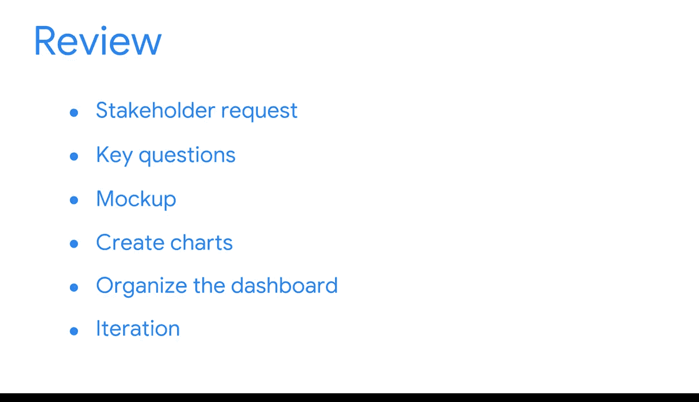

#  109：总结回顾

在本节课中，我们将回顾并总结一个完整的商业智能仪表板项目流程。你将看到如何将理论知识应用于一个模拟的真实工作场景，从需求理解到最终交付。

## 项目概述

上一节我们介绍了商业智能的基础概念，本节中我们来看看一个完整的项目实践。你扮演了一位BI专业人士的角色，将仪表板知识和利益相关者需求应用于一个模拟的工作场景。虽然这个场景发生在学习环境中，但它包含了专业环境中常见的多个组成部分。

## 项目流程回顾

以下是该项目的主要步骤：

1.  **接收需求**：一位利益相关者请求你构建一个流量监控仪表板。
2.  **分析与规划**：你接收了他们分享的信息，随后考虑了关键问题，并创建了一个线框图来帮助你选择图表。
3.  **图表创建**：接下来，你创建了图表。这涉及评估数据集，并决定展示哪些信息以及如何展示。
4.  **仪表板组织**：之后是组织仪表板的各个元素。你的利益相关者希望有一个可以随时获取即时洞察的工具，因此你运用了BI技能来满足这一需求。
5.  **反馈与迭代**：最后，你收到了反馈并对仪表板进行了迭代。这涉及思考所请求的变更在项目背景下是否可行且合理。

## 项目成果与价值

这个实践项目是你在BI领域能力的有力证明。请将此项目纳入你的作品集，以便在求职时与招聘经理分享。你出色地展示了所有的辛勤工作。

## 总结

本节课中我们一起学习了如何系统性地完成一个BI仪表板项目。从理解需求、规划设计、实施创建，到接收反馈并迭代优化，这个过程完整地模拟了真实工作环境中的BI开发生命周期。掌握这一流程是成为一名合格BI专业人士的关键。