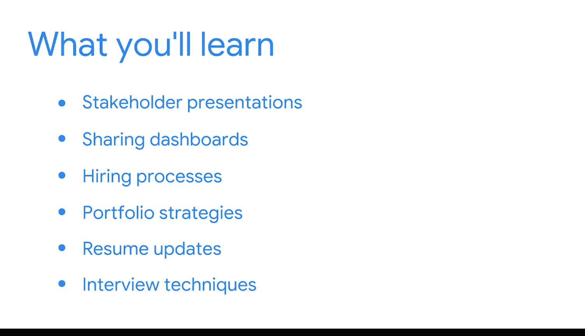

#  110：职场核心技能 🚀

在本模块中，我们将聚焦于商业智能专业人士除技术能力外，同样至关重要的职场软技能。我们将学习如何有效地沟通、展示工作成果，并为职业发展做好准备。

## 商业智能专业人士的技能构成

上一节我们概述了本模块的学习目标，本节中我们来看看商业智能工作所需的具体技能组合。

作为一名商业智能专业人士，工作涉及多项技术技能。

这些技能包括：
*   知道如何为特定项目识别正确的数据。
*   确定合适的指标和关键绩效指标。
*   应用数据建模和管道来组织和移动数据。
*   将数据转换为可用的形式。
*   利用数据解决问题和回答问题。
*   创建推动业务流程和目标的可视化图表与数据看板。

然而，商业智能同样需要出色的沟通和演示技能。毕竟，如果你希望自己的辛勤工作能真正产生影响，懂得如何有效地与他人分享至关重要。

成功的商业智能专业人士能够清晰地展示他们创建的工具如何帮助客户实现业务目标。此外，这对于你的职业发展也很重要，无论你是在面试工作、讨论晋升，还是向主管询问新的培训或教育机会，强大的沟通和演示技能都能助你脱颖而出。

## 本模块学习路线图

在接下来的课程中，我们将专注于这些关键的职场技能。它们是对你已在本课程中获得的所有技术知识的重要补充。

以下是本模块将涵盖的核心内容：
*   首先，你将探索面向利益相关者的演示以及与客户共享数据看板。
*   接着，你将把重点转向商业智能的招聘流程和完善作品集的策略。
*   此外，你将有机会更新你在商业智能领域的简历，以清晰地展示你所有的新经验。
*   最后，你将回顾面试技巧，这些技巧将帮助你在招聘人员和招聘经理面前展示你的技能。

这些课程中的每一节都将为你将商业智能职业生涯提升到新的水平做好准备。现在，让我们开启这段激动人心的职业旅程吧。

## 总结

本节课中，我们一起学习了商业智能专业人士所需的双重技能组合：技术硬技能与沟通软技能。我们明确了本模块将重点培养演示、作品集构建、简历优化及面试准备等关键职场能力，为你的职业进阶打下坚实基础。