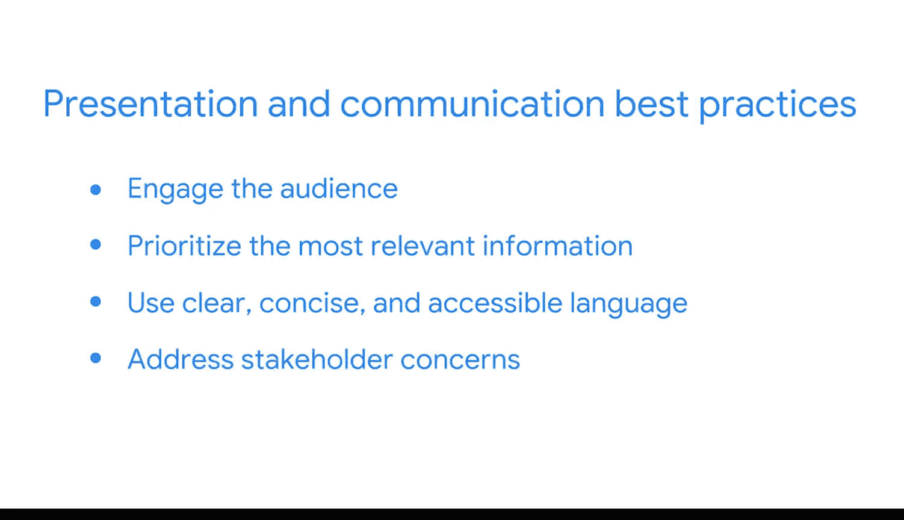

#  111：呈现数据洞见

在本节课中，我们将要学习如何在商业智能项目中有效地呈现和沟通数据洞见。你将了解到，BI中的“呈现”不仅限于会议室里的演讲，它涵盖了所有与利益相关者就项目需求和状态进行的沟通。我们将探讨在不同阶段（从低保真线框图到功能完备的仪表板）进行沟通的最佳实践，并学习如何根据受众调整沟通方式，以确保信息清晰、相关且易于理解。

## 理解BI中的“呈现”

上一节我们介绍了BI项目的迭代性质，本节中我们来看看如何将项目进展有效地传达给利益相关者。

在商业智能领域，“呈现”的概念与常规理解有所不同。这里的“呈现”指的是任何与利益相关者就其需求或项目状态进行的沟通。

请注意，这并不包括回答关于项目细节的简单问题或提供澄清。BI中的呈现更为正式，即使它可能以电子邮件的形式进行。

无论利益相关者是通过收件箱、电话、会议还是混合方式接收你的项目更新，你都应在确认项目范围和截止日期时尽早明确这一点。

无论使用何种格式，都应始终遵循呈现和沟通的最佳实践。

以下是沟通时需要遵循的核心原则：

*   **理解受众视角**：花时间理解他们的观点，思考他们在项目中的利益以及他们希望从你提供的数据洞见中获得什么。
*   **优先处理相关信息**：这意味着首先提供高层次的更新，无论是关于当前进度、近期变化还是下一步计划。
*   **使用清晰简洁的语言**：有效的BI专业人士明白，有些人可能使用过仪表板，但情况并非总是如此。尽管BI是一个技术领域，但明智的做法是避免使用过多的技术术语。尽可能简单地解释你的工作。这是体现同理心重要性的另一个例子。
*   **为特定受众定制内容**：我发现，为每个特定的受众调整措辞和细节层次非常重要。例如，我知道有些具有技术背景的高管希望我深入细节，而另一些则只想要最终结论。
*   **回应关切并确认**：如果利益相关者在上次会议中提出了关切，那么在你的下一次呈现中描述你如何解决该问题就非常重要。并且务必确认他们对你的后续计划感到满意。

## 不同阶段的呈现策略

理解了沟通的核心原则后，我们来看看在BI项目的不同阶段应如何进行具体的呈现。

你第一次向利益相关者进行呈现，很可能是在分享你的低保真线框图时。正如你所知，这些草图能让每个人都清楚地了解你的设计意图，并且对于获取必要的反馈至关重要。

通常，你会进行一次初步的电话沟通或发送电子邮件，询问你所呈现的想法是否符合利益相关者的目标。

由于线框图阶段处于设计过程的早期，你可以吸收人们的想法和建议，然后在必要时，轻松地转向新的方向，而无需花费数小时将线框图变为实际的仪表板。

之后，你将与用户分享你的功能性仪表板。首先，这涉及到解释如何使用它。即使是最清晰、最直观的仪表板也值得在此进行解释。你可以提供现场演示，或者创建一个幻灯片来讲解如何解读可视化图表和更改设置。

最后，你现在已经知道，大多数仪表板都是不断演变的工具，因此它们不一定有最终状态。只需持续呈现关于近期变化或已识别的新机会的更新。

这样，你将能够成功地与利益相关者协作，并尽可能保持仪表板的新鲜度和实用性。

## 总结

本节课中我们一起学习了在商业智能项目中呈现数据洞见的关键方法。我们明确了BI中“呈现”的广泛定义，它涵盖了从电子邮件到正式会议的各种沟通形式。我们探讨了在不同项目阶段（从线框图评审到仪表板交付及后续迭代）进行沟通的策略，并强调了理解受众、优先处理信息、使用清晰语言以及持续回应反馈等核心最佳实践。掌握这些技能，将帮助你更有效地与团队和利益相关者协作，确保数据洞见能够驱动明智的决策。