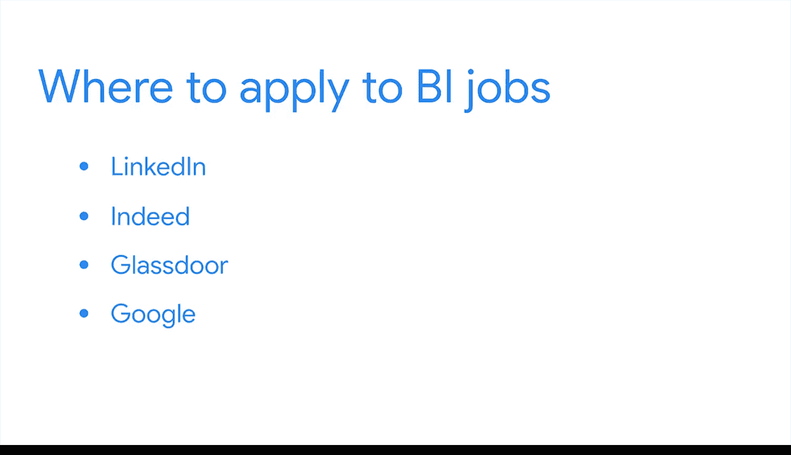

#  112：求职导航与准备 🧭

在本节课中，我们将学习商业智能（BI）领域的求职流程。你将了解BI岗位的分布情况、常见的职位头衔、如何寻找和申请工作，以及面试前后的关键步骤。

---

很高兴继续与你一同学习商业智能专业的相关知识。

在本节课程的前面部分，你已经学习了如何在项目期间向利益相关者展示你的工作和见解。现在，你将把这些同样的展示技巧应用到你的职业发展中。

## BI行业概览与求职起点

上一节我们介绍了如何展示工作成果，本节中我们来看看如何将这些成果转化为职业机会。首先，了解BI行业如何运作将帮助你更好地规划求职。

需要知道的第一点是，BI无处不在，存在于每个行业。公司都需要商业智能来做出明智的决策。无论你对医疗保健、金融、人力资源、教育、建筑还是其他任何领域充满热情，都有适合你的BI岗位。

你可以通过将搜索条件限定在特定行业来开始寻找BI工作。你的搜索关键词可以是“商业智能 医疗保健”或“商业智能 金融”。如果你没有特定偏好，可以尝试更宽泛地搜索，例如“初级商业智能”。

## BI常见职位头衔与申请策略

以下是BI专业人士可能拥有的几个特定头衔：

通常，入门级或早期职业的BI专业人士会被称为**商业智能分析师**。你也可能遇到“初级”或“助理商业智能分析师”的职位。提供此类头衔的职位可能要求0到3年的经验。

然而，如果一个BI职位要求的经验年限比你拥有的多，只要你的技能组合与职位描述匹配，你仍然应该申请。凭借一份出色的作品集和简历，即使你没有太多经验，你也可能成为优秀的候选人。

如果你在寻找特定行业的工作，职位列表可能会要求与该领域相关的技能或知识。你可以研究你感兴趣行业的招聘机会，以确定你应该额外发展哪些技能。

## 寻找与申请BI职位的途径

那么，你应该在哪里申请BI工作呢？你可以在任何求职网站上找到招聘信息，例如LinkedIn、Indeed或Glassdoor。一次快速的谷歌搜索也能帮助你找到一些更新的工作机会。

通过这些网站或公司的特定申请表格，你将能够填写职位申请并分享你的简历和作品集。或者，你也可以通过电子邮件向该职位的招聘经理申请。

## 面试流程与后续步骤

如果你的申请得到了回复，你很可能会与招聘人员或招聘经理进行互动。他们可能会通过电子邮件或电话联系你安排面试。如果是这样，恭喜你！你可以通过研究公司（如果尚未进行）和排练面试来做好准备。

一些组织可能会联系你进行多轮面试，特别是当他们收到大量申请时。你可能会被要求描述你作品集中的项目，或完成一个简短的BI相关练习，类似于你在这个课程中一直在做的活动。

一旦你完成了最终面试，等待就开始了。可以说，这是最艰难的部分，但你可以充分利用这段时间。

以下是你可以做的事情：
首先，你应该跟进并感谢面试官。你也可以申请更多的工作，并努力提升你的BI技能。希望不久之后，你就能获得一个令人兴奋的新机会。

---

既然你已经了解了BI招聘流程的预期，现在就是准备申请材料的时候了。这包括你的BI项目、作品集和一份更新的简历。接下来，你将学习更多面试技巧，以帮助你获得第一个BI职位。

本节课中我们一起学习了BI求职的全过程，从行业认知、职位搜索到申请面试与后续跟进。掌握这些步骤将帮助你更有信心地开启商业智能领域的职业生涯。