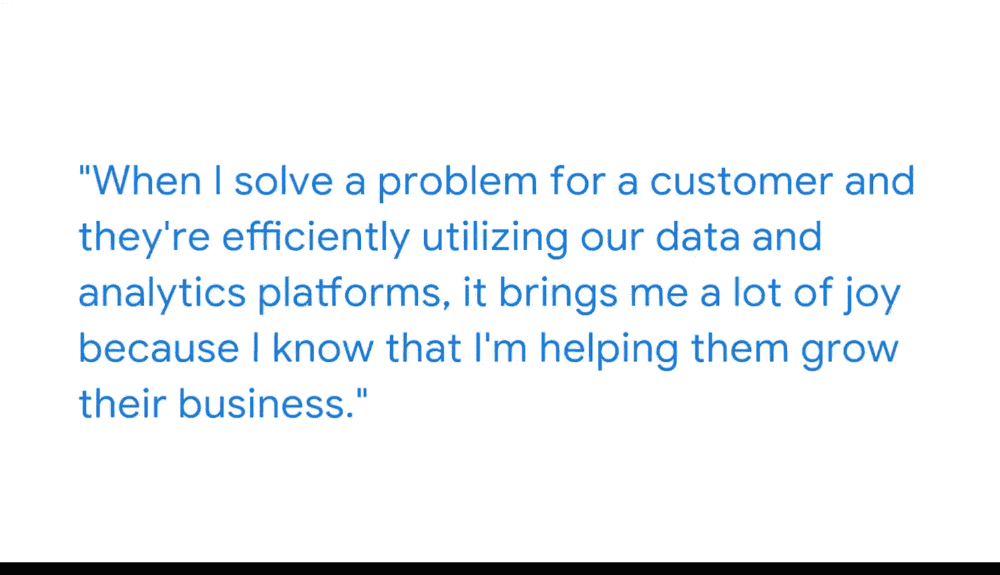

#  113：个人历程分享

在本节课中，我们将跟随希瑟的个人经历，了解她如何在没有传统学历背景的情况下，通过发掘自身技能、主动建立人脉并持续学习，成功进入并扎根于商业智能领域。她的故事将为你展示一条非典型的职业发展路径。

## 背景与起点

我的名字是希瑟，我是一名数据与分析销售专员。

我在纽约市做了多年的服务员，我没有学士学位。

我的祖父通过努力在商业领域取得了成功。在我小时候，他告诉我，我也可以做到同样的事。于是，我开始了自己的旅程。

## 职业发展理念与行动

我一直认为，在一个组织中，从基层做起，逐步向上发展，是找到自己位置的方式。

对我而言，这个行业恰好是科技行业，也是我最终落脚的地方。

为了进入这个领域，我采取了以下行动：
*   我免费参加实习，晚上则继续做服务员工作。
*   我会在领英上搜索相关人士。
*   我会在领英上添加好友，请求与他们进行对话，向他们介绍自己。

我会说：“你好，我是希瑟。我擅长与人沟通，对数字敏感，懂得如何使用计算机系统。我可以成为你团队中的一名得力助手。”

我大概在三年多的时间里，不断地重复这个过程，直到我获得了在科技领域的第一份工作。

## 可迁移的技能

我认为，任何在餐饮服务业工作过的人，无论是服务员、侍者还是调酒师，都拥有极佳的可迁移技能，足以胜任商业智能领域的工作。

我拥有许多客户，与许多合作伙伴共事，也与许多团队成员协作。

我在服务行业，尤其是在纽约市，学到的技能包括：
*   **多任务处理能力**：能够同时应对多张餐桌的客人。
*   **记忆力**：能够记住客人的点单。
*   **客户关系维护**：友善对待常客。

现在，我将我的客户视为我的“常客”，就像十年前我调酒时那样，确保他们感到满意。试想，你去一家餐厅，如果服务体验不佳，你会记住那次不愉快的经历。

## 工作中的协作与成就感

在商业智能领域工作，我与解决方案架构师、客户工程师以及其他合作伙伴协作，共同为客户提供支持。

当我为客户解决问题，帮助他们高效地利用我们的数据与分析平台时，我感到非常快乐，因为我知道我正在帮助他们发展业务。

我曾进行过大约6到7个小时的视频会议，每一次都进展顺利。我理解了客户的问题，并能够以一种技术性的、有效的方式介绍我们的产品。

能够以这种方式与我的客户、我的扩展团队沟通，让我感到非常高兴。

## 给初学者的建议

所以，不要对自己过于苛刻，也不要害怕向他人提问。

不要害怕在领英上与人建立联系，请求一次对话来介绍自己。

现在很少有人这样做了。因此，让自己脱颖而出，勇敢地展现自己。

---

本节课中，我们一起学习了希瑟从餐饮服务业成功转型至商业智能领域的个人历程。她的故事强调了**可迁移技能**（如沟通、多任务处理）的重要性，展示了**主动建立人脉**（如通过领英）和**持续学习**的价值，并鼓励我们**勇敢展现自己**，不要害怕提问和寻求机会。无论起点如何，通过发掘自身优势并采取积极行动，都能在商业智能领域找到自己的发展道路。