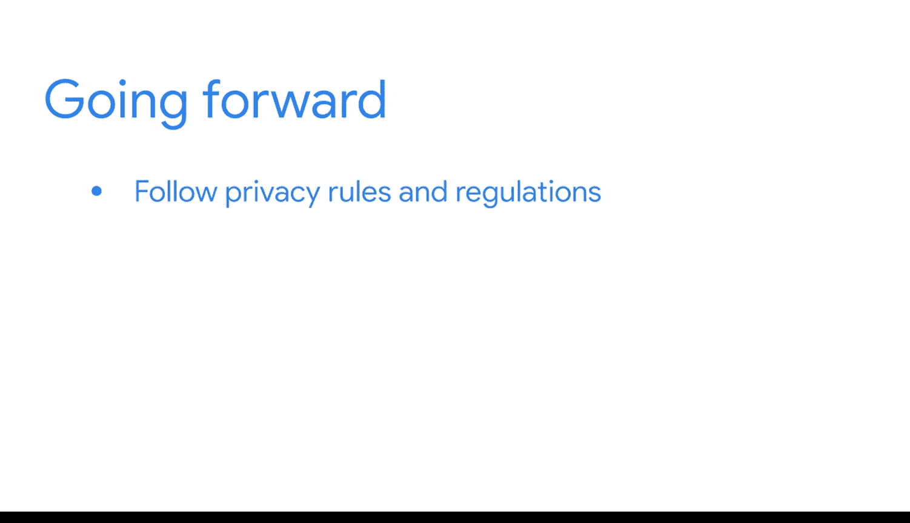

#  114：将商业智能作品纳入作品集 📁

在本节课中，我们将学习如何创建和优化你的个人作品集，以展示你在商业智能（BI）和数据领域的技能与成就。一个精心准备的作品集是向潜在雇主证明你能力的关键。

## 概述

作品集是一系列可分享材料的集合，它是你求职申请中展示成就证据的部分。无论你是已经获得了谷歌数据分析证书，还是完成了任何非商业智能的数据项目，建立一个作品集都至关重要。它能以可分享、易访问的方式展示你的工作，让你在候选人中脱颖而出。

## 选择作品集平台

上一节我们介绍了作品集的重要性，本节中我们来看看如何选择承载你作品的平台。你可以将作品集托管在自定义网站上，也可以利用现有的数据分享平台。

以下是几种常见的平台选择：
*   **自定义网站**：提供最大的灵活性和个性化空间。
*   **GitHub / Kaggle**：这些你可能用于分享代码和数据的平台，也可以用来链接到你的数据看板。
*   **Tableau Public**：Tableau本身提供了一个社交平台和分享功能，非常适合嵌入和展示数据可视化作品。

## 组织作品集内容

选择了平台之后，下一步就是向其中添加你的项目。你需要决定如何呈现每个项目。

以下是你可以考虑包含的内容：
*   **原始数据**（如果允许分享）。
*   **数据看板的截图**。
*   **嵌入式数据看板本身**。
*   一个**指向Tableau等平台上你的看板的链接**。

除了最终成果，描述你的工作过程同样重要。这能帮助他人理解你的思路。

## 完善作品集细节

为了让作品集更完整、更具个人特色，添加一些背景信息会很有帮助。

请考虑包含以下元素：
*   **项目总结**：阐述你的思考过程、具体工作内容，以及未来可能改进的方向。
*   **简短的个人简介**：描述你的职业目标和兴趣，这能个性化你的作品集并使其脱颖而出。

## 注意数据隐私与合规性

在整理作品集时，有一个非常重要的事项需要牢记：你参与的项目可能涉及私有或敏感数据。

因此，请务必遵循以下原则：
*   严格遵守雇主关于数据分享的规章制度。
*   如果无法分享项目的任何数据或可视化成果，可以在作品集中包含一份你所做工作的**文字总结**。
*   具体能分享哪些细节可能取决于雇主的政策，但记录你在每个参与项目中的角色仍然非常重要。

## 总结

本节课中我们一起学习了如何创建和更新你的商业智能作品集。我们探讨了选择平台、组织内容、添加个人简介以及遵守数据隐私的重要性。请记住，维护作品集是一个贯穿你整个职业生涯的、需要定期进行的过程。现在，是时候开始创建或更新你的作品集了。