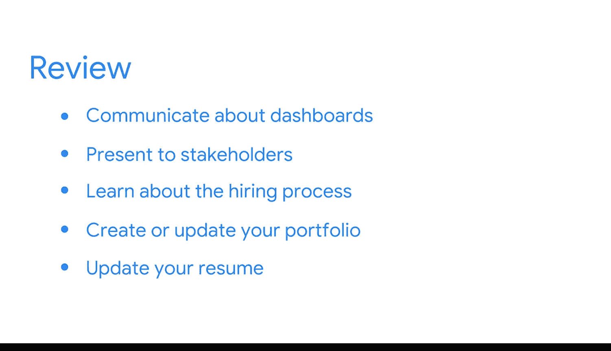

#  115：总结回顾

在本节课中，我们将对课程第四部分“沟通与职业发展”的核心内容进行总结回顾，并为你接下来的职业发展指明方向。

## 课程概述

在未来的商业智能（BI）职位中，有效沟通你的洞察与成果将是一项核心技能。本部分课程旨在帮助你掌握这项技能，并为你的求职之路做好准备。

## 主要内容回顾

上一节我们介绍了如何准备面试，现在我们来整体回顾本部分的学习路径。

以下是本部分涵盖的关键学习模块：

1.  **沟通与展示技能**：你学习了在与利益相关者分享数据看板时，沟通和演示技能的重要性。
2.  **职业准备**：你了解了招聘流程与求职方法，并着手构建你的个人作品集。在创建演示文稿过程中学到的技能，可以帮助你用最新的BI成果更新作品集。
3.  **简历更新**：你更新了个人简历，以反映在本课程项目中培养的各项技能。
4.  **面试准备**：你学习了一些面试技巧，为求职面试做好了准备。

## 总结

本节课中我们一起学习了如何将BI技术成果转化为职业优势。通过掌握沟通、作品集构建、简历撰写和面试技巧，你现在已经为开始申请BI相关职位奠定了坚实的基础。

恭喜你在此课程中取得了显著进步。