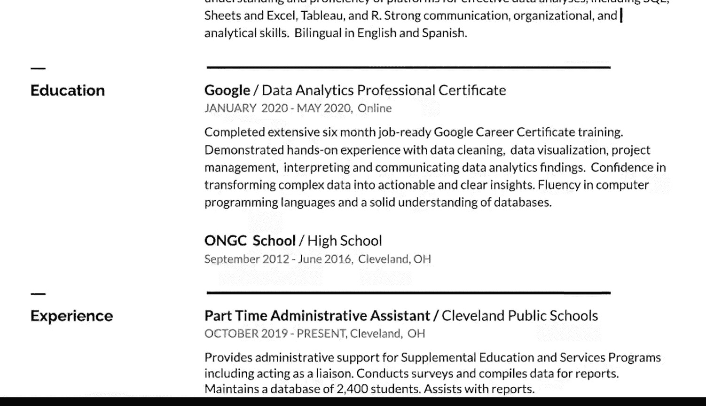

#  117：创建专业简历

## 概述
在本节课中，我们将学习如何创建一份专业、简洁且有效的简历。我们将从理解简历的核心目的开始，逐步介绍简历的结构、内容撰写技巧以及如何突出你的技能和经验，特别是与数据分析相关的部分。

---

## 简历的本质：一份专业快照 📸

上一节我们介绍了课程背景，本节中我们来看看简历的核心概念。

当你拍照时，通常会在一张图像中捕捉许多不同的事物。拍摄日落时，你可能想捕捉云彩、树木和山脉。本质上，你想要的是那个完整时刻的快照。

你可以用同样的方式来思考简历的构建。你希望你的简历成为你在学校和工作中的所有成就的快照。当经理和招聘人员查看你的简历时，他们应该能立刻看出你能为公司提供什么。

这里的关键是简洁。尽量将所有内容控制在一页内，每个描述只用几个要点。2到4个要点就足够了，但要记住保持要点简洁。坚持一页纸有助于你专注于最能反映你是谁或你希望成为谁的专业细节。招聘经理和招聘人员可能也只有时间看一页纸。他们很忙，所以你希望你的简历能尽快吸引他们的注意力。

---

## 构建简历：从模板开始 🛠️

上一节我们了解了简历应像快照一样简洁有力，本节中我们来看看如何开始构建它。

现在，让我们谈谈实际构建你的简历。这时模板就派上用场了。它们是构建全新简历或重新格式化已有简历的好方法。

像 Microsoft Word、Google Docs 甚至一些求职网站都有你可以使用的模板。模板为你需要输入的信息预留了位置，并拥有自己的设计元素，使你的简历看起来更吸引人。

稍后你将有机会探索这个选项。现在，我们将介绍一些步骤，使你的简历显得专业、易于阅读且没有错误。如果你已经有一份简历文档，你可以使用这些步骤来调整它。

---

## 简历的结构与内容

以下是构建简历时可以遵循的主要部分和步骤。

### 1. 联系信息

大多数简历在文档顶部都有联系信息。这包括你的姓名、地址、电话号码和电子邮件地址。如果你有多个电子邮件地址或电话号码，请使用最可靠且听起来最专业的那个。如果能在电子邮件地址中使用你的名字和姓氏会更好，例如 `JaneDoe17@email.com`。你还应确保你的联系信息与你在专业网站上包含的详细信息一致。

虽然大多数简历的联系信息都在同一位置，但如何组织这些信息取决于你。

### 2. 选择简历格式

简历格式不止一种。一种更侧重于技能和资历而非工作历史的格式，非常适合工作经历有空白期的人。对于刚刚开始职业生涯或正在转行的人来说也很好。

如果你想突出你的工作历史，可以随意包含你的工作经验细节，从最近的工作开始。如果你有很多与所申请新职位相关的工作经历，这种格式是合理的。

如果你正在编辑已有的简历，可以保持相同的格式并调整细节。如果你是第一次开始制作新简历，请选择对你最有意义的格式。网上有很多简历资源。你应该浏览大量不同的简历，以了解你认为最适合你的格式。

### 3. 撰写个人摘要（可选）

一旦决定了格式，你就可以开始添加你的详细信息。有些简历以摘要开头，但这是可选的。如果你的经验对于数据分析师来说不传统，或者你正在转行，摘要会很有帮助。

如果你决定包含摘要，请将其控制在一两句话内，突出你的优势以及你如何能帮助所申请的公司。你还需要确保你的摘要包含关于你自己的积极词汇，如“专注的”和“积极主动的”。你可以用数据来支持这些词汇，比如你工作的年数或你熟悉的工具，如 **SQL** 和电子表格。

摘要可以这样开头：“拥有超过五年经验的勤奋客户服务代表”。一旦你完成本课程并获得证书，你也可以将其包含进去，听起来可能像这样：“初级数据分析专业人士，最近完成了谷歌数据分析专业证书”。

另一个选择是，在构建简历其余部分时，为摘要留一个占位符，然后在完成其他部分后再撰写。这样，你可以回顾提到的技能和经验，并提取两三个亮点用于摘要。还需要注意的是，摘要可能会随着你申请不同的工作而略有变化。

### 4. 描述工作与相关经验

如果你包含工作经验部分，可以添加许多不同类型的经验。除了在其他公司的工作，你还可以包括你担任过的志愿者职位以及任何自由职业或完成的工作。

这里的关键在于你描述这些经历的方式。尝试以与你申请的职位相关的方式来描述你所做的工作。

大多数职位描述都列出了最低资格或要求。这些是你被考虑录用所需的经验、技能和教育背景。因此，在简历中明确说明它们很重要。如果你符合要求，下一步就是查看首选资格，许多职位描述也包括这些。这些不是必需的，但你符合的每一项额外资格都会使你成为该职位更具竞争力的候选人。

将你的技能和经验中与职位描述相匹配的任何部分包含进去，都将有助于你的简历脱颖而出。

因此，如果职位描述将一项工作职责描述为“有效管理数据资源”，你会希望有自己的描述来反映这一职责。例如，如果你在当地的学校或社区中心做过志愿者或工作，你可能会说你“有效管理了课后活动的资源”。稍后，你将学习更多方法，让你的工作历史为你服务。

以同样的方式描述你的技能和资格也很有帮助。例如，如果职位描述谈到“组织能力”和“与他人合作”，试着想想你曾有过的相关经历。也许你曾帮助组织食品募捐活动，或与某人合作创办了一家在线企业。

在你的描述中，你想突出你在该角色中产生的影响，以及该角色对你产生的影响。如果你帮助一家企业起步或达到新的高度，请谈谈那段经历以及你在其中扮演的角色。或者，如果你在一家商店刚开业时在那里工作，你可以说你“通过确保优质的客户服务，帮助成功启动了业务”。如果你在任何工作中使用过数据分析，你也一定要将其包含进去。

我们稍后将介绍如何添加特定的数据分析技能。

一种方法是在描述中遵循一个公式：

**公式：通过做 Z，实现了 X，其衡量标准是 Y。**

以下是一个在简历上可能如何呈现的例子：

“基于领导潜力和学术成就，被选为全国 275 名参与者之一，参加这个为期 12 个月的高潜力人才专业发展项目。”

如果你在某段经历中获得了新技能，请务必突出所有这些技能以及它们如何提供了帮助。

### 5. 突出数据分析技能

这可能是提出数据分析的好时机。即使本课程是你第一次真正思考数据分析，既然你掌握了一些知识，你会希望利用它来获益。

因此，如果你曾经管理过资金，也许这意味着你帮助企业分析了未来收益，或者你根据对先前支出的分析制定了预算。即使是为了你自己或朋友的小生意，这也是你分析过的数据。现在你可以反思何时以及如何使用它，并将其用在你的简历中。

### 6. 教育背景

添加工作经验和技能后，你应该包含一个部分，列出你完成的任何教育背景。是的，这门课程绝对算数。你可以将这门课程作为你教育背景的一部分添加，你也可以在摘要和技能部分提及它。

### 7. 技术技能

根据你简历的格式，你可能想添加一个部分，列出你在这门课程及其他地方获得的技术技能。除了像 **SQL** 这样的技术技能，你还可以在此部分包含语言能力。掌握英语以外的某种语言能力只会对你的求职有帮助。

---

## 总结

本节课中我们一起学习了如何创建一份专业且吸引人的简历。你现在了解了如何使你的简历看起来专业且吸引人。随着你继续前进，你将学到更多关于如何让你的简历脱颖而出的知识。最终，你将拥有一份可以引以为豪的简历。接下来，我们将讨论如何让你的简历真正独一无二。