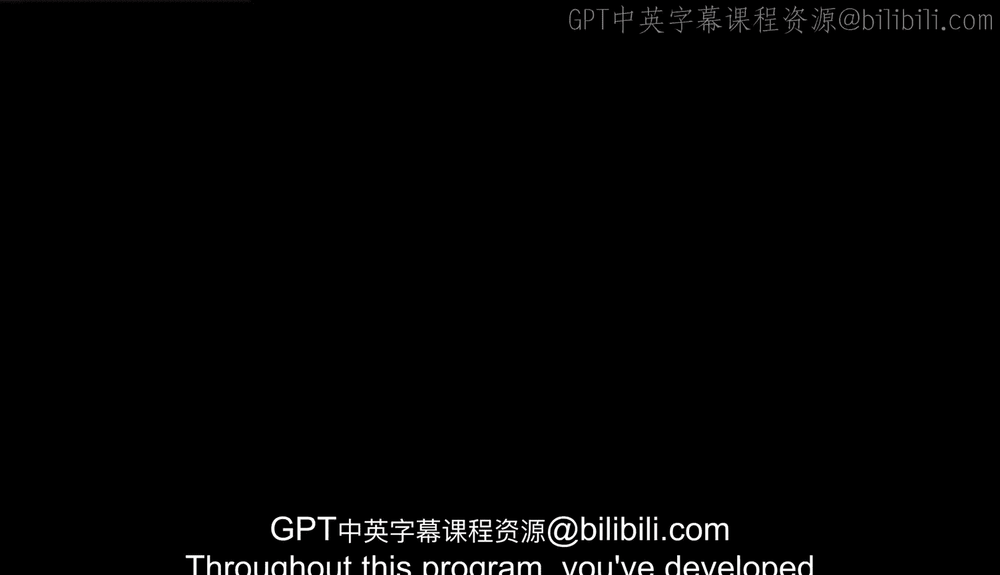
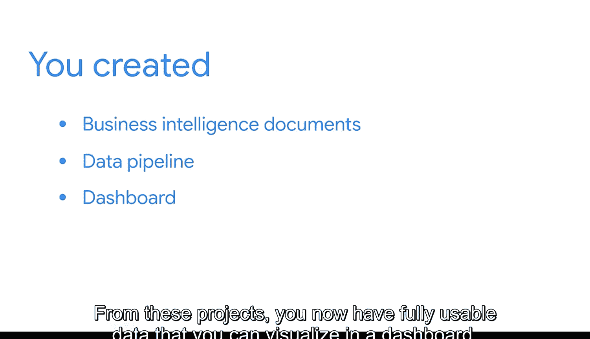

#  118：数据看板构建与项目收尾 🚀

在本模块中，我们将学习如何规划、构建并展示数据看板，以完成最终的课程项目。我们将利用之前课程中准备好的数据和管道，在可视化软件中创建仪表板，从而呈现关键的商业洞察。

---

在整个课程中，你已经掌握了商业智能的核心技能。你也了解了构建作品集以展示个人能力和成就的重要性。现在，是时候回到你的期末项目了。

在之前的课程中，你完成了一个可以放入作品集的商业智能项目。你创建了关键的商业智能文档和数据管道，以练习为商业场景产出交付物。从这些项目中，你现在拥有了可用于在仪表板中进行可视化的完整数据。

上一节我们回顾了项目基础，本节中我们来看看本模块的具体目标。在本课程中，你将学习如何规划、构建和展示仪表板。掌握这些新技能后，你现在可以完成你的期末项目了。

接下来，你将把那些报告表加载到可视化软件中，通过商业智能仪表板来突出重要的洞察。你需要持续记录你的方法、步骤、成就和可迁移技能，以便将这些信息添加到你的作品集中。

当你完成项目的这一步时，你将拥有一个完整的端到端商业智能案例研究。这将帮助你在面试和社交机会中展示你的商业智能知识，这对于获得第一份商业智能工作至关重要。

---

未来的雇主和商业伙伴将了解你为提升技能所付出的努力。开始这个项目时，请记住你可以按照自己的节奏进行。如果你遇到挑战或需要帮助，可以随时参考本课程中的课程和资源。

准备好迎接你期末项目的下一个，也是最后一个步骤。

---

本节课中我们一起学习了如何为期末项目规划和构建数据看板，并理解了完成端到端案例研究对于职业发展的重要性。