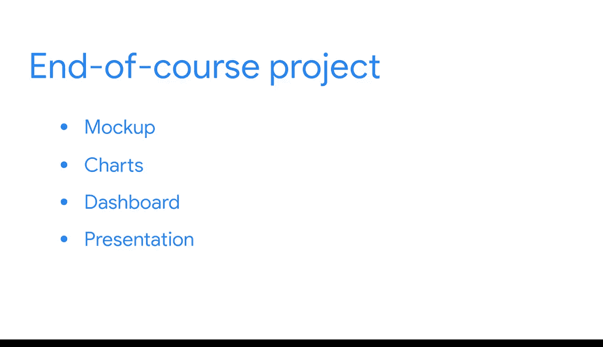

#  119：完成期末课程项目 🎯

在本节课中，我们将学习如何完成商业智能（BI）的期末课程项目。我们将整合之前课程中完成的关键文档、数据管道和报告表，并最终创建一个数据看板。

---

## 项目概述

现在，是时候完成你的商业智能期末课程项目了。截至目前，你已经完成了关键BI文档、数据管道以及之前课程中的报告表。如果你尚未完成这些内容，可以花些时间完成这些交付成果，为下一阶段做好准备。否则，你可以使用为这些项目提供的范例来构建即将进行的可视化。

---

## 准备阶段

上一节我们介绍了项目的整体目标，本节中我们来看看具体的准备工作。

当你的报告表准备就绪，可以加载到Tableau等可视化工具中时，你就可以继续推进项目了。

---

## 项目执行步骤

以下是完成期末项目的三个主要步骤。

1.  **创建原型**：首先，你需要创建一个看板原型。
2.  **制作图表并组织看板**：接着，创建图表并将它们组织到一个数据看板中。
3.  **设计演示风格**：最后，开发你独特的演示风格，以便在作品集中分享看板时使用。

项目按此顺序构建。但一如既往，你可以按照自己的节奏和选择的方式进行。你可以通读材料，然后直接从原型跳到看板，再返回处理图表设计细节。你甚至可以在流程的每个步骤之间来回切换，以适合你风格的方式工作。你的看板艺术完全属于你自己。

---

## 技能应用与回顾

如果你完成了本课程的活动，那么你已经完成了上述每个步骤。这些材料对你来说都不会是全新的。如果遇到困难，你可以回顾之前的课程。这个项目延续了你在之前课程中开始的工作。

你将运用一路上掌握的技能来指导整个过程。这将使你能够做出自己的商业智能决策，并独立发展你的技能，以便在工作场所遇到BI项目时做好准备。

---

## 案例研究与最终成果

本节中的阅读材料将包含案例研究的场景、你需要回答的业务问题，以及关于需要构建何种可视化的说明。

现在，是时候开始了。请通读案例研究材料，决定如何最佳地设计你的看板，并在你选择的可视化工具中创建你的项目和演示。

当你完成时，你将拥有自己完整的案例研究，可以向潜在雇主展示。享受构建你作品集的过程吧。😊

---

## 总结

本节课中，我们一起学习了如何整合前期工作，通过创建原型、制作图表与看板、设计演示风格三个步骤来完成商业智能期末项目。这个过程旨在帮助你应用所学技能，独立完成一个完整的BI案例，为未来的职场挑战做好准备。