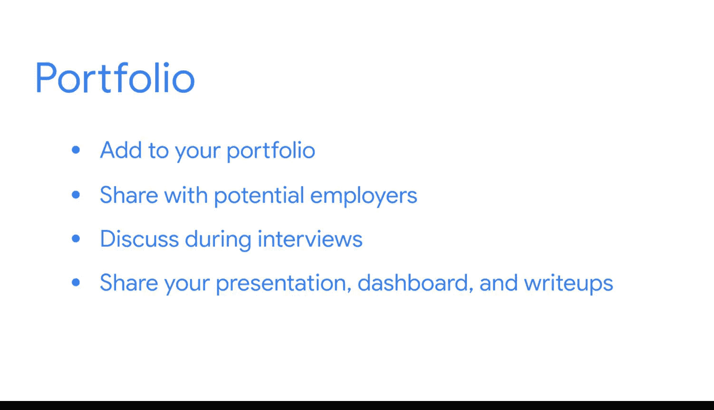

#  120：课程总结 🎉

在本节课中，我们将对谷歌商业智能课程进行总结，回顾你在课程项目中的成就，并展望未来的职业发展。

## 概述

恭喜你，你已经完成了课程最终项目的最后一个组成部分。这是一个巨大的成就，它证明了你在本课程中的所有辛勤努力。

## 项目成果回顾

上一节我们介绍了项目的主体构建，本节中我们来看看你独立完成的最终成果。你运用了所学的商业智能、数据管道和仪表板知识，创造了一个真正展示你作为BI专业人士成长的作品。

你现在可以将这个项目演示文稿纳入你的作品集。

## 如何展示你的成果

以下是你可以采取的几种方式来展示你的项目成果：

*   与潜在雇主分享。
*   在面试中进行讨论。

你可以分享以下材料：

*   你制作的演示文稿。
*   仪表板本身。
*   关于你所用流程和所做选择的书面说明。

理想情况下，你应该展示以上所有内容。每个组成部分都说明了你的BI学习之旅。

## 课程结束与未来展望

现在，你已经朝着BI职业生涯迈出了第一步，并到达了本课程的终点。请不要错过下一部分，那里有一些熟悉的面孔带来的特别信息，以帮助你庆祝这一成就。

😊

## 总结

本节课中我们一起学习了如何总结和展示你的课程项目成果。你独立完成了最终项目，综合运用了商业智能、数据管道和仪表板的知识，这标志着你在BI领域的专业成长。请妥善保存和展示你的项目成果，它将是你职业发展中的重要资产。