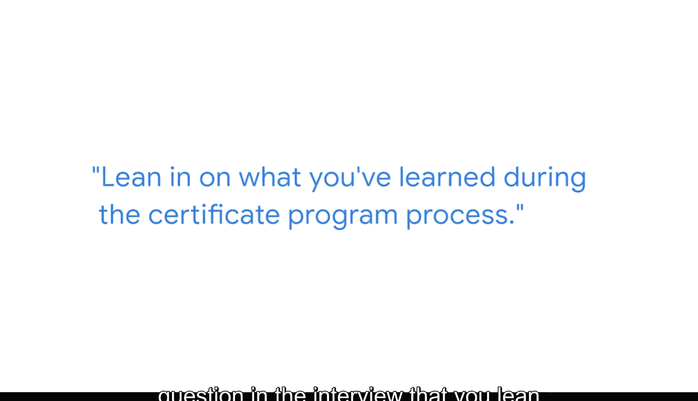

#  121：托尼的职业发展策略 🚀


在本节课中，我们将学习来自谷歌财务项目经理托尼的宝贵建议，了解如何在商业智能领域的求职面试中脱颖而出。课程将重点介绍如何弥补经验不足、掌控面试节奏以及有效展示个人技能。

## 核心面试策略：连接所学与岗位需求 🔗

上一节我们介绍了课程背景，本节中我们来看看托尼分享的核心面试策略。对于缺乏直接工作经验的求职者，关键在于主动建立**所学知识**与**目标职位**之间的联系。

当面试官提出开放式问题时，应抓住机会深入阐述你的学习成果及其应用方式。例如，面试官可能提出一个宽泛的业务问题，你可以选择从财务数据分析角度切入，并主动引入技术工具作为解决方案。

**核心行动公式**：`主动阐述 = 展示学习成果 + 连接岗位需求`

以下是具体操作建议：

*   **引导技术讨论**：主动谈论你将如何使用 **`SQL`**、**`Python`** 或 **`R`** 等工具来解决问题。
*   **模拟解决流程**：向面试官逐步演示你实施解决方案的思考过程。
*   **突出证书价值**：明确表达你如何将证书课程中学到的知识，应用于当前讨论的职位挑战中。

## 面试环境控制：营造专业与舒适的空间 💻

掌握了主动展示的策略后，另一个常被忽视但至关重要的因素是面试环境。特别是在当前虚拟面试为主的背景下，对环境的有意控制能极大影响面试表现。

绝对不建议在无法控制的环境中面试，例如嘈杂的街头或咖啡馆外。控制环境不仅是为了给面试官留下专业印象，更是为了让你自己能感到舒适、自信且不受干扰。

以下是准备面试环境的要点：

*   **选择可控空间**：确保面试地点安静、私密、网络稳定。
*   **提前测试设备**：检查摄像头、麦克风和面试软件是否正常。
*   **保持背景整洁**：使用简洁、专业的虚拟背景或整理好实体背景。

## 面试前准备：系统化整理你的项目资产 📁

为了在面试中能流畅、自信地展示自己，充分的考前准备必不可少。这需要你将学习过程中的成果转化为可随时调用的“资产”。

从面试官的角度看，对于初级职位候选人，更关注的是你如何清晰阐述所学知识，而非过往经验。因此，你需要提前梳理在证书课程中完成的所有项目和案例分析。

以下是项目整理的步骤：

1.  **全面回顾**：浏览证书学习期间完成的所有分析项目。
2.  **精选案例**：选出几个最具代表性、最能体现你综合能力的项目。
3.  **提炼故事**：为每个精选项目准备一个简明的叙述，包括背景、方法、工具和成果。
4.  **应对通用问题**：将这些项目案例与常见的面试问题（如“请描述一个你解决过的分析问题”）关联起来，做到随时可以引用。

## 展现自信：坚信你的学习成果 💪

当面试进入更技术性的讨论环节时，这是你展示证书学习深度的最佳时机。你需要做的是坚定地依靠你在课程中获得的知识。

请相信，你所完成的学习和项目工作，已经足以让你获得这次面试机会。你应充满自信，积极把握这个展示自己的时刻。

**心态代码**：
```python
if interview_question == "technical":
    respond_with(confidence, knowledge_from_certificate)
    # 自信地展示你在课程中学到的技能
```



---


本节课中我们一起学习了谷歌专家托尼的职业发展策略。我们明确了在面试中主动连接所学知识与岗位需求的重要性，了解了控制面试环境的关键细节，掌握了系统化整理项目资产的方法，并最终认识到，带着自信展示学习成果是打动面试官的核心。记住，充分的准备和积极的展示，能让你在商业智能领域的求职路上脱颖而出。