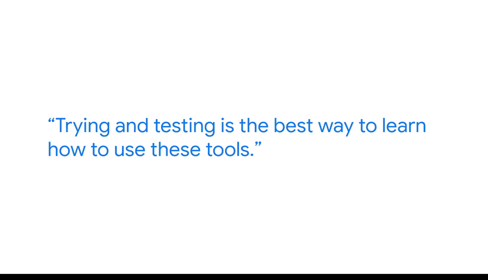

#  122：迈尔斯-人工智能在职场中的影响力驱动 🤖

## 概述
在本节课中，我们将跟随谷歌数据工程师迈尔斯的分享，了解人工智能（AI）在商业智能和数据工作中的实际应用与影响。我们将探讨AI如何提升工作效率、自动化繁琐任务，并学习如何有效利用AI工具来辅助数据分析工作。

---

我是迈尔斯，是谷歌的一名数据工程师。我的主要工作是维护大型数据库，这些数据库也被称为数据湖，其中包含我们从资本性支出到运营性支出，再到收入的广泛财务信息。我的职责是向利益相关者提供这些数据。

我非常热爱数据分析师这份工作。这份工作并非总是与数字打交道，其中很大一部分也涉及讲故事。能够创建吸引人且视觉上引人入胜的内容呈现给业务伙伴，是一件非常独特的事情，这是许多其他职业所不具备的经验。数据是我们所做一切工作的被遗忘的支柱，没有数据，我们就无法像现在这样准确地做出任何决策。

---

## AI的重要性与定位 🚀
上一节我们了解了数据工作的核心价值。本节中，我们来看看AI在其中扮演的角色。

AI是一件大事。我们认为它是下一个前沿领域。如果我们把数据分析看作第一步，那么AI就是第二步。在我的工作中，我每天都使用AI，它让我和我的所有同事都更高效、更有生产力。更不用说它让我们能够自动化那些我们不喜欢做的、重复性或繁琐的任务。

---

## AI的实际应用案例 📄
了解了AI的宏观定位后，我们通过一个具体案例来看看AI如何解决实际问题。

最近，我在谷歌的岗位上使用AI的一个例子是，当我们必须围绕数据访问创建文档时。我们基本上需要为业务伙伴整合大约10种不同的访问权限，并创建文档让他们知道在何时何地申请访问。我们这样做是因为我们维护大量财务数据，众所周知，这些数据非常机密且需要知悉。因此，创建易于阅读和易于应用的文档对于在谷歌担任数据分析师至关重要。

我使用了这个新工具，或者说Gemini的总结功能。我每天都使用它，无论是处理电子邮件、长表格还是解析代码，它确实能帮助你更快地找到你想要的核心要点。

---

## 给初学者的建议：如何学习使用AI 🧪
我们已经看到了AI的实际效用。那么，对于想要入门数据分析并利用AI达成目标的人，迈尔斯有什么建议呢？

以下是我给刚开始学习数据分析并希望利用AI的人的建议：尝试和测试是学习如何使用这些工具的最佳方式。将其视为一个游乐场，尽情玩耍，搞乱一些东西，向它提出假问题，也提出真实问题。尽你所能去真正理解它会给出什么输出，这样当你真正需要做一些有成效的事情时，就能更好地利用它。

---

## 进阶技巧：用AI学习AI 🧠
除了基础使用，AI本身还能成为我们学习的强大助手。

一个有趣的小技巧是，你实际上可以使用AI来教你AI。你甚至可以要求聊天机器人教你如何使用它自己。基本上，AI会给你一个输出，然后你可以问它，它认为这个输出在多大程度上满足了我的输入需求。

使用这些新技术非常令人兴奋。这几乎就像在你工作时有一个私人助理在你身边，无论你是向工具抛出问题和想法，还是向其输入数据以帮助你更快地完成某事。它不仅能节省你的时间，还能教会你很多东西。

---

## 总结
本节课中，我们一起学习了谷歌数据工程师迈尔斯对AI在职场中影响力的见解。我们了解到：
1.  **AI是提升效率和自动化的关键工具**，能处理重复性任务。
2.  **AI在具体工作（如文档创建、信息总结）中具有实际应用价值**。
3.  **学习AI的最佳方式是动手实践和反复测试**，将其当作探索的工具。
4.  **AI本身可以成为学习AI的导师**，通过提问和反馈来深化理解。

掌握这些理念和方法，将帮助你在数据分析和商业智能领域更有效地利用人工智能技术。