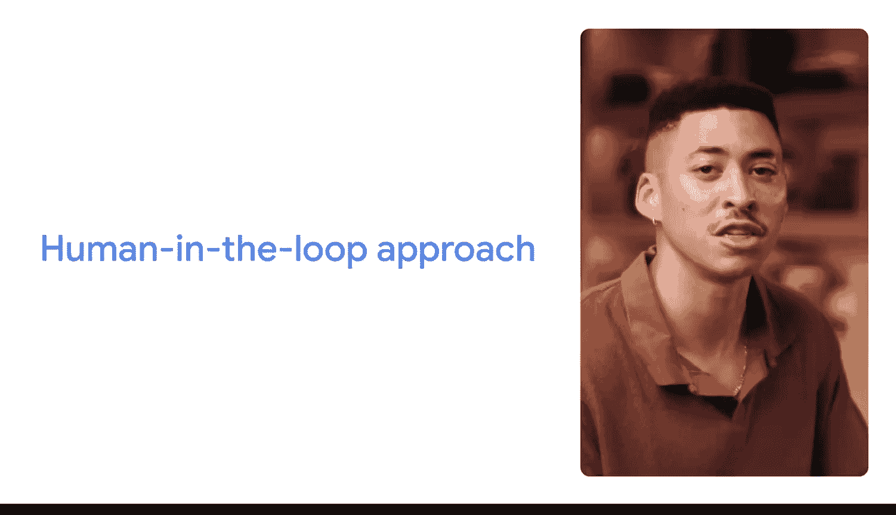

#  123：利用人工智能提升数据分析技能 🤖

在本节课中，我们将学习如何利用生成式人工智能（GenAI）来提升数据分析工作的效率与创造力。我们将重点介绍如何构建有效的提示词（Prompt），并探讨如何将AI作为人类技能的补充，负责任地应用于数据分析的各个环节。

---

人工智能正在改变我们在工作和生活中处理日常任务的方式。使用人工智能可以帮助你更快地完成常规性工作，从而让你能将更多时间投入到能产生最大影响力的领域。

回想一下你典型的工作日。如果它和我的情况类似，你会有很多事情要做，但时间总是不够。有些时候，你的待办事项清单似乎永无止境。但试想一下，如果AI能提供帮助呢？作为一名数据专业人士，我将分享几个你可能遇到、且AI能帮助你更智能、更快速工作的场景，并展示具体操作方法。你将了解如何加速数据清洗过程、创建引人入胜的数据可视化图表、为数据分析构思问题等。

我叫Miles，是谷歌收入系统团队的一名数据工程师。我的团队处理与谷歌财务相关的数据。具体来说，我维护着被称为“数据湖”的大型、结构化或非结构化数据库，其中包含我们的财务数据。我经常为创收项目自动化数据报告，并协助利益相关者进行分析，以帮助我们的产品和项目发展。AI帮助我更高效、更有创意地工作，因此我很高兴分享我的使用经验。

---

## 构建有效的提示词框架 ✍️

为了充分利用生成式人工智能（GenAI），编写有效的提示词至关重要。提示词是你提供给AI模型的输入，用以引发特定的回应。一个好的提示词遵循一个简单的框架：**任务（Task）、上下文（Context）、参考（References）、评估（Evaluate）和迭代（Iterate）**，简称 **T、C、R、E、I**。如果你记不住这些步骤，只需记住这句口诀：**“深思熟虑地创造真正优秀的输入（Thoughtfully Create Really Excellent Inputs）”**。

以下是该框架的详细分解：

### 1. 任务（Task）
任务是指你希望模型做什么。这应该简单明了。我们可以将任务分解为**角色（Persona）**和**格式（Format）**。

*   **角色**：指你希望GenAI工具借鉴何种专业知识。你可以要求工具扮演特定角色，例如“一位专业的演讲撰稿人”或“一位拥有15年经验的营销主管”；你也可以要求它为特定受众（如客户或你的经理）创建输出。
*   **格式**：指你希望输出以何种形式呈现。无论是项目符号列表、短句还是表格。请记住，任务描述应清晰、具体地说明你希望模型做什么。

### 2. 上下文（Context）
上下文是帮助GenAI工具理解你需求所必需的细节信息。这造成了两种请求方式的区别：
*   “给我一些30美元以下的生日礼物点子。”
*   “给我5个生日礼物点子。预算30美元。礼物是送给一位29岁、热爱冬季运动、最近刚从单板滑雪转向双板滑雪的人。”

添加上下文能使指令更精确。

### 3. 参考（References）
有时，你需要在提示词中添加参考资料，供GenAI工具在创建输出时使用。例如，在你请GenAI工具提供生日礼物点子后，如果你添加过去送过的礼物作为参考，工具就能给出更有用的建议。需要注意的是，并非总有明确的参考资料可用，尤其是在处理更抽象的任务或寻找灵感和创意时。关键在于指令要清晰、具体。

**提示词编写要点**：使用自然语言，就像与另一个人交谈一样，并表达完整的想法。

### 4. 评估（Evaluate）与 5. 迭代（Iterate）
在包含了任务、上下文和参考并得到输出后，就到了评估阶段。问问自己：你提供的输入是否得到了你需要的输出？这引出了框架的最后一部分：迭代。

如果你评估输出后，发现没有得到所需内容，可以尝试通过添加更多信息或编辑你的提示词来重试。这是有效提示的关键环节。

**关于框架的补充说明**：构建有效提示词的方法有很多。提示词的构建顺序不如其内容实质重要。只要你遵循“深思熟虑地创造真正优秀的输入”这一原则，你的输出结果应该会很出色。

---

## 负责任地使用AI：人在回路方法 🔄

在我们探索如何在数据分析中使用AI时，请记住，**当AI作为我们独特人类技能和能力的补充时，它能发挥最佳作用**。你应该始终通过应用“人在回路（Human-in-the-loop）”方法来负责任地使用AI。

AI是帮助你完成任务的有用工具，但它需要人类的参与。没有任何AI工具拥有我们人类所具备的深厚经验、实践知识和互动技能。这就是为什么“人在回路”方法是负责任使用AI的关键。它结合了机器和人类的智能来训练、使用、验证和完善AI结果。

实际上，这意味着要**注意你输入AI工具的内容，并始终评估和验证其输出**。当你使用AI工具时，请仔细考虑是否需要使用机密或敏感信息来执行任务，并务必首先查阅你所在组织的规则或政策。

即使在工作之外使用AI工具，你也应避免输入个人或机密信息，并始终检查你输入的数据可能被如何使用。

**最后一点**：市面上有很多GenAI工具。我将使用Gemini来演示如何编写提示词，但你将学到的所有技巧和最佳实践都可以应用于其他GenAI工具，如ChatGPT、Copilot或Claude。

---

## AI在数据分析中的应用场景 📊

像我们这样的数据分析师经常被数据清洗和整理等耗时任务所困扰。我想我从未遇到过有人说这是他们工作中最喜欢的部分。真正的兴奋点在于从数据中发现新知、深入挖掘洞察，并与团队合作将这些洞察转化为决策。

AI工具可以赋能我们数据专业人士，让我们在为团队或组织发掘机遇方面扮演更重要的角色。

---

**本节课总结**：我们一起学习了如何利用生成式人工智能提升数据分析技能。核心内容包括：1）掌握 **T、C、R、E、I提示词框架** 来有效引导AI；2）理解并应用 **“人在回路”** 方法，确保负责任且有效地使用AI，将其作为人类专业能力的补充；3）认识到AI能够将我们从繁琐的常规任务中解放出来，从而更专注于高价值的洞察发现与决策支持工作。现在，让我们开始实践吧。